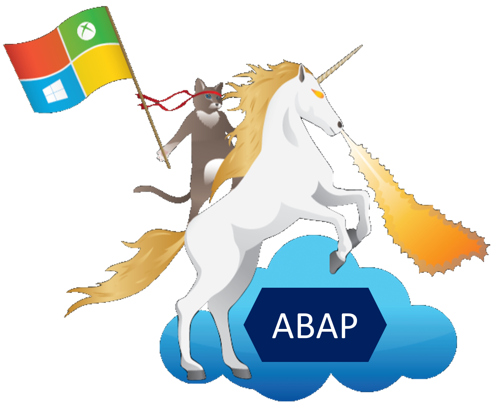

# 🌌Wander across the worlds of SAP and Microsoft - Journey of an ABAP'er🪐

🏗️Under Construction🚧

`Content supporting the DSAG ABAP Developer Day February 2023`

Digitization of business processes and deriving intelligent action automatically is one of the mega trends across all industries globally. As part of this mission, should you choose to accept it, you will experience challenges and solution approaches firsthand acting as the much needed incubation team 🐣 of the Contoso Inc.

You will be expanding your ABAP developer horizon and ultimately be equipped to shape digitization efforts one step at a time. But first things first.

## 🔭 Introduction

`"what's the harm of collecting invoices manually and also typing them into your Enterprise-Resource-Planning system after all?"`

There are multiple studies and reports on automation impacts on human labor. We are quoting just two to make the point: According to the [Smartsheet report](https://www.smartsheet.com/content-center/product-news/automation/workers-waste-quarter-work-week-manual-repetitive-tasks) knowledge workers could save almost a full working day per week if their repetitive tasks were automated. What could you do with an extra day? [McKinsey's featured insight](https://www.mckinsey.com/featured-insights/artificial-intelligence/five-fifty-fear-fear-not) addresses the fear of automation destroying jobs and freeing the most creative force from repetitive manual tasks in the business to work on challenges it was built for by millions of years of evolution: the human brain 🧠.

You will be using Microsoft tooling and the globally most-widely adopted ERP with your well-known ABAP environment as the foundation.

💺buckle up and get your fellow humans that extra day to work on challenges, be outdoors to get fresh ideas, socialize with colleagues, work only 4 days a week and still get their work done or just for the sake of advancing modern work.

Ready to go on a digitization adventure?

image source: [giphy.com](https://giphy.com/gifs/movie-film-cute-14bWswbeWGzYEo)

## 🧙🏾‍♀️Epic Quests

Before you go: verify [prerequisites](PREREQUISITES.md) are met (backpack, lunch box, good-bye kiss, haunted jewelry, ABAP Development Tools, etc.)

> **Warning** - avoid getting lost in personas and users that exist in your environment by employing [isolated browser profiles](https://support.microsoft.com/topic/sign-in-and-create-multiple-profiles-in-microsoft-edge-df94e622-2061-49ae-ad1d-6f0e43ce6435) or the infamous [incognito mode](https://support.microsoft.com/microsoft-edge/browse-inprivate-in-microsoft-edge-cd2c9a48-0bc4-b98e-5e46-ac40c84e27e2) in case you have existing personal or corporate accounts for M365, SAP, etc. This might save you from a lot of session trouble later on.

0. [The Journey](student/quest0.md) - Where will those quests take us
1. [Novice's path](student/quest1.md) - Empower your fellow humans on Microsoft Teams via SAP RFCs
2. [Apprentice's curious road](student/quest2.md) - Trigger your first workflow via the ABAP SDK for Azure (to infinity and beyond)
3. [Debutant's journey](student/quest3.md) - Close the interaction cycle on Microsoft Teams and write back to SAP (OData)
4. [Accountant's detour](student/quest4.md) - Load the data into Microsoft Excel via OData
5. [Master's trail](student/quest5.md) - Unleash one of the mightiest automation tools on your workflow - the Azure Bot Framework
6. [Wizard's route](student/quest6.md) - Approach the last quest with a bang and improve one of the most dusted and slow processes there is -> automatically pre-fill your invoice drafted in Microsoft Word with master data from SAP

Finish the final quest and claim your badge 😎

No one should say there aren't any cool stickers for ABAP'ers!

Original image adapted from [source](https://martinpankraz.github.io/ninja-unicorn/about/). Credits go out to KC Lemson and Morgan Deegan.

See you out there traversing the depths of enterprise integration across Microsoft and SAP🌠

## ✨Recommended courses and further learning

- [ABAP Environment (aka Embedded Steampunk)](https://blogs.sap.com/2022/10/25/how-to-use-embedded-steampunk-in-sap-s-4hana-cloud-private-edition-and-in-on-premise-the-new-abap-extensibility-guide/)
- [ABAP SDK for Azure](https://github.com/microsoft/ABAP-SDK-for-Azure)
- [ABAP RESTful Application Programming Model (RAP)](https://help.sap.com/docs/ABAP_PLATFORM_NEW/b5670aaaa2364a29935f40b16499972d/289477a81eec4d4e84c0302fb6835035.html)
- [Adaptive Cards in Microsoft Teams](https://learn.microsoft.com/microsoftteams/platform/task-modules-and-cards/cards/design-effective-cards?tabs=design)
- [Azure Bot Framework](https://learn.microsoft.com/azure/bot-service/bot-overview?view=azure-bot-service-4.0)

## 📢Feedback

This repos encourages contributions and feedback via the [GitHub Issues](https://github.com/MartinPankraz/ABAP-Developer-Day/issues/new/choose).

## 🚸 Adventure Guides [🔗](mentor/quest1.md)

- [Karl Kessler - SAP](https://www.linkedin.com/in/karl-kessler-1a9b353/)
- [Harish Bokkasam - SAP](https://www.linkedin.com/in/bokkasam-harish/)
- [Holger Bruchelt - Microsoft](https://www.linkedin.com/in/holger-bruchelt/)
- [Bart Delanghe - Microsoft](https://www.linkedin.com/in/bart-delanghe/)
- [Thijs Zandvliet - Microsoft](https://www.linkedin.com/in/thijszandvliet/)
- [Bartosz Jarkowski - Microsoft](https://www.linkedin.com/in/bartosz-jarkowski/)
- [Robert Boban - Microsoft](https://www.linkedin.com/in/rboban/)
- [Martin Pankraz - Microsoft](https://www.linkedin.com/in/martin-pankraz/)
