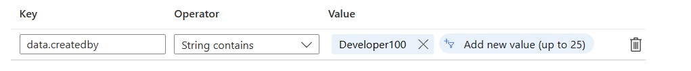

# Adventure-Guide notes quest 2

[< Quest 1](quest1.md) - **[🏠Home](../README.md)** - [ Quest 3 >](quest3.md)

In this step the participants will use a predefined Azure Event Grid Topic. Each participant will need to create his personal Event Subscription which points to his Service Bus queue. The Service Bus will be the receiver of the event. In a further step, a LogicApp will read out the event for processing.

The ABAP SDK will send the events towards the Event Grid Topic. These events will then be forwarded to all the Subscriptions. In order to make sure each participant receives his own events, there is a filter based on the SAP User of the participants.
The SAP user is part of the Event.data send by the ABAP SDK.

<b>Example Advanced filter</b>
<p align="center" width="100%">

</p>

<b>Example Event Message</b>
```json
{
    "subject": "OnlineShop/Order/Created",
    "eventtype": "onlineshop.order.created",
    "id": "00000015",
    "data": {
        "ordernr": "00000015",
        "createdby": "DEVELOPER103",
        "event": "created",
        "date": "2023-02-17",
        "time": "01:31:06"
    },
    "dataversion": "2.0",
    "metadataversion": "1",
    "eventtime": "2023-02-17T09:31:07Z",
    "topic": "/subscriptions/22a9ba10-8328-4f21-baeb-50728288a33c/resourceGroups/SharedResources/providers/Microsoft.EventGrid/topics/EventsFromOnlineShop"
}
```

## Azure Setup
|<!-- --> | <!-- -->   |
|---|---|
| Azure Event Grid Topic | `EventsFromOnlineShop`|
| URL | https://eventsfromonlineshop.northeurope-1.eventgrid.azure.net/api/events |
| Azure Service Bus Namespace | `ServiceBusForSAPOnlineShop` |

>Note : There is a Event Subscription `allmessages` which will receive all events from all participants. The corresponding queue is `allmessages`.

## SAP Setup
|<!-- --> | <!-- -->   |
|---|---|
| RFC Destination for Azure Event Grid Topic | `AzEGTOrderEventsASDK00` |
| ABAP SDK Interface ID | `AZEGT_P00`|
| Function Module | `Z_ONLINESHOP_SDK_BUS` This function module is called by the Online Shop RAP and calls the ABAP SDK |
| Surrounding Class | `lsc_zr_onlineshop_ms1->save_modified` --> `ZCL_MS1=>abap_sdk_read` --> `Z_ONLINESHOP_SDK_BUS` |


<b>ABAP SDK Tables</b>

| Table (sm30) | Description |
|:---|:---|
|ZREST_CONFIG | link to RFC destination |
|ZREST_CONF_MISC | link to Interface type, EventGrid in this case |
|ZADF_CONFIG | contains the EventGrid Access Key |
|ZADF_EHUB_POLICY | not used for EventGrid, there is no sender policy|