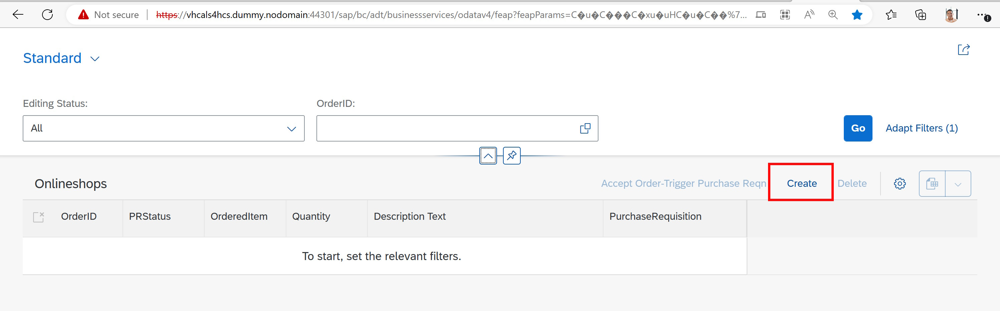

# The Scenario

**[🏠Home](../README.md)** - [ Quest 1 >](quest1.md)

Our journey will start from an SAP Online Shop that allows users to choose and place orders from a variety of products. One the orders are placed in the Online Shop, a manager can "Approve" these orders and create an actual Purchase Requisition in the SAP system.

## Quest 1 - Empower your fellow humans on Microsoft Teams via SAP RFCs

We will start our journey by fetching specific Order Items from the Online Shop and posting an information (a so called Adaptive Card) in Teams. This first step will be done by creating a Logic App that needs to be manually triggered from Azure. This Logic App will then connect via an RFC to the SAP system and fetch some very basic information.

## Quest 2 - Trigger your first workflow via the ABAP SDK for Azure (to infinity and beyond)

Obviously manually triggering the process to read and display information in Teams does not make a lot of sense. So the next step will be to use the actual event when an order is placed in the Online Shop to trigger the Logic App created in Quest 1 automatically. For this we are going to use the ABAP SDK for Azure to react to the event and trigger the Logic Apps.

## Quest 3 - Close the interaction cycle on Microsoft Teams and write back to SAP (OData)

As you probably saw, the RFC does not return a lot of information. We only get the ordered item and a little more information. That's why we enhance the Logic App and call an OData service to the SAP system which fetches additional information (obviously we could use this OData service to fetch all the information right away, but we want to show different ways how to interact with the SAP system). With this additional information, we can enrich the Adaptive Card that is shown in Teams. We can also go one step further. We enhance the Adaptive Card to have some actions: We want to allow the user to open up the Online Store with the specific order Item and to enable the user to Create a purchase requisition directly from Teams.

## Quest 4 - Load the data into Microsoft Excel via OData

With a growing number of Orders in the Online Shop you might want to get a better overview. A lot of customers are using Excel to work with data. Instead of Export / Importing / Copy & Pasting the information from the Online Shop to Excel, we create a "live" connection from Excel to the underlying OData service of the Online Shop. With this users can always get an up-to-date view of the data in the SAP system.

## Quest 5 - Unleash one of the mightiest automation tools on your workflow - the Azure Bot Framework

While working in Teams and chatting with colleagues it might be required for you to quickly lookup the status of a specific Order. You could switch back and forth between Teams and the Online Shop, but it would be much easier to just ask a Bot about the status. Leveraging the very same connections that we previously used, we will then use the Bot Framework Composer to create a very simply bot that allows you to fetch details from an Order and display it interactively in Teams.

## Quest 6 - Automatically pre-fill your invoice drafted in Microsoft Word with master data from SAP

Approach the last quest with a bang and improve one of the most dusted and slow processes there ii.

Now that the order is place and a purchase requisition has been created, we might need to write an Invoice or contact the buyer. In our case we are using Microsoft Word to write this letter, but in order to fetch the correct information from the Online Shop, we create an Add-in to Word that enables the user to connect to the SAP System directly from Word and paste the content in the document itself.

## What we have so far -- the SAP Online Shop

As a new front end to our SAP S/4HANA System we have created a RAP application where users can create orders.
The Online Shop was developed using RAP, ...
ToDo--ToDo--ToDo--ToDo--ToDo--ToDo--ToDo--ToDo--

To access the [Online Shop](https://vhcals4hcs.dummy.nodomain:44301/sap/bc/adt/businessservices/odatav4/feap?feapParams=C%C2%87u%C2%84C%C2%83%C2%84%C2%89C%C2%83xu%C2%88uHC%C2%87u%C2%84C%C2%8E%C2%89%7Ds%C2%83%C2%82%C2%80%7D%C2%82y%C2%87%7C%C2%83%C2%84s%C2%81%C2%87Es%C2%83HC%C2%87%C2%86%C2%8AxC%C2%87u%C2%84C%C2%8E%C2%89%7Ds%C2%83%C2%82%C2%80%7D%C2%82y%C2%87%7C%C2%83%C2%84s%C2%81%C2%87ECDDDEC77c%C2%82%C2%80%7D%C2%82ysg%7C%C2%83%C2%84777777ni%5Dscb%60%5DbYg%5CcdsagE77DDDE77ni%5Dscb%60%5DbYg%5CcdsagEscH&sap-ui-language=EN&sap-client=100) click here. 

Log in with your SAP users that was assigned to you, e.g. Developer100. 

Feel free to play around and a place a first order. As mentioned these orders are created in the Online Shop RAP application. No purchase requesision as been created for these orders yet. 

Once you are familiar with the shop, lets continue with the next step!

## Useful links used throughout the journey
|What is it|URL|
|---|---|
|SAP Online Shop| [Online Shop](https://vhcals4hcs.dummy.nodomain:44301/sap/bc/adt/businessservices/odatav4/feap?feapParams=C%C2%87u%C2%84C%C2%83%C2%84%C2%89C%C2%83xu%C2%88uHC%C2%87u%C2%84C%C2%8E%C2%89%7Ds%C2%83%C2%82%C2%80%7D%C2%82y%C2%87%7C%C2%83%C2%84s%C2%81%C2%87Es%C2%83HC%C2%87%C2%86%C2%8AxC%C2%87u%C2%84C%C2%8E%C2%89%7Ds%C2%83%C2%82%C2%80%7D%C2%82y%C2%87%7C%C2%83%C2%84s%C2%81%C2%87ECDDDEC77c%C2%82%C2%80%7D%C2%82ysg%7C%C2%83%C2%84777777ni%5Dscb%60%5DbYg%5CcdsagE77DDDE77ni%5Dscb%60%5DbYg%5CcdsagEscH&sap-ui-language=EN&sap-client=100)|
|Outook| [Office 365 Outlook Inbox](https://outlook.office.com/mail/inbox/)|

## Where to next?

**[🏠Home](../README.md)** - [ Quest 1 >](quest1.md)

[🔝](#)
