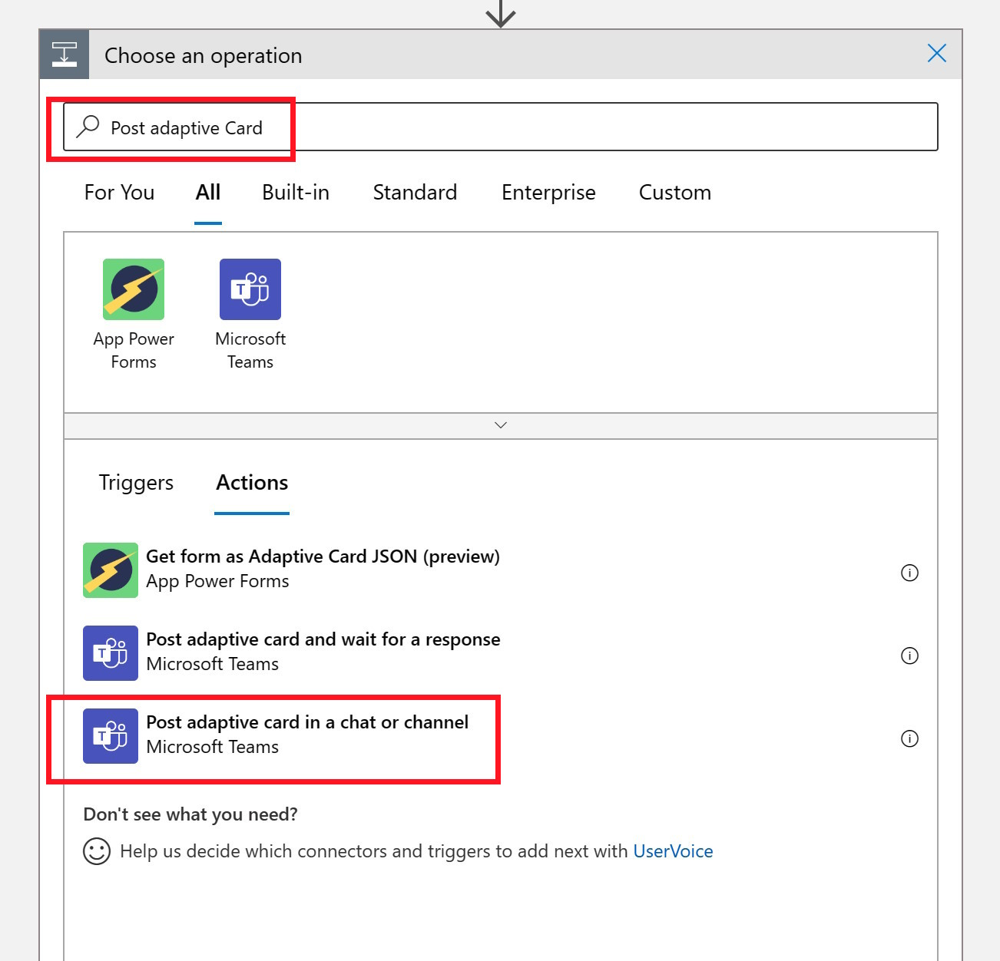
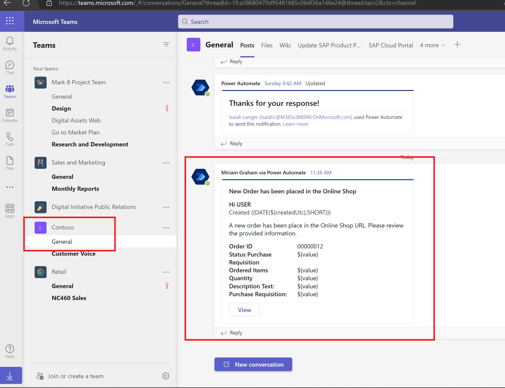

# Quest 1 - Novice's path

[< Quest 0](quest0.md) - **[🏠Home](../README.md)** - [ Quest 2 >](quest2.md)

🌟🌟🌟🌟
🕒 1 h

## Introduction

Throughout the next exercises we will use an Office 365 user, an Azure subscription and some Office 365 tools. In order to make sure that everything is fine, it is best to quickly try and verify all used resources.

### Video
📺 You can find a video of the performed steps [here](https://youtu.be/eoByMm89DH0)

1. Open up your [Office 365 Outlook Inbox](https://outlook.office.com/mail/inbox/). Make sure to authenticate with your Developer Office 365 user, not with your corporate / personal user. One of the last emails in the Inbox should be the invitation email for the Contoso YAAC Azure subscription.

<p align="center" width="100%">

</p>

> **Note**: If you have not done so yet, accept the invite. You will be asked to Accept certain permissions to read your profile. 

2. Open [Microsoft Teams](https://teams.microsoft.com/). When doing that it is best to use the Browser experience (in order not to interfere with any other local Teams and Accounts that you might have installed).

3. Check if you have Excel on-prem installed. Here you do not need to authenticate and it is fine to use the rich-client. In Quest 4 we will connect to an OData service and read data from our Online Store.

> **Note**: if you want you can go to [Office.com](https://www.office.com/?auth=2&home=1) and click on "Install Apps" to run the OfficeSetup.exe which will insatll the rich clients for Excel (and other Office apps)

4. For the last exercise we are going to integrate in [Microsoft Word](https://www.office.com/launch/word?auth=2). You can open and create a Blank document from there.

5. For every participant a resource group in Azure has been created in a central Azure subscription. In order to not interfere with other users, please always make sure that you only operate in the resource group assigned to you. 

> **Note** - To log-on to the [Azure portal](https://portal.azure.com/#home), please use your Microsoft 365 users which has been assigned as a contribute to the central Azure subscription.

Make sure that the Directory shown in the upper right corner of your user says "Contoso YAAC".

<p align="center" width="100%">

</p>

If not switch to this Directory, by clicking on your user, selecting **Switch directory** and then clicking on Switch for the Contoso YAAC Directory.

<p align="center" width="100%">

</p>


## Provision your workflow orchestrator - Azure Logic Apps

1. From the [Azure portal](https://portal.azure.com/#home), use the Search bar at the top, search for **Logic Apps** and click on the Logic Apps under Services.

<p align="center" width="100%">

</p>

2. Click on **+ Add**

<p align="center" width="100%">

</p>

3. Enter the required Logic Apps information

<br>
<div style="margin-left: auto; margin-right: auto; width: 50%">

|Property|Value|
|---|---|
|Resource Group|Select the resource group available to you, e.g. **Developer\<XX>**|
|Logic App Name|Use a unique name, e.g. **Developer\<XX>-OrderItem**|
|Region|Select **North Europe**|
|Plan Type|Select **Consumption**|
</div>

<br>

<p align="center" width="100%">

</p>

4. Click on **Review + Create**/ **Create**

5. Once the creation is done, click on **Go to resource**

<p align="center" width="100%">

</p>

## Design your workflow in Azure Logic Apps

### Setting up the Flow

1. On the welcome screen, select **When a HTTP request is received**. In the first step we will trigger the Logic Apps flow manually, but later on the SAP system can trigger the request automatically when a new order has been created in the Online Shop.

<p align="center" width="100%">

</p>

> **Note** - Sometimes it takes a long time to load the Logic Apps Designer for the first time. If this happens, just click on **Refresh** on your browser. 

> **Note** - Please start by switching back to the "old" Canvas to ensure consistency with the following screenshots.

<p align="center" width="100%">

</p>


2. Click on **+ New Step**

<p align="center" width="100%">

</p>

3. Search for and select **SAP** in the **Choose an operations** box.

<p align="center" width="100%">

</p>
 
4. Select **[RFC] Call function in SAP (preview)**, select the on-prem data Gateway system and also provide the SAP System detail information as mentioned below.

<p align="center" width="100%">

</p>

5. Create the Connection using the following values.

<br>
<div style="margin-left: auto; margin-right: auto; width: 50%">

|Property|Value|
|---|---|
|Connection name|Use a unique name, e.g. **Dev\<XX>-SAPConnection**|
|Connection Gateway|Select **AKDevelopmentWithJohnWin4**|
|Client|**100**|
|SAP Username|**Developer\<XX>**|
|SAP Password|**\<YourPassword>**|
|AS Host|**10.0.0.34**|
|AS Service|**3200**|
|AS System Number|**00**|
</div>

<br>

<p align="center" width="100%">

</p>

6. Click on **Create**
 
7. Click on the **Add new parameter** drop down and select **RFC Filter Group**
1. 
> **Note** - You need to click "somewhere" else so that the dialog box closes.

<p align="center" width="100%">

</p>

> **Warning** - Fetching all the filter groups from the SAP system **may take some time**. Use "Enter Custom Value" to enter the technical name **Z_ONLINESHOP_MSF:msf**.

<p align="center" width="100%">

</p>

8. Enter the Filter group name **Z_ONLINESHOP_MSF:msf**

<p align="center" width="100%">

</p>

9. From the RFC Name field, select the RFC  **ZF_RFC_ONLINESHOP_GET_ORDER:order:Z_ONLINESHOP_MSF**. 

<p align="center" width="100%">

</p>

10. As a first step we want to lookup a specific Order ID by **IM_ORDER** number. For the first test, enter Order ID 12 (feel free to select a number of an order that you have previously created!)

```xml
<ZF_RFC_ONLINESHOP_GET_ORDER xmlns="http://Microsoft.LobServices.Sap/2007/03/Rfc/">
<IM_ORDER>       12</IM_ORDER>
</ZF_RFC_ONLINESHOP_GET_ORDER>
```

> **Warning** - watch out for the leading spaces in the XML payload.

<p align="center" width="100%">

</p>

> **Note** - See [How to create the Logic App Content](LogicAppContent.md) for more details on how to construct the XML payload for the RFC request in Logic Apps

11. From the top of the flow click on **Save** and **Run Trigger** to execute the Flow.

<p align="center" width="100%">

</p>

12. As a result you will see the OrderID and some additional information coming back from the SAP System.

<p align="center" width="100%">

</p>

13. Copy results from the Json Response to your Clipboard. We will use it in the next steps.

```json
{
  "EM_ORDER": [
    {
      "CLIENT": "",
      "ORDERUUID": "44g8idhTHt2oxgLO5ZOh1w==",
      "ORDERID": "00000012",
      "ORDEREDITEM": "Laptop",
      "PURCHASEREQN": "0010001417",
      "PRSTATUS": "In Process",
      "CREATED_AT": 0,
      "CREATED_BY": "",
      "LAST_CHANGED_BY": "",
      "LAST_CHANGED_AT": 0,
      "LOCAL_LAST_CHANGED_AT": 0
    }
  ]
}
```

### Working with the results from SAP

1. With the results from the RFC call, we can now take this data and use it to publish to Teams. Click on **Designer** to return to the Logic Apps Designer view. 

<p align="center" width="100%">

</p>

2. The first step is that we need to parse the results from the RFC call. Click on the **+ New Step**

<p align="center" width="100%">

</p>

2. Type **Parse JSON** and select the Parse JSON Action.

<p align="center" width="100%">

</p>

3. Select the *Content Field* and from the Dynamic content pane on the right select **JsonResponse** Then click on **Use sample payload to generate schema**. This allows us to leverage the output of the RFC call from the SAP system and generate a Schema directly out of it.

<p align="center" width="100%">

</p>

4. Next we can paste the sample payload from the first run.

```json
{
  "EM_ORDER": [
    {
      "CLIENT": "",
      "ORDERUUID": "44g8idhTHt2oxgLO5ZOh1w==",
      "ORDERID": "00000012",
      "ORDEREDITEM": "Laptop",
      "PURCHASEREQN": "0010001417",
      "PRSTATUS": "In Process",
      "CREATED_AT": 0,
      "CREATED_BY": "",
      "LAST_CHANGED_BY": "",
      "LAST_CHANGED_AT": 0,
      "LOCAL_LAST_CHANGED_AT": 0
    }
  ]
}
```

<p align="center" width="100%">

</p>

5. The Parse JSON Action should now look like this:

<p align="center" width="100%">

</p>

### Create Adaptive Card in Teams

1. In order to create an Adaptive Card to Teams, we now need to add another Action. As before, click on **+ New Step** and search for **Post adaptive card**. Select the **Post adaptive card in a chat or channel**

<p align="center" width="100%">

</p>

2. Click on the **Sign-In** button, to Sign-in with your Office 365 user in Teams

<p align="center" width="100%">

</p>

3. Select your User and Authenticate

<p align="center" width="100%">

</p>

4. In the **Post in** drop-down select **Channel**

<p align="center" width="100%">

</p>

> **Note**: Please make sure to select the value from the drop-down. Don't type it in!

5. Select a Team and Channel (just remember which combination you selected)

<p align="center" width="100%">

</p>

6. For convenience, leverage below json created with the [Adaptive Card Designer](https://www.adaptivecards.io/designer/) and paste the content into the respective field.

⤵️AdaptiveCard code block

```json
{
    "type": "AdaptiveCard",
    "body": [
        {
            "type": "TextBlock",
            "size": "Medium",
            "weight": "Bolder",
            "text": "New Order has been placed in the Online Shop"
        },
        {
            "type": "ColumnSet",
            "columns": [
                {
                    "type": "Column",
                    "items": [
                        {
                            "type": "TextBlock",
                            "weight": "Bolder",
                            "text": "Hi, ",
                            "wrap": true
                        }
                    ],
                    "width": "stretch"
                }
            ]
        },
        {
            "type": "TextBlock",
            "text": "A new order has been placed in the Online Shop URL. Please review the provided information. ",
            "wrap": true
        },
        {
            "type": "FactSet",
            "facts": [
                {
                    "title": "Order ID",
                    "value": "${value}"
                },
                {
                    "title": "Status Purchase Requisition",
                    "value": "${value}"
                },
                {
                    "title": "Ordered Items",
                    "value": "${value}"
                },
                {
                    "title": "Quantity",
                    "value": "${value}"
                },
                {
                    "title": "Description Text: ",
                    "value": "${value}"
                },
                {
                    "title": "Purchase Requisition: ",
                    "value": "${value}"
                }
            ]
        }
    ],
    "actions": [
        {
            "type": "Action.OpenUrl",
            "title": "View",
            "url": "URL"
        }
    ],
    "$schema": "http://adaptivecards.io/schemas/adaptive-card.json",
    "version": "1.3"
}
```


<p align="center" width="100%">

</p>

> **Note** - Feel free to switch over to the Adaptive Card Designer and create your own Adaptive Card. Just make sure that you have several "placeholder" for Order ID, Status Purchase Requisition, Ordered Items and Purchase Requisition. 

7. The adaptive Card has some hard coded "placeholder" in it. Find the place for **Order ID** and replace the **${value}** with the Dynamic Content from the Parsed JSON response from the SAP System.

Do the same for the other properties (we are not yet updating Description Text or Quantity since these values are not returned by the RFC).

* Order ID -> **ORDERID**
* Status Purchase Requisition -> **PRSTATUS**
* Ordered Items -> **ORDEREDITEM**
* Purchase Requisition -> **PURCHASEREQN**

<br>

<p align="center" width="100%">

</p>

> **Note** - You might have seen that when adding the first OrderID dynamic variable, the Adaptive Card was put in a **For each** loop. That is because the schema of the resulting Json returns an array and potentially we could get multiple Orders back when filtering for a specific Order ID. 

<p align="center" width="100%">

</p>

8. **Save** and Run* the Logic App flow again via **Run Trigger** -> **Run**. As a result you should see an Adaptive Card in [Teams](https://teams.microsoft.com/) showing the information from the Order specified (make sure to navigate to your Teams Channel, e.g. Contoso -> General)

<p align="center" width="100%">

</p>

> **Note** - If not all properties are shown, go back to the Teams action in the Logic Apps and validate the configuration.

> **Note** - You can find a template for the Logic App flow for Quest 1 (you still need to adjust to your specific SAP Connector and Teams connection):

<br>
<details><summary><strong>⤵️Block for the full Logic App Code for Quest 1</strong></summary>

```json
{
    "definition": {
        "$schema": "https://schema.management.azure.com/providers/Microsoft.Logic/schemas/2016-06-01/workflowdefinition.json#",
        "actions": {
            "For_each": {
                "actions": {
                    "Post_adaptive_card_in_a_chat_or_channel": {
                        "inputs": {
                            "body": {
                                "messageBody": "{\n    \"type\": \"AdaptiveCard\",\n    \"body\": [\n        {\n            \"type\": \"TextBlock\",\n            \"size\": \"Medium\",\n            \"weight\": \"Bolder\",\n            \"text\": \"New Order has been placed in the Online Shop\"\n        },\n        {\n            \"type\": \"ColumnSet\",\n            \"columns\": [\n                {\n                    \"type\": \"Column\",\n                    \"items\": [\n                        {\n                            \"type\": \"TextBlock\",\n                            \"weight\": \"Bolder\",\n                            \"text\": \"Hi, \",\n                            \"wrap\": true\n                        }\n                    ],\n                    \"width\": \"stretch\"\n                }\n            ]\n        },\n        {\n            \"type\": \"TextBlock\",\n            \"text\": \"A new order has been place in the Online Shop URL. Please review the provided information. \",\n            \"wrap\": true\n        },\n        {\n            \"type\": \"FactSet\",\n            \"facts\": [\n                {\n                    \"title\": \"Order ID\",\n                    \"value\": \"@{items('For_each')?['ORDERID']}\"\n                },\n                {\n                    \"title\": \"Status Purchase Requisition\",\n                    \"value\": \"@{items('For_each')?['PRSTATUS']}\"\n                },\n                {\n                    \"title\": \"Ordered Items\",\n                    \"value\": \"@{items('For_each')?['ORDEREDITEM']}\"\n                },\n                {\n                    \"title\": \"Quantity\",\n                    \"value\": \"${value}\"\n                },\n                {\n                    \"title\": \"Description Text: \",\n                    \"value\": \"${value}\"\n                },\n                {\n                    \"title\": \"Purchase Requisition: \",\n                    \"value\": \"@{items('For_each')?['PURCHASEREQN']}\"\n                }\n            ]\n        }\n    ],\n    \"actions\": [\n        {\n            \"type\": \"Action.OpenUrl\",\n            \"title\": \"View\",\n            \"url\": \"URL\"\n        }\n    ],\n    \"$schema\": \"http://adaptivecards.io/schemas/adaptive-card.json\",\n    \"version\": \"1.3\"\n}",
                                "recipient": {
                                    "channelId": "19:a38680470d95481685c064f36a146e24@thread.tacv2",
                                    "groupId": "c1eedb2a-3a35-4f0e-98e3-898c2d5e907c"
                                }
                            },
                            "host": {
                                "connection": {
                                    "name": "@parameters('$connections')['teams']['connectionId']"
                                }
                            },
                            "method": "post",
                            "path": "/v1.0/teams/conversation/adaptivecard/poster/Flow bot/location/@{encodeURIComponent('Channel')}"
                        },
                        "runAfter": {},
                        "type": "ApiConnection"
                    }
                },
                "foreach": "@body('Parse_JSON')?['EM_ORDER']",
                "runAfter": {
                    "Parse_JSON": [
                        "Succeeded"
                    ]
                },
                "type": "Foreach"
            },
            "Parse_JSON": {
                "inputs": {
                    "content": "@body('[RFC]_Call_function_in_SAP')?['JsonResponse']",
                    "schema": {
                        "properties": {
                            "EM_ORDER": {
                                "items": {
                                    "properties": {
                                        "CLIENT": {
                                            "type": "string"
                                        },
                                        "CREATED_AT": {
                                            "type": "integer"
                                        },
                                        "CREATED_BY": {
                                            "type": "string"
                                        },
                                        "LAST_CHANGED_AT": {
                                            "type": "integer"
                                        },
                                        "LAST_CHANGED_BY": {
                                            "type": "string"
                                        },
                                        "LOCAL_LAST_CHANGED_AT": {
                                            "type": "integer"
                                        },
                                        "ORDEREDITEM": {
                                            "type": "string"
                                        },
                                        "ORDERID": {
                                            "type": "string"
                                        },
                                        "ORDERUUID": {
                                            "type": "string"
                                        },
                                        "PRSTATUS": {
                                            "type": "string"
                                        },
                                        "PURCHASEREQN": {
                                            "type": "string"
                                        }
                                    },
                                    "required": [
                                        "CLIENT",
                                        "ORDERUUID",
                                        "ORDERID",
                                        "ORDEREDITEM",
                                        "PURCHASEREQN",
                                        "PRSTATUS",
                                        "CREATED_AT",
                                        "CREATED_BY",
                                        "LAST_CHANGED_BY",
                                        "LAST_CHANGED_AT",
                                        "LOCAL_LAST_CHANGED_AT"
                                    ],
                                    "type": "object"
                                },
                                "type": "array"
                            }
                        },
                        "type": "object"
                    }
                },
                "runAfter": {
                    "[RFC]_Call_function_in_SAP": [
                        "Succeeded"
                    ]
                },
                "type": "ParseJson"
            },
            "[RFC]_Call_function_in_SAP": {
                "inputs": {
                    "body": "<ZF_RFC_ONLINESHOP_GET_ORDER xmlns=\"http://Microsoft.LobServices.Sap/2007/03/Rfc/\">\n<IM_ORDER>       10</IM_ORDER>\n</ZF_RFC_ONLINESHOP_GET_ORDER>",
                    "host": {
                        "connection": {
                            "name": "@parameters('$connections')['sap']['connectionId']"
                        }
                    },
                    "method": "post",
                    "path": "/CallRfc",
                    "queries": {
                        "autoCommit": false,
                        "rfcGroupFilter": "Z_ONLINESHOP_MSF:msf",
                        "rfcName": "ZF_RFC_ONLINESHOP_GET_ORDER:order:Z_ONLINESHOP_MSF"
                    }
                },
                "runAfter": {},
                "type": "ApiConnection"
            }
        },
        "contentVersion": "1.0.0.0",
        "outputs": {},
        "parameters": {
            "$connections": {
                "defaultValue": {},
                "type": "Object"
            }
        },
        "triggers": {
            "manual": {
                "inputs": {
                    "schema": {}
                },
                "kind": "Http",
                "type": "Request"
            }
        }
    },
    "parameters": {
        "$connections": {
            "value": {
                "sap": {
                    "connectionId": "/subscriptions/22a9ba10-8328-4f21-baeb-50728288a33c/resourceGroups/Developer103/providers/Microsoft.Web/connections/sap",
                    "connectionName": "sap",
                    "id": "/subscriptions/22a9ba10-8328-4f21-baeb-50728288a33c/providers/Microsoft.Web/locations/northeurope/managedApis/sap"
                },
                "teams": {
                    "connectionId": "/subscriptions/22a9ba10-8328-4f21-baeb-50728288a33c/resourceGroups/Developer103/providers/Microsoft.Web/connections/teams",
                    "connectionName": "teams",
                    "id": "/subscriptions/22a9ba10-8328-4f21-baeb-50728288a33c/providers/Microsoft.Web/locations/northeurope/managedApis/teams"
                }
            }
        }
    }
}
```

</details>
<br>


## Where to next?

[< The Journey](quest0.md) - **[🏠Home](../README.md)** - [ Quest 2 >](quest2.md)

[🔝](#)
