# Quest 2 - Apprentice's curious road

[< Quest 1](quest1.md) - **[🏠Home](../README.md)** - [ Quest 3 >](quest3.md)

🌟🌟🌟
🕒 45 mins

Now that we have the Logic App in place to fetch data from the SAP system and create an Adaptive Card in Teams, we want to trigger this flow automatically from the SAP System once a new order is placed in the Online Shop.

For this the SAP System is enhanced using the Azure ABAP SDK to react on the custom event triggered by the Online Shop. This event will be sent out by the ABAP SDK for Azure and sent to an Azure Service Bus. From there our Logic App from Quest 1 can be triggered.

## Video guide provided by our Mentors

<p align="center" width="100%">
    <a href="https://youtu.be/mWGLkkER5cM" target="_blank" rel="noopener noreferrer">
        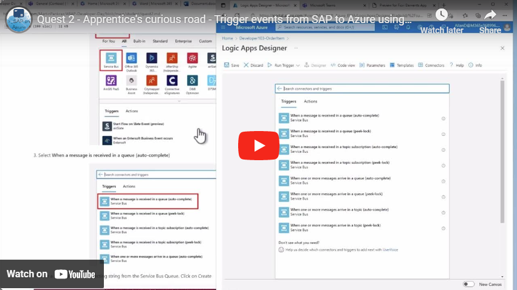
    </a>
</p>

The video shall provide hints where lore, poetic code snippets, and narrative cannot.

## Create a Queue in Azure Service Bus

1. Search from the [Azure Portal](https://portal.azure.com/) for **ServiceBusForSAPOnlineShop** and select the Service Bus

<p align="center" width="100%">
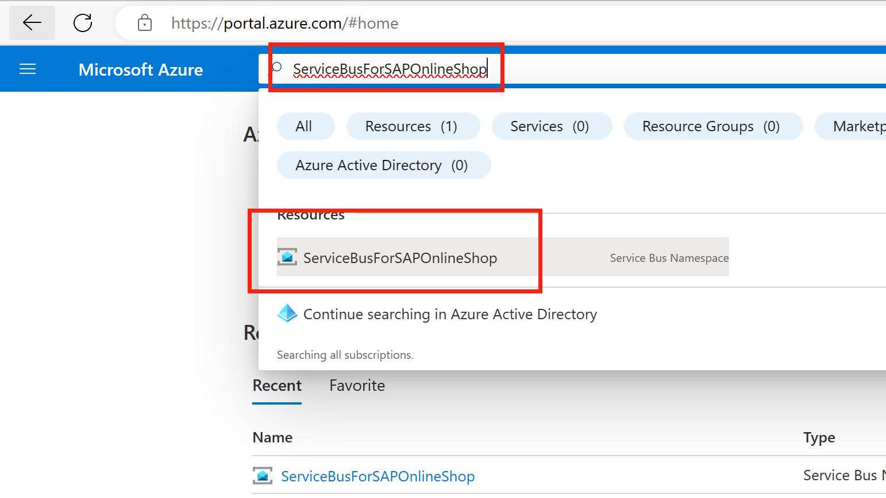
</p>

2. Create a new Queue by clicking on **+ Queue** and enter a Queue name, like **Developer\<XX>** and click on **Create**

<p align="center" width="100%">
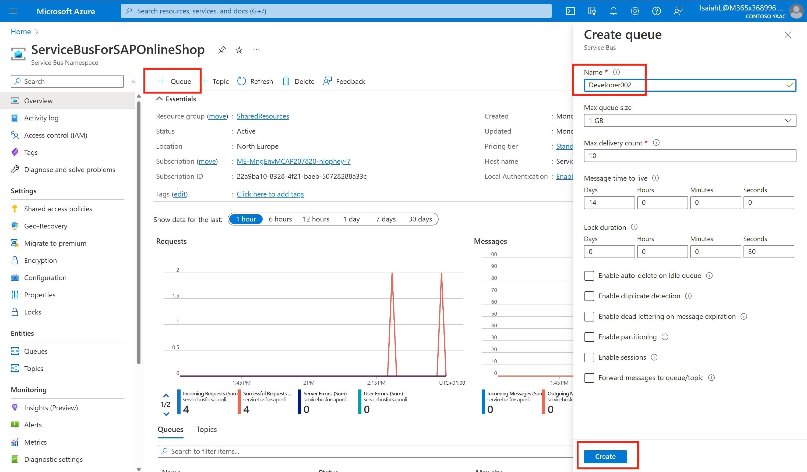
</p>

3. When you scroll down you can see the Queue that was created. 

<p align="center" width="100%">
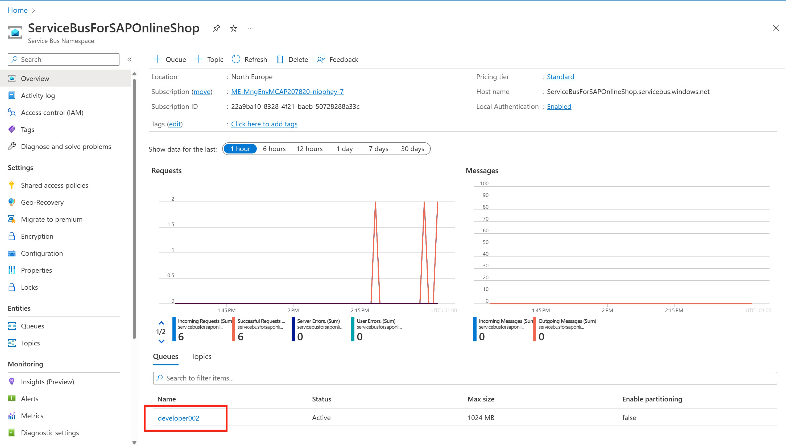
</p>

## Create a Event Subscription in Azure Event Grid
📺 [Jump to the video](https://youtu.be/mWGLkkER5cM?t=38)


1. Similar like before, in the Azure Portal search for **EventsFromOnlineShop** and select the **Event Grid**

<p align="center" width="100%">

</p>

2. Click on **+ Event Subscription** and create a new subscription for the Event Grid

<p align="center" width="100%">
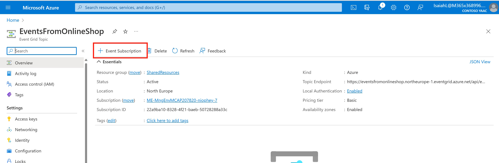
</p>

3. Start entering the details like, subscription name (**Developer<XX>Subscription**) and select **Azure Service Bus Queue** as the Endpoint Type. 

<p align="center" width="100%">

</p>

4. Click on **Select an endpoint** and make sure to select the Service Bus Queue for your Developer\<XX> previous created. Then click on **Confirm Selection**. 

<p align="center" width="100%">
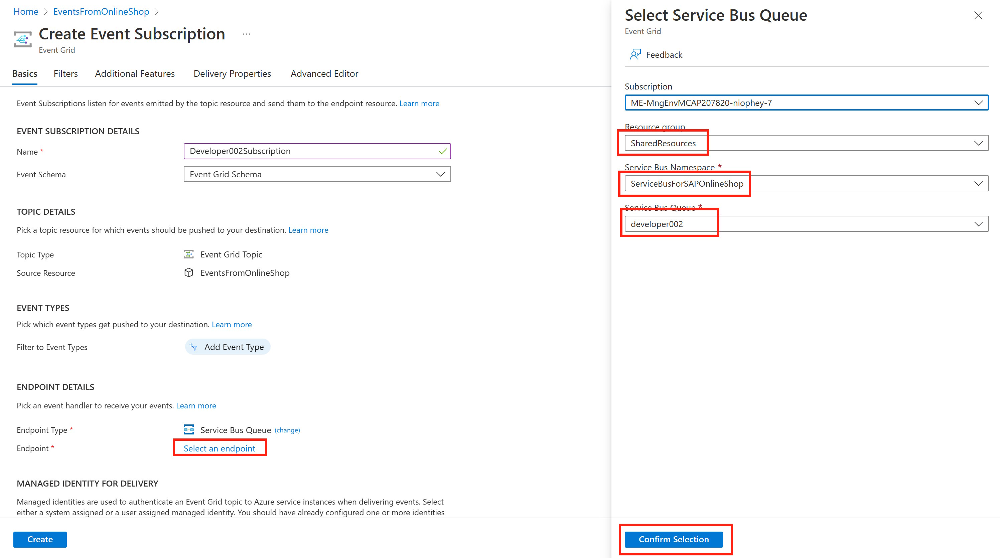
</p>

5. Click on the **Filter** tab and click on **Add new filter**

<p align="center" width="100%">
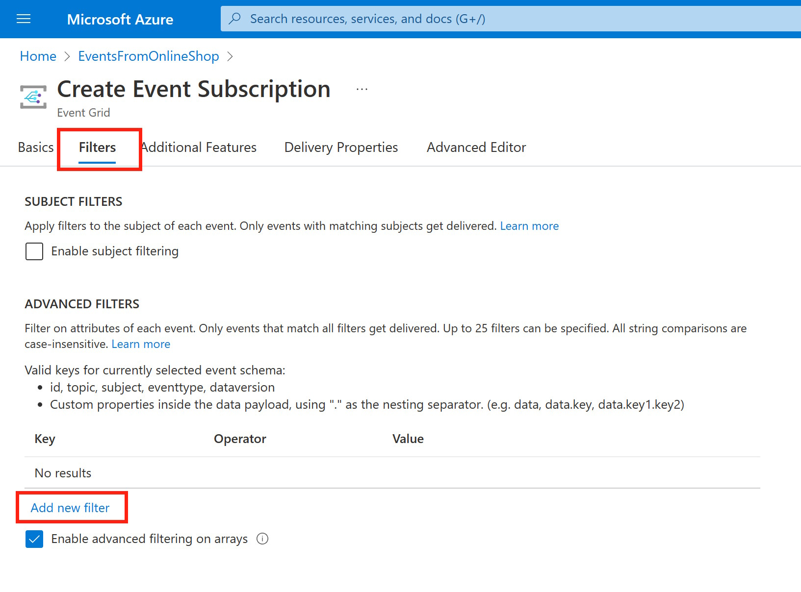
</p>

6. For the filter, enter **data.createdby**, select **Contains ins** and click **Add new values**

<p align="center" width="100%">
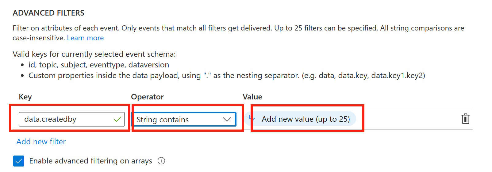
</p>

7) Enter your SAP user, e.g. **Developer\<XX>** and click on **Create**

<p align="center" width="100%">
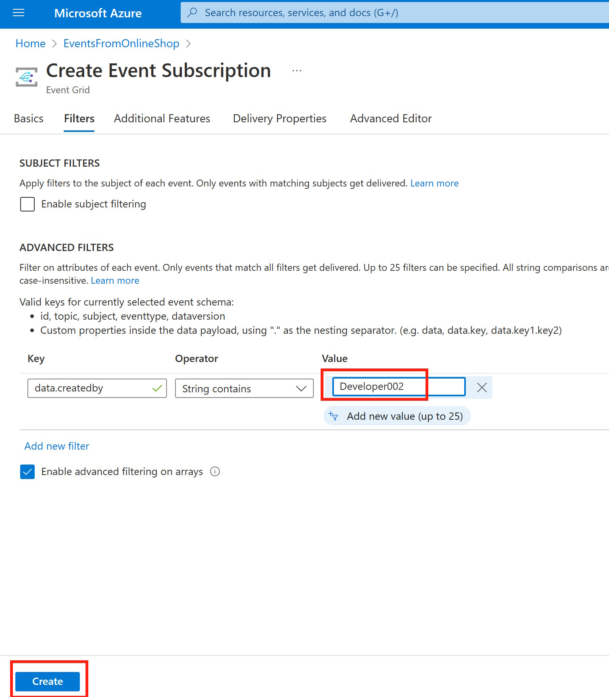
</p>

### Test
📺 [Jump to the video](https://youtu.be/mWGLkkER5cM?t=119)

Now events from the SAP system should be sent to the Service Bus Queue whenever a new Order is created in the Online Shop. Head over to the [Online Shop](https://13.81.170.205:44301/sap/bc/adt/businessservices/odatav4/feap?feapParams=C%C2%87u%C2%84C%C2%83%C2%84%C2%89C%C2%83xu%C2%88uHC%C2%87u%C2%84C%C2%8E%C2%89%7Ds%C2%83%C2%82%C2%80%7D%C2%82y%C2%87%7C%C2%83%C2%84s%C2%81%C2%87Es%C2%83HC%C2%87%C2%86%C2%8AxC%C2%87u%C2%84C%C2%8E%C2%89%7Ds%C2%83%C2%82%C2%80%7D%C2%82y%C2%87%7C%C2%83%C2%84s%C2%81%C2%87ECDDDEC77c%C2%82%C2%80%7D%C2%82ysg%7C%C2%83%C2%84777777ni%5Dscb%60%5DbYg%5CcdsagE77DDDE77ni%5Dscb%60%5DbYg%5CcdsagEscH&sap-ui-language=EN&sap-client=100) create a new Order and check for incoming events.

The easiest way is to search for **EventsFromOnlineShop** and select your Event Subscription (e.g. **Developer\<XX>Subscription**) from the bottom of the page.

<p align="center" width="100%">
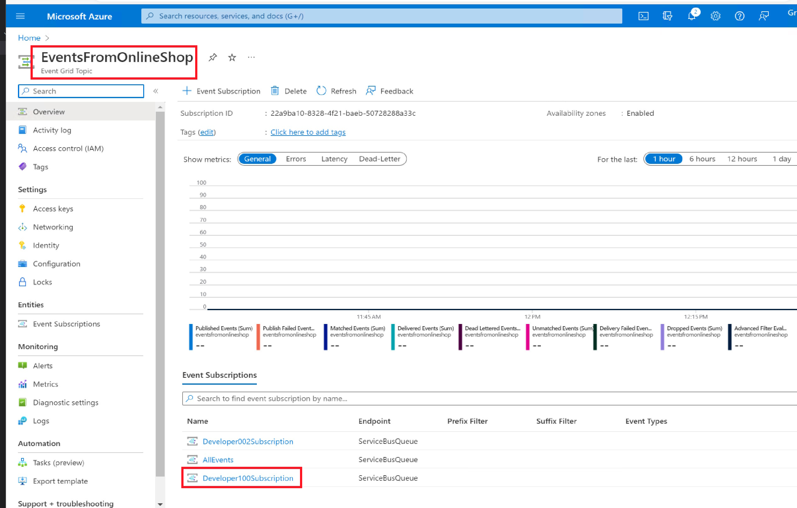
</p>

if the event is not yet shown, click on your Service Bus Queue (e.g. **Developer\<XX>** at the bottom 

<p align="center" width="100%">
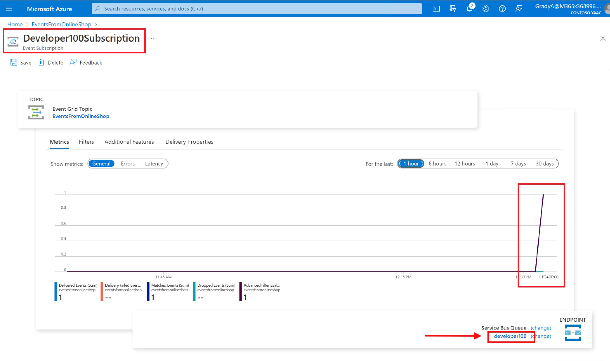
</p>

Now you can peek in the Service Bus Queue by selecting **Service Bus Explorer** on the left, click on **Peek from start** and select the latest entry from the Sequence Number list. In the Message Body you can then see the event from the Online Store. 

<p align="center" width="100%">
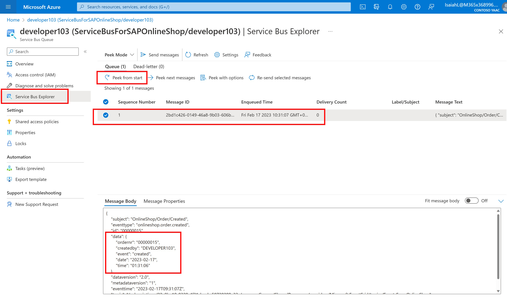
</p>

## Connect the event to our Logic App
📺 [Jump to the video](https://youtu.be/mWGLkkER5cM?t=199)

1. Now we need to change the configuration of our Logic App to react to incoming events in the Service Bus Queue. Open the Logic App created in Quest 1 and **delete** the first Trigger / Action (**When a HTTP request is received**)

<p align="center" width="100%">
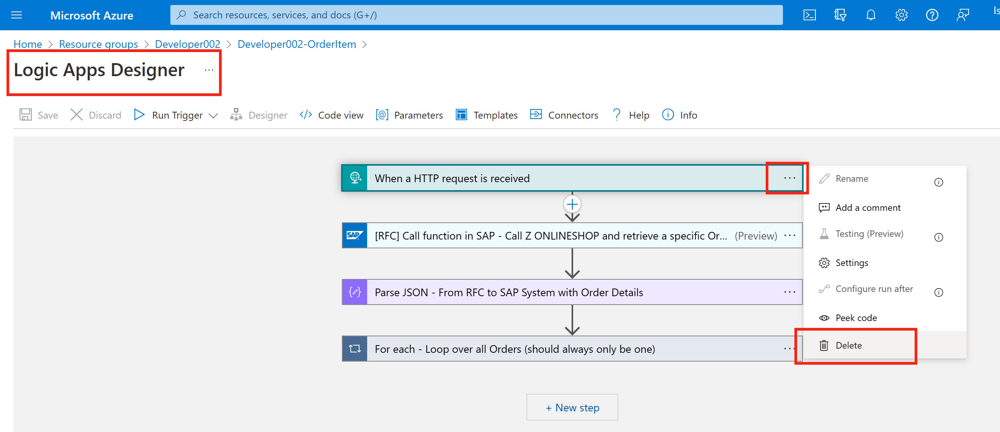
</p>

> **Note**: An easy way to navigate back to your Logic App is to search for **Developer<XX>-OrderItem** in the Search bar on the top and then selecting the **Logic app designer** view in the navigation on the left.

2. Search for **Service Bus** and select the new Trigger action **Service Bus**

<p align="center" width="100%">
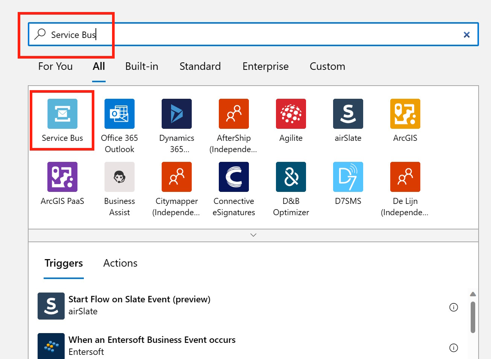
</p>

3. Select **When a message is received in a queue (auto-complete)**

<p align="center" width="100%">
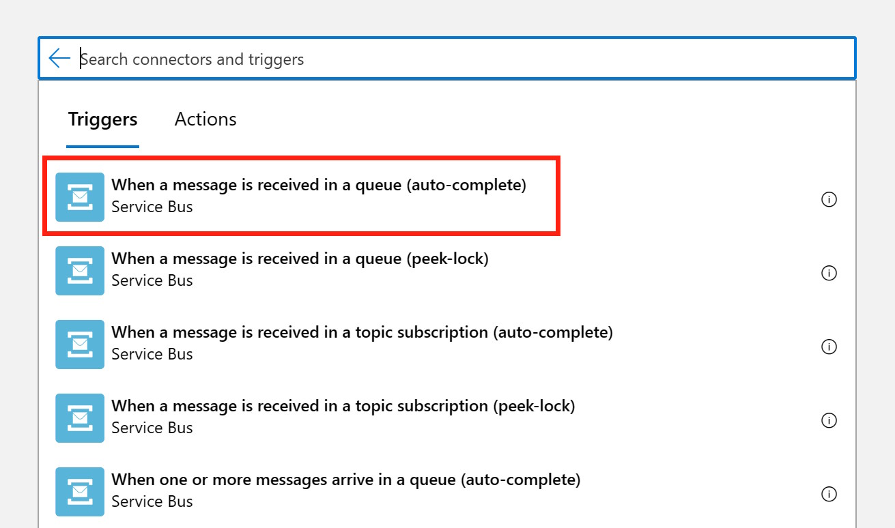
</p>

4. Enter a name (e.g. **Trigger from Online Shop**) and the Connecting string (see below) from the Service Bus Queue. Click on **Create**

```http
Endpoint=sb://servicebusforsaponlineshop.servicebus.windows.net/;SharedAccessKeyName=RootManageSharedAccessKey;SharedAccessKey=cIcJZtV87fyvpldm78OVcABI8LSw7QxRI+ASbCrll/w=
```

<p align="center" width="100%">
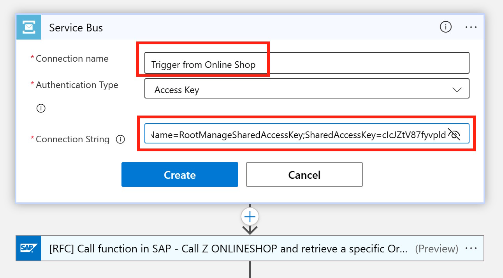
</p>

> **Note** - the Connection string can be retrieved from

<p align="center" width="100%">
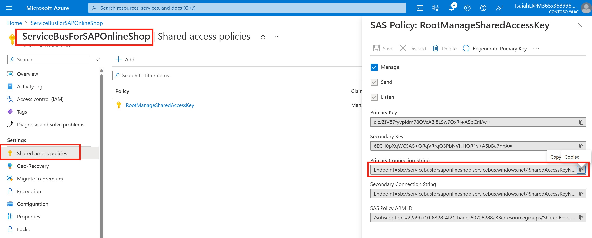
</p>

5. Select the Queue name that you previously created (e.g. **developer\<xx>**).

<p align="center" width="100%">
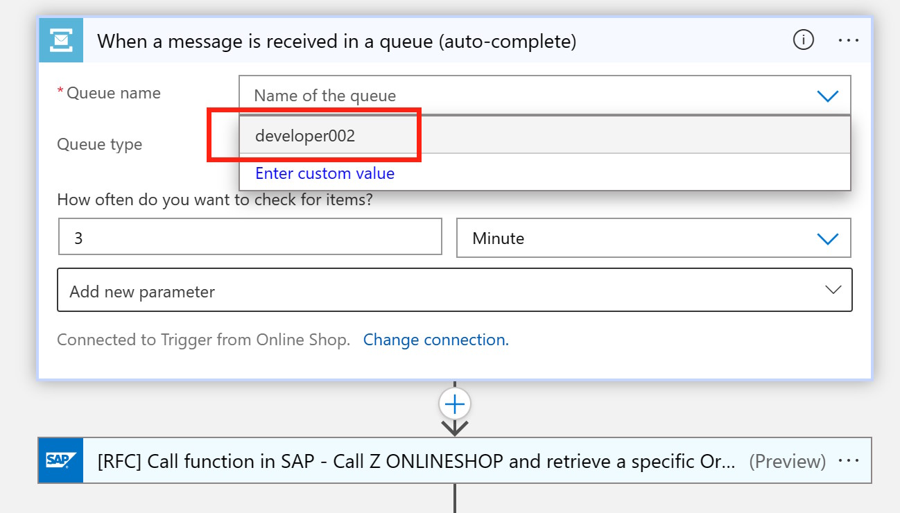
</p>

6. Add another action

<p align="center" width="100%">
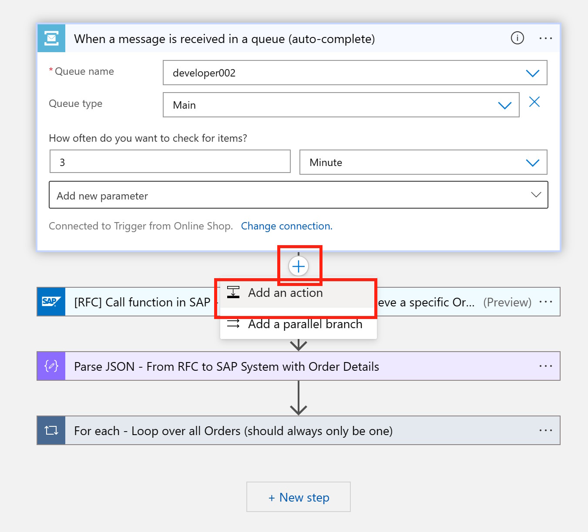
</p>

7. Search for **Initialize variable** and add **Initialize Variable**

<p align="center" width="100%">
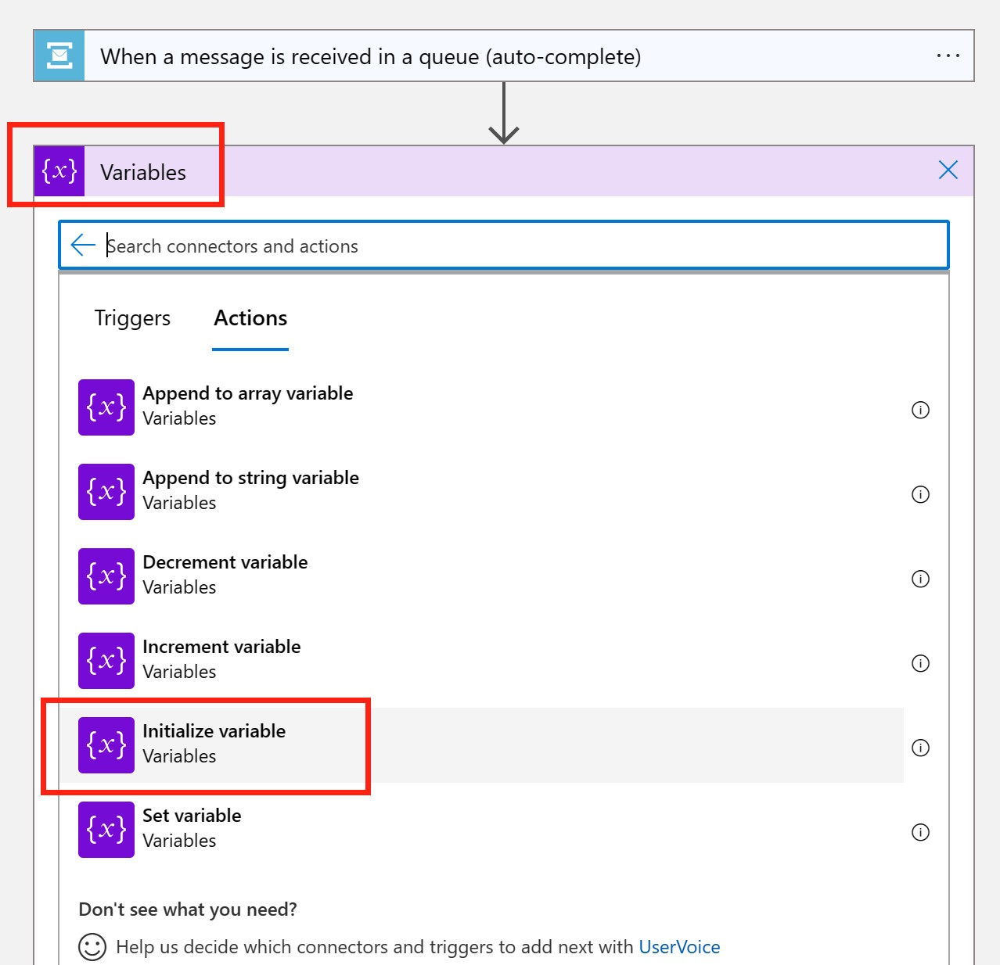
</p>

8. Provide a Name, e.g. **Message Content** and for the value use the **Content** from the incoming Service Bus request. Then make sure to change the type from Boolean to **String**

<p align="center" width="100%">
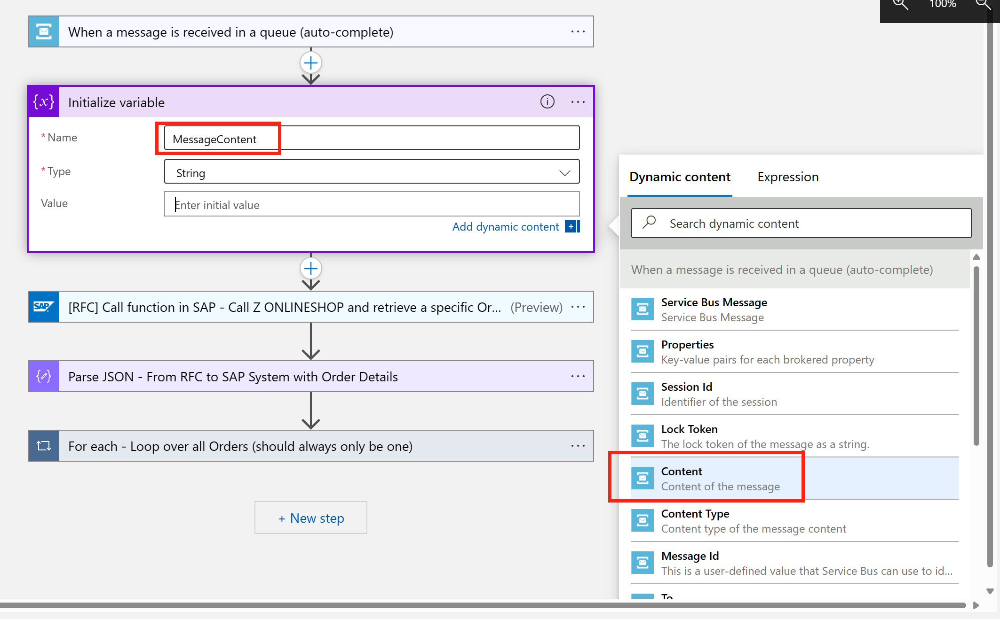
</p>

9. As before click on the "+" to add a **Parse Json** action

<p align="center" width="100%">
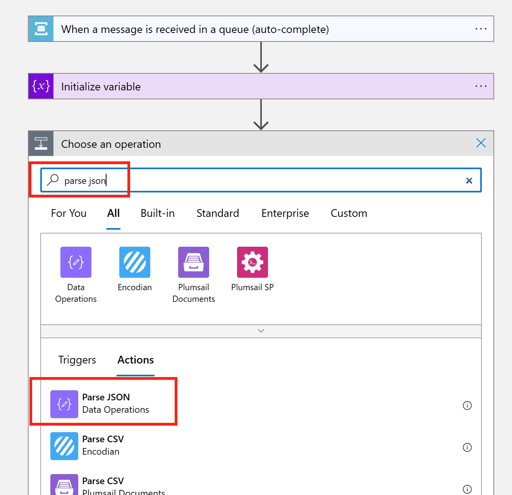
</p>

10. Use the previously initialized variable (e.g. **Message Content**) and use the Schema from below.

<p align="center" width="100%">
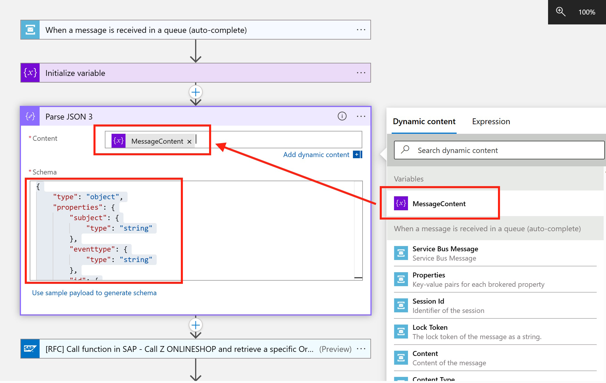
</p>

JSON schema code block

```json
{
    "type": "object",
    "properties": {
        "subject": {
            "type": "string"
        },
        "eventtype": {
            "type": "string"
        },
        "id": {
            "type": "string"
        },
        "data": {
            "type": "object",
            "properties": {
                "ordernr": {
                    "type": "string"
                },
                "createdby": {
                    "type": "string"
                },
                "event": {
                    "type": "string"
                },
                "date": {
                    "type": "string"
                },
                "time": {
                    "type": "string"
                }
            }
        },
        "dataversion": {
            "type": "string"
        },
        "metadataversion": {
            "type": "string"
        },
        "eventtime": {
            "type": "string"
        },
        "topic": {
            "type": "string"
        }
    }
}
```


11. In the next step to call the RFC, replace the hard-coded order Nr with the **ordernr** field from the parsed message body. 

<p align="center" width="100%">
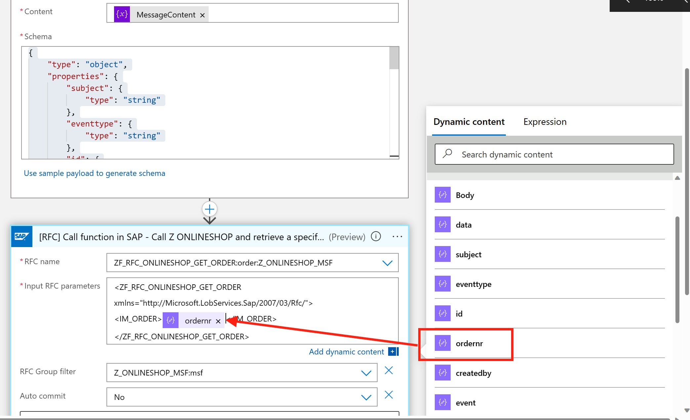
</p>

> **Note**: You might need to expand the properties from the Parse Json response.

<p align="center" width="100%">

</p>

12. Click on **Save** to save the Logic Apps

### Test it!
📺 [Jump to the video](https://youtu.be/mWGLkkER5cM?t=388)


1. Open up again the [Online Shop](https://13.81.170.205:44301/sap/bc/adt/businessservices/odatav4/feap?feapParams=C%C2%87u%C2%84C%C2%83%C2%84%C2%89C%C2%83xu%C2%88uHC%C2%87u%C2%84C%C2%8E%C2%89%7Ds%C2%83%C2%82%C2%80%7D%C2%82y%C2%87%7C%C2%83%C2%84s%C2%81%C2%87Es%C2%83HC%C2%87%C2%86%C2%8AxC%C2%87u%C2%84C%C2%8E%C2%89%7Ds%C2%83%C2%82%C2%80%7D%C2%82y%C2%87%7C%C2%83%C2%84s%C2%81%C2%87ECDDDEC77c%C2%82%C2%80%7D%C2%82ysg%7C%C2%83%C2%84777777ni%5Dscb%60%5DbYg%5CcdsagE77DDDE77ni%5Dscb%60%5DbYg%5CcdsagEscH&sap-ui-language=EN&sap-client=100)

<p align="center" width="100%">
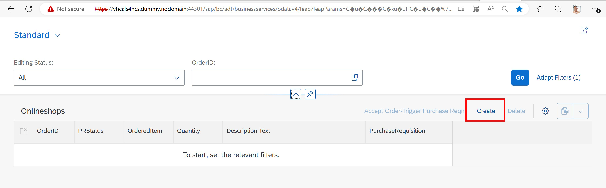
</p>

2. Fill in the required properties and click on **Create**

<p align="center" width="100%">
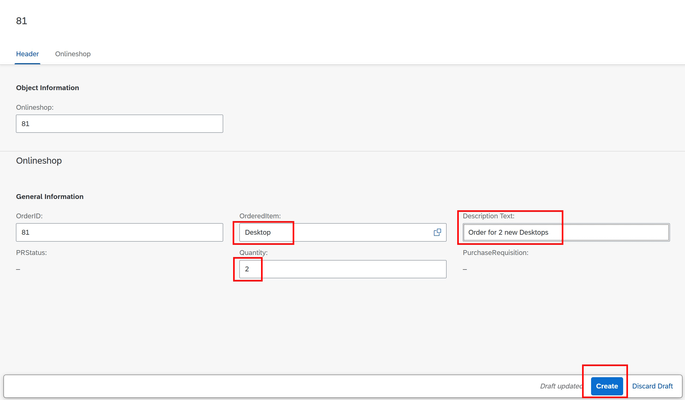
</p>

3. As soon as you click on create, head over to [Teams](https://teams.microsoft.com/) and check your channel. You should now see the Adaptive Card with your Order Item

<p align="center" width="100%">
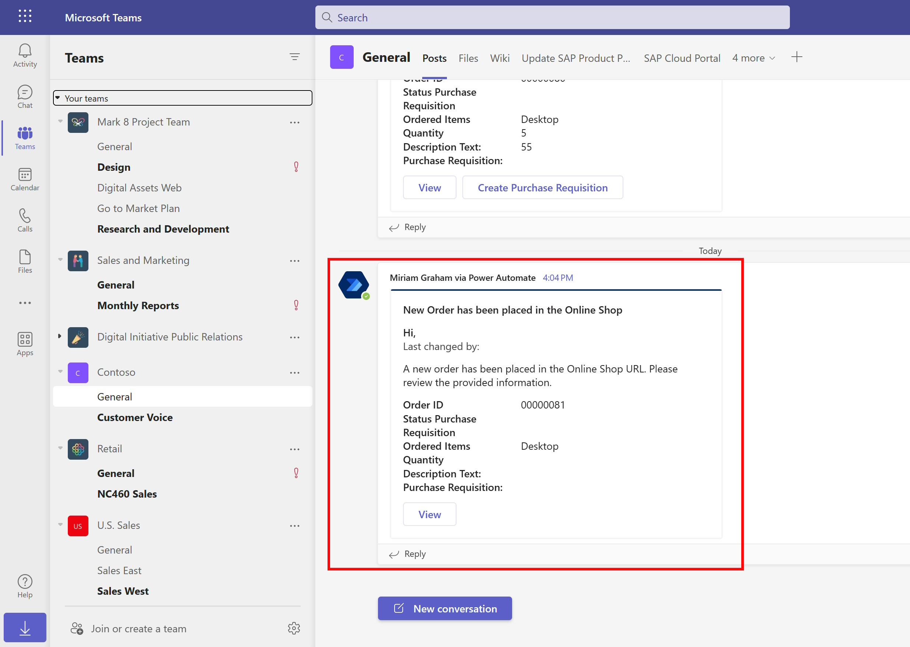
</p>

> **Note**: Sometimes it can take a minute before the adaptive card shows up. Feel free to check the incoming event like in the Test before or check the behind the scenes from below. 

#### Behind the scene

1. When you go back to your the Azure Event Grid Topic (search for **EventsFromOnlineShop**), you can see the Event coming via the ABAP SDK for Azure when a new Order is crated in the Online Shop. At the bottom you can also see the Subscription, that you had created for this event. 

<p align="center" width="100%">
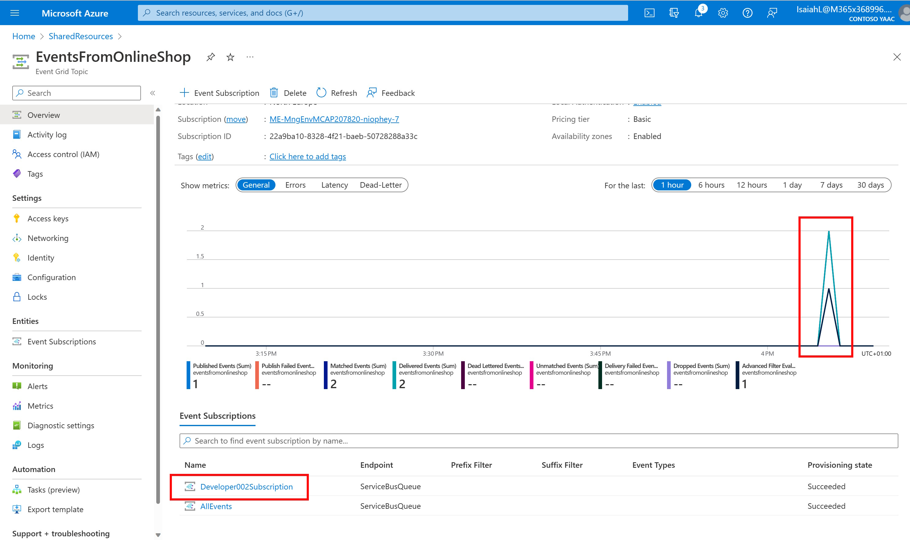
</p>

> **Note**: Since we have multiple users working on the same Online Shop, you will most likely see lots of different events coming in. 

2. In this subscription we had specified a filter for your Online Shop user, that would put incoming events into an Service Bus Queue. 

<p align="center" width="100%">
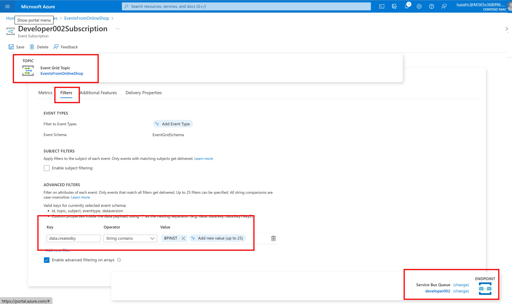
</p>

3. Once an event is in this queue, we had created a Logic Apps trigger, that kicks off your specific flow to post an adaptive card in Teams. Open up your Logic App again and click on Run History. 

<p align="center" width="100%">
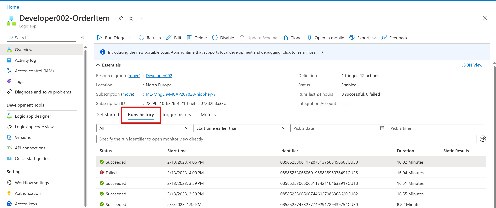
</p>

4. From there you can see the previous runs of the Logic App.

<p align="center" width="100%">
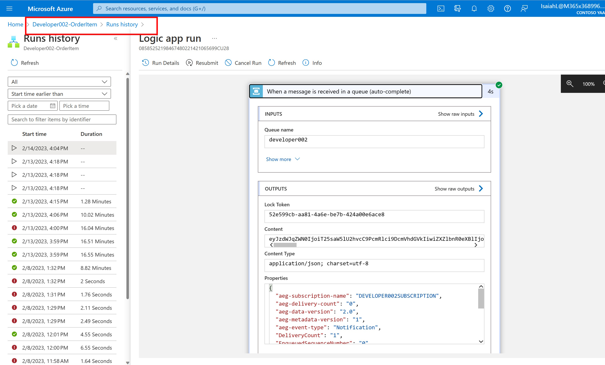
</p>


<br>
<details><summary><strong>⤵️Block for the full Logic App Code for Quest 2</strong></summary>

```json
{
    "definition": {
        "$schema": "https://schema.management.azure.com/providers/Microsoft.Logic/schemas/2016-06-01/workflowdefinition.json#",
        "actions": {
            "For_each": {
                "actions": {
                    "Post_adaptive_card_in_a_chat_or_channel": {
                        "inputs": {
                            "body": {
                                "messageBody": "{\n    \"type\": \"AdaptiveCard\",\n    \"body\": [\n        {\n            \"type\": \"TextBlock\",\n            \"size\": \"Medium\",\n            \"weight\": \"Bolder\",\n            \"text\": \"New Order has been placed in the Online Shop\"\n        },\n        {\n            \"type\": \"ColumnSet\",\n            \"columns\": [\n                {\n                    \"type\": \"Column\",\n                    \"items\": [\n                        {\n                            \"type\": \"TextBlock\",\n                            \"weight\": \"Bolder\",\n                            \"text\": \"Hi, \",\n                            \"wrap\": true\n                        }\n                    ],\n                    \"width\": \"stretch\"\n                }\n            ]\n        },\n        {\n            \"type\": \"TextBlock\",\n            \"text\": \"A new order has been place in the Online Shop URL. Please review the provided information. \",\n            \"wrap\": true\n        },\n        {\n            \"type\": \"FactSet\",\n            \"facts\": [\n                {\n                    \"title\": \"Order ID\",\n                    \"value\": \"@{items('For_each')?['ORDERID']}\"\n                },\n                {\n                    \"title\": \"Status Purchase Requisition\",\n                    \"value\": \"@{items('For_each')?['PRSTATUS']}\"\n                },\n                {\n                    \"title\": \"Ordered Items\",\n                    \"value\": \"@{items('For_each')?['ORDEREDITEM']}\"\n                },\n                {\n                    \"title\": \"Quantity\",\n                    \"value\": \"${value}\"\n                },\n                {\n                    \"title\": \"Description Text: \",\n                    \"value\": \"${value}\"\n                },\n                {\n                    \"title\": \"Purchase Requisition: \",\n                    \"value\": \"@{items('For_each')?['PURCHASEREQN']}\"\n                }\n            ]\n        }\n    ],\n    \"actions\": [\n        {\n            \"type\": \"Action.OpenUrl\",\n            \"title\": \"View\",\n            \"url\": \"URL\"\n        }\n    ],\n    \"$schema\": \"http://adaptivecards.io/schemas/adaptive-card.json\",\n    \"version\": \"1.3\"\n}",
                                "recipient": {
                                    "channelId": "19:a38680470d95481685c064f36a146e24@thread.tacv2",
                                    "groupId": "c1eedb2a-3a35-4f0e-98e3-898c2d5e907c"
                                }
                            },
                            "host": {
                                "connection": {
                                    "name": "@parameters('$connections')['teams']['connectionId']"
                                }
                            },
                            "method": "post",
                            "path": "/v1.0/teams/conversation/adaptivecard/poster/Flow bot/location/@{encodeURIComponent('Channel')}"
                        },
                        "runAfter": {},
                        "type": "ApiConnection"
                    }
                },
                "foreach": "@body('Parse_JSON')?['EM_ORDER']",
                "runAfter": {
                    "Parse_JSON": [
                        "Succeeded"
                    ]
                },
                "type": "Foreach"
            },
            "Initialize_variable": {
                "inputs": {
                    "variables": [
                        {
                            "name": "Message Content",
                            "type": "string",
                            "value": "@base64ToString(triggerBody()?['ContentData'])"
                        }
                    ]
                },
                "runAfter": {},
                "type": "InitializeVariable"
            },
            "Parse_JSON": {
                "inputs": {
                    "content": "@body('[RFC]_Call_function_in_SAP')?['JsonResponse']",
                    "schema": {
                        "properties": {
                            "EM_ORDER": {
                                "items": {
                                    "properties": {
                                        "CLIENT": {
                                            "type": "string"
                                        },
                                        "CREATED_AT": {
                                            "type": "integer"
                                        },
                                        "CREATED_BY": {
                                            "type": "string"
                                        },
                                        "LAST_CHANGED_AT": {
                                            "type": "integer"
                                        },
                                        "LAST_CHANGED_BY": {
                                            "type": "string"
                                        },
                                        "LOCAL_LAST_CHANGED_AT": {
                                            "type": "integer"
                                        },
                                        "ORDEREDITEM": {
                                            "type": "string"
                                        },
                                        "ORDERID": {
                                            "type": "string"
                                        },
                                        "ORDERUUID": {
                                            "type": "string"
                                        },
                                        "PRSTATUS": {
                                            "type": "string"
                                        },
                                        "PURCHASEREQN": {
                                            "type": "string"
                                        }
                                    },
                                    "required": [
                                        "CLIENT",
                                        "ORDERUUID",
                                        "ORDERID",
                                        "ORDEREDITEM",
                                        "PURCHASEREQN",
                                        "PRSTATUS",
                                        "CREATED_AT",
                                        "CREATED_BY",
                                        "LAST_CHANGED_BY",
                                        "LAST_CHANGED_AT",
                                        "LOCAL_LAST_CHANGED_AT"
                                    ],
                                    "type": "object"
                                },
                                "type": "array"
                            }
                        },
                        "type": "object"
                    }
                },
                "runAfter": {
                    "[RFC]_Call_function_in_SAP": [
                        "Succeeded"
                    ]
                },
                "type": "ParseJson"
            },
            "Parse_JSON_2": {
                "inputs": {
                    "content": "@variables('Message Content')",
                    "schema": {
                        "properties": {
                            "data": {
                                "properties": {
                                    "createdby": {
                                        "type": "string"
                                    },
                                    "date": {
                                        "type": "string"
                                    },
                                    "event": {
                                        "type": "string"
                                    },
                                    "ordernr": {
                                        "type": "string"
                                    },
                                    "time": {
                                        "type": "string"
                                    }
                                },
                                "type": "object"
                            },
                            "dataversion": {
                                "type": "string"
                            },
                            "eventtime": {
                                "type": "string"
                            },
                            "eventtype": {
                                "type": "string"
                            },
                            "id": {
                                "type": "string"
                            },
                            "metadataversion": {
                                "type": "string"
                            },
                            "subject": {
                                "type": "string"
                            },
                            "topic": {
                                "type": "string"
                            }
                        },
                        "type": "object"
                    }
                },
                "runAfter": {
                    "Initialize_variable": [
                        "Succeeded"
                    ]
                },
                "type": "ParseJson"
            },
            "[RFC]_Call_function_in_SAP": {
                "inputs": {
                    "body": "<ZF_RFC_ONLINESHOP_GET_ORDER xmlns=\"http://Microsoft.LobServices.Sap/2007/03/Rfc/\">\n<IM_ORDER>@{body('Parse_JSON_2')?['data']?['ordernr']}</IM_ORDER>\n</ZF_RFC_ONLINESHOP_GET_ORDER>",
                    "host": {
                        "connection": {
                            "name": "@parameters('$connections')['sap']['connectionId']"
                        }
                    },
                    "method": "post",
                    "path": "/CallRfc",
                    "queries": {
                        "autoCommit": false,
                        "rfcGroupFilter": "Z_ONLINESHOP_MSF:msf",
                        "rfcName": "ZF_RFC_ONLINESHOP_GET_ORDER:order:Z_ONLINESHOP_MSF"
                    }
                },
                "runAfter": {
                    "Parse_JSON_2": [
                        "Succeeded"
                    ]
                },
                "type": "ApiConnection"
            }
        },
        "contentVersion": "1.0.0.0",
        "outputs": {},
        "parameters": {
            "$connections": {
                "defaultValue": {},
                "type": "Object"
            }
        },
        "triggers": {
            "When_a_message_is_received_in_a_queue_(auto-complete)": {
                "evaluatedRecurrence": {
                    "frequency": "Minute",
                    "interval": 3
                },
                "inputs": {
                    "host": {
                        "connection": {
                            "name": "@parameters('$connections')['servicebus']['connectionId']"
                        }
                    },
                    "method": "get",
                    "path": "/@{encodeURIComponent(encodeURIComponent('developer103'))}/messages/head",
                    "queries": {
                        "queueType": "Main"
                    }
                },
                "recurrence": {
                    "frequency": "Minute",
                    "interval": 3
                },
                "type": "ApiConnection"
            }
        }
    },
    "parameters": {
        "$connections": {
            "value": {
                "sap": {
                    "connectionId": "/subscriptions/22a9ba10-8328-4f21-baeb-50728288a33c/resourceGroups/Developer103/providers/Microsoft.Web/connections/sap",
                    "connectionName": "sap",
                    "id": "/subscriptions/22a9ba10-8328-4f21-baeb-50728288a33c/providers/Microsoft.Web/locations/northeurope/managedApis/sap"
                },
                "servicebus": {
                    "connectionId": "/subscriptions/22a9ba10-8328-4f21-baeb-50728288a33c/resourceGroups/Developer103/providers/Microsoft.Web/connections/servicebus",
                    "connectionName": "servicebus",
                    "id": "/subscriptions/22a9ba10-8328-4f21-baeb-50728288a33c/providers/Microsoft.Web/locations/northeurope/managedApis/servicebus"
                },
                "teams": {
                    "connectionId": "/subscriptions/22a9ba10-8328-4f21-baeb-50728288a33c/resourceGroups/Developer103/providers/Microsoft.Web/connections/teams",
                    "connectionName": "teams",
                    "id": "/subscriptions/22a9ba10-8328-4f21-baeb-50728288a33c/providers/Microsoft.Web/locations/northeurope/managedApis/teams"
                }
            }
        }
    }
}
```

</details>
<br>


## Where to next?

[< Quest 1](quest1.md) - **[🏠Home](../README.md)** - [ Quest 3 >](quest3.md)

[🔝](#)
