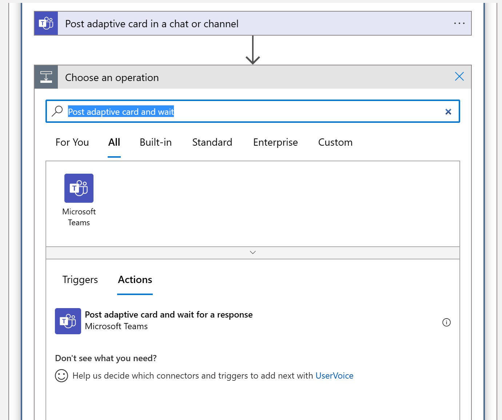
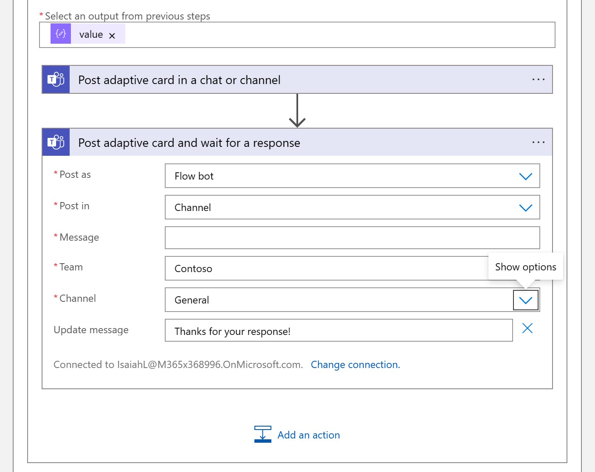
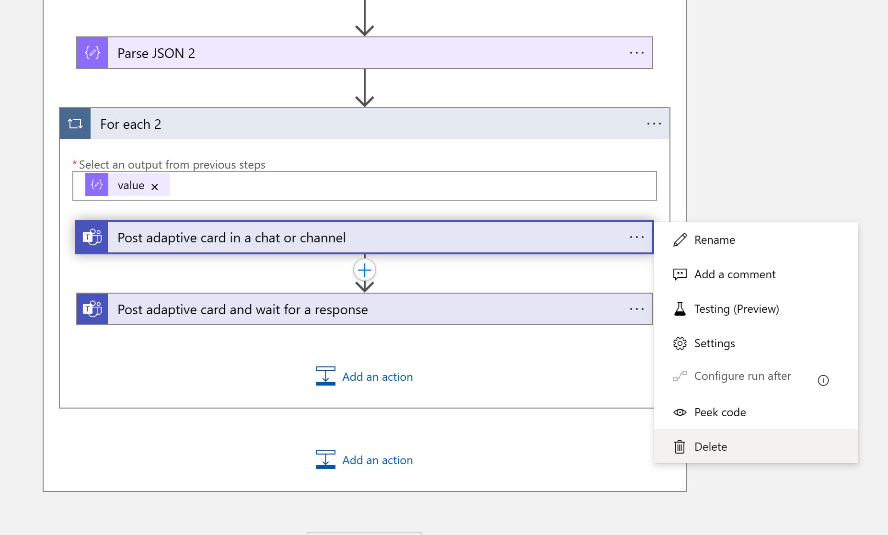
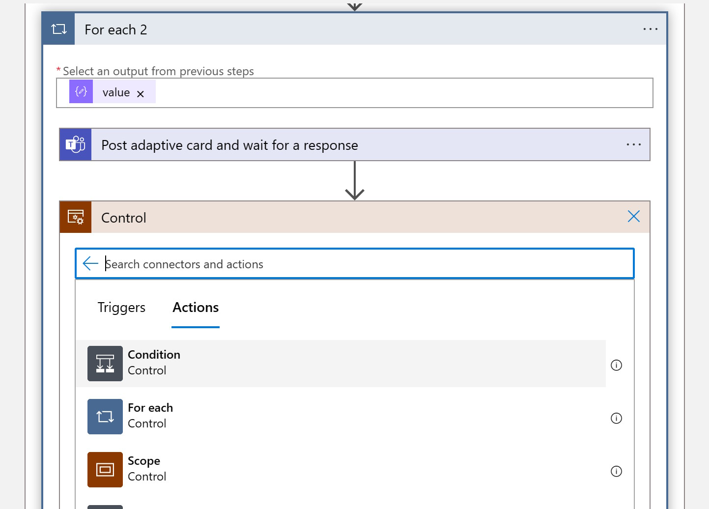
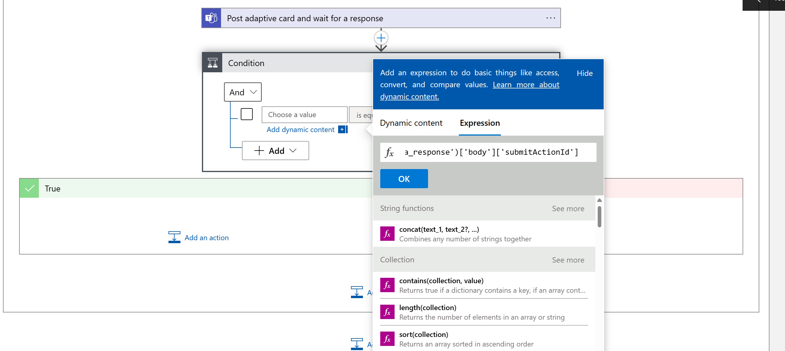
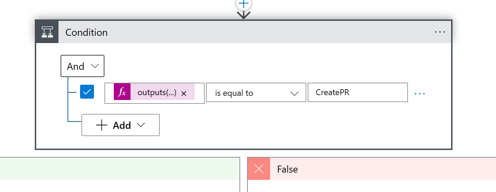
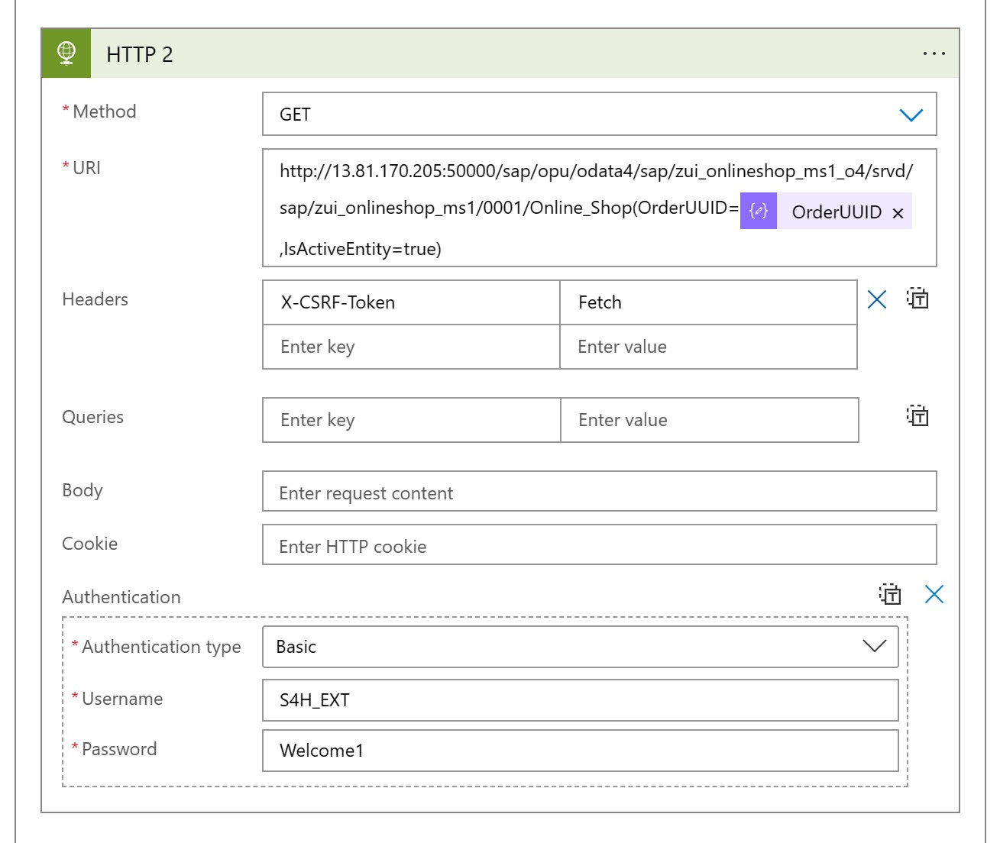
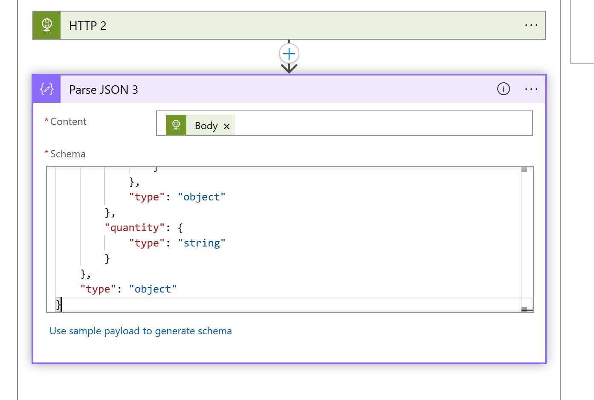
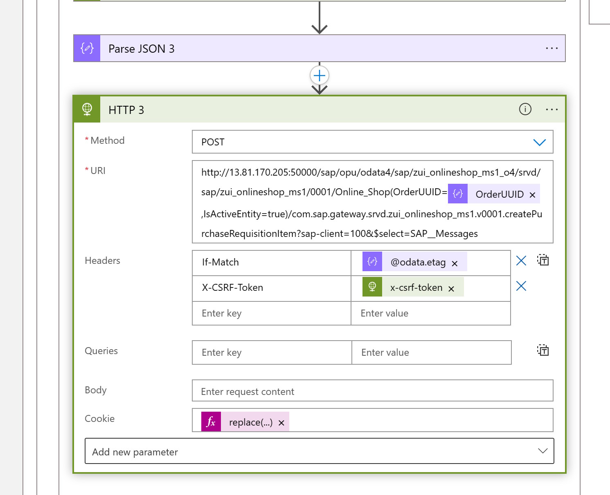

# Quest 3 - Debutant's journey
Whenever an Order is created in the Online Shop the user is now notified in Teams. However, a Purchase Requisition is not yet created. 

In order to simplify this process we want to empower the Teams user to review the created order and then create a Purchase Requistion diretly from Teams. For this we will enhance our Adaptive Card and make it interactive: The user should have the option to create a Purchase Requisition directly from Teams. 

Instead of doing this again via an RFC call, we will now switch to OData. At first we will leverage an OData call to fetch additional information from our Order (since the RFC did not return all the required information like Description). 

Then we will also call the official API (which we can also find in the [SAP API Business Hub](http://api.sap.com)) to create a Purchase Requisition in the SAP System. 

### Enhance the existing Logic App with an additional call to the Odata service
1) In the "For Each" loop that we have to send the Adaptive Card, click on "Add an Action"
  

2) Add HTTP Action


3) Obviously the HTTP action needs to be exectued before the Adaptive Card is sent to Teams. So before providing the required values to the HTTP action, change the position of the "HTTP Action and the Post adaptive card in a chat or channel" action by dragging and dropping the Teams action under the HTTP action. 


4) We are going to execute a call using the GET method (we are only reading information), via the URL !!!IP Adress will change; configure DNS hostname!!!
```
http://
13.81.170.205:50000/sap/opu/odata4/sap/zui_onlineshop_ms1_o4/srvd/sap/zui_onlineshop_ms1/0001/Online_Shop?$filter=OrderID%20eq%20%27ORDERID%27
```
Basically we are colling the OData Service for the Online shop and filtering for the OrderID = our OrderID. 


5) Since we always want to look for the Order ID that was previously fetched from the RFC, replace the OrderID with the variable from the previous RFC call. 


6) Add Authentication


7) Select Authentication Type Basic and enter the username and password for the SAP System, S4H_EXT / Welcome1


6) Similar like with the RFC call we can now prase the JSON response, by adding a new action


7) Using the Parse Json Function 


8) and adding the schema: 
using the Schema
```
{
    "type": "object",
    "properties": {
        "@@odata.context": {
            "type": "string"
        },
        "@@odata.metadataEtag": {
            "type": "string"
        },
        "value": {
            "type": "array",
            "items": {
                "type": "object",
                "properties": {
                    "@@odata.etag": {
                        "type": "string"
                    },
                    "#com.sap.gateway.srvd.zui_onlineshop_ms1.v0001.createPurchaseRequisitionItem": {
                        "type": "object",
                        "properties": {}
                    },
                    "#com.sap.gateway.srvd.zui_onlineshop_ms1.v0001.Edit(PreserveChanges)": {
                        "type": "object",
                        "properties": {}
                    },
                    "OrderUUID": {
                        "type": "string"
                    },
                    "OrderID": {
                        "type": "string"
                    },
                    "Ordereditem": {
                        "type": "string"
                    },
                    "Purchasereqn": {
                        "type": "string"
                    },
                    "Prstatus": {
                        "type": "string"
                    },
                    "DeliveryDate": {},
                    "LocalLastChangedAt": {
                        "type": "string"
                    },
                    "quantity": {
                        "type": "string"
                    },
                    "DescriptionText": {
                        "type": "string"
                    },
                    "URL": {
                        "type": "string"
                    },
                    "CreatedAt": {
                        "type": "string"
                    },
                    "CreatedBy": {
                        "type": "string"
                    },
                    "LastChangedAt": {
                        "type": "string"
                    },
                    "LastChangedBy": {
                        "type": "string"
                    },
                    "HasDraftEntity": {
                        "type": "boolean"
                    },
                    "DraftEntityCreationDateTime": {},
                    "DraftEntityLastChangeDateTime": {},
                    "HasActiveEntity": {
                        "type": "boolean"
                    },
                    "IsActiveEntity": {
                        "type": "boolean"
                    },
                    "__EntityControl": {
                        "type": "object",
                        "properties": {
                            "Deletable": {
                                "type": "boolean"
                            },
                            "Updatable": {
                                "type": "boolean"
                            }
                        }
                    },
                    "__OperationControl": {
                        "type": "object",
                        "properties": {
                            "createPurchaseRequisitionItem": {
                                "type": "boolean"
                            },
                            "Edit": {
                                "type": "boolean"
                            }
                        }
                    },
                    "SAP__Messages": {
                        "type": "array"
                    }
                },
                "required": [
                    "@@odata.etag",
                    "#com.sap.gateway.srvd.zui_onlineshop_ms1.v0001.createPurchaseRequisitionItem",
                    "#com.sap.gateway.srvd.zui_onlineshop_ms1.v0001.Edit(PreserveChanges)",
                    "OrderUUID",
                    "OrderID",
                    "Ordereditem",
                    "Purchasereqn",
                    "Prstatus",
                    "DeliveryDate",
                    "LocalLastChangedAt",
                    "quantity",
                    "DescriptionText",
                    "URL",
                    "CreatedAt",
                    "CreatedBy",
                    "LastChangedAt",
                    "LastChangedBy",
                    "HasDraftEntity",
                    "DraftEntityCreationDateTime",
                    "DraftEntityLastChangeDateTime",
                    "HasActiveEntity",
                    "IsActiveEntity",
                    "__EntityControl",
                    "__OperationControl",
                    "SAP__Messages"
                ]
            }
        }
    }
}
```
8) and selecting the Body form the previous HTTP Call


7) With this information we can make the new information like Description and Quantity also available in the Adaptive Card. 

>> Note: Since the response from the OData call is again an Array, Logic Apps automatically converted the Flow into another For each flow. In our case the results will most likely always be single items, but it is great to see that Logic Apps follows the schema and would be ready for arrays

8) Since the OData services also returned the Order UUID we can now also add a URL to the View Button. 
e3883c89-d853-1edd-a8c6-02cee593a1d7
```
"http://13.81.170.205:50000/sap/bc/adt/businessservices/odatav4/feap?feapParams=C%C2%87u%C2%84C%C2%83%C2%84%C2%89C%C2%83xu%C2%88uHC%C2%87u%C2%84C%C2%8E%C2%89%7Ds%C2%83%C2%82%C2%80%7D%C2%82y%C2%87%7C%C2%83%C2%84s%C2%81%C2%87Es%C2%83HC%C2%87%C2%86%C2%8AxC%C2%87u%C2%84C%C2%8E%C2%89%7Ds%C2%83%C2%82%C2%80%7D%C2%82y%C2%87%7C%C2%83%C2%84s%C2%81%C2%87ECDDDEC77c%C2%82%C2%80%7D%C2%82ysg%7C%C2%83%C2%84777777ni%5Dscb%60%5DbYg%5CcdsagE77DDDE77ni%5Dscb%60%5DbYg%5CcdsagEscH&sap-ui-language=EN&sap-client=100#/Online_Shop(OrderUUID=@{items('For_each_2')?['OrderUUID']},IsActiveEntity=true)
```

8) Now we can test the scenario by creating another Order in our Online Shop

### Add an action to create the Purchase Requisition
In the next step we want to enable the user to create a purchase requisition directly from Teams. We could call the Purchase Requisition API as documented on the 
[SAP API Business Hub](https://api.sap.com/api/OP_PURCHASEREQUISITION_0001/resource), but our Online Shop already provides a proxy that takes care of all the properties. So we can just ask the Online Shop to create a Purchase Requisition for a specific Order Item. 
The creation happens via a POST message. Since POSTing data to an SAP requires a few steps (e.g. you need to fetch a X-CSRF Token and handle etag), we "outsource" the logic into (another Logic Apps)[http://]

1) Lets take a look at the Logic App: 
The first things we need to do is use another action for publishing the adaptive card to Teams, which also waits for the response of the user. 


2) Search for "Post adaptive card and wait" and select the new Teams Action


3) Enter the same values for Team and Channel as before. Keep the "Message" property empty for now


4) For the message copy and paste the following content. Compared to the previous Adaptive Card, we have now added an addition action. 
```json
{
    "type": "AdaptiveCard",
    "body": [
        {
            "type": "TextBlock",
            "size": "Medium",
            "weight": "Bolder",
            "text": "New Order has been placed in the Online Shop"
        },
        {
            "type": "ColumnSet",
            "columns": [
                {
                    "type": "Column",
                    "items": [
                        {
                            "type": "TextBlock",
                            "weight": "Bolder",
                            "text": "Hi USER",
                            "wrap": true
                        },
                        {
                            "type": "TextBlock",
                            "spacing": "None",
                            "text": "Created {{DATE(${createdUtc},SHORT)}}",
                            "isSubtle": true,
                            "wrap": true
                        }
                    ],
                    "width": "stretch"
                }
            ]
        },
        {
            "type": "TextBlock",
            "text": "A new order has been place in the Online Shop URL. Please review the provided information. ",
            "wrap": true
        },
        {
            "type": "FactSet",
            "facts": [
                {
                    "title": "Order ID",
                    "value": "@{items('For_each')?['ORDERID']}"
                },
                {
                    "title": "Status Purchase Requisition",
                    "value": "@{items('For_each')?['PRSTATUS']}"
                },
                {
                    "title": "Ordered Items",
                    "value": "@{items('For_each')?['ORDEREDITEM']}"
                },
                {
                    "title": "Quantity",
                    "value": "@{items('For_each_2')?['quantity']}"
                },
                {
                    "title": "Description Text: ",
                    "value": "@{items('For_each_2')?['DescriptionText']}"
                },
                {
                    "title": "Purchase Requisition: ",
                    "value": "@{items('For_each')?['PURCHASEREQN']}"
                }
            ]
        }
    ],
    "actions": [
        {
            "type": "Action.OpenUrl",
            "title": "View",
            "url": "https://vhcals4hcs.dummy.nodomain:44301/sap/bc/adt/businessservices/odatav4/feap?feapParams=C%C2%87u%C2%84C%C2%83%C2%84%C2%89C%C2%83xu%C2%88uHC%C2%87u%C2%84C%C2%8E%C2%89%7Ds%C2%83%C2%82%C2%80%7D%C2%82y%C2%87%7C%C2%83%C2%84s%C2%81%C2%87Es%C2%83HC%C2%87%C2%86%C2%8AxC%C2%87u%C2%84C%C2%8E%C2%89%7Ds%C2%83%C2%82%C2%80%7D%C2%82y%C2%87%7C%C2%83%C2%84s%C2%81%C2%87ECDDDEC77c%C2%82%C2%80%7D%C2%82ysg%7C%C2%83%C2%84777777ni%5Dscb%60%5DbYg%5CcdsagE77DDDE77ni%5Dscb%60%5DbYg%5CcdsagEscH&sap-ui-language=EN&sap-client=100#/Online_Shop(OrderUUID=@{items('For_each_2')?['OrderUUID']},IsActiveEntity=true)"
        },
        {
            "type": "Action.Submit",
            "title": "Create Purchase Requisition",
             "id": "CreatePR"
}
    ],
    "$schema": "http://adaptivecards.io/schemas/adaptive-card.json",
    "version": "1.3"
}
```

5) With this we can delete the first Action to send an Adaptive Card to Teams. 

  
### Wait for input 
1) Now we have to react to the answer from the user. If the User clicked on the "Create Purchase Requision" button, we need to call the OData Service of the Online Shop to create the Purchase Requisition. Add a new Action by searching for "Control" and selecting the "Condition" action. If there is an action, we want to Check if it was our Create Purchase Requisition Button and only then execute next steps. 

 

2) For the conditions enter, the value
```json
outputs('Post_adaptive_card_and_wait_for_a_response')['body']['submitActionId']
```



3) and CreatePR for the value


### Create Purchase Requisition
If the user clicked on the button we can finally create the Purchase Requisition. For this we can use the service.
```
Online_Shop(OrderUUID=<OrderUUID>,IsActiveEntity=true)/com.sap.gateway.srvd.zui_onlineshop_ms1.v0001.createPurchaseRequisitionItem?sap-client=100&$select=SAP__Messages
```
Since this is a POST call, we also need to provide a valid X-CSRF-Token and do the required e-tag handling. 

1) Let's create another "HTTP" Action in the "True" flow which calls the OData service for a specific OrderUUID and fetches the required X-CSRF token
```html
http://13.81.170.205:50000/sap/opu/odata4/sap/zui_onlineshop_ms1_o4/srvd/sap/zui_onlineshop_ms1/0001/Online_Shop(OrderUUID=@{variables('OrderUUID')},IsActiveEntity=true)
```
Select Method Get, add the Header: X-CSRF-Token = Fetch and also provide credentials for the authentication


2) Next we parse the JSON response to be able to access the X-CSRF-Token

```json
{
    "properties": {
        "#com.sap.gateway.srvd.zui_onlineshop_ms1.v0001.Edit(PreserveChanges)": {
            "properties": {},
            "type": "object"
        },
        "#com.sap.gateway.srvd.zui_onlineshop_ms1.v0001.createPurchaseRequisitionItem": {
            "properties": {},
            "type": "object"
        },
        "@@odata.context": {
            "type": "string"
        },
        "@@odata.etag": {
            "type": "string"
        },
        "@@odata.metadataEtag": {
            "type": "string"
        },
        "CreatedAt": {
            "type": "string"
        },
        "CreatedBy": {
            "type": "string"
        },
        "DeliveryDate": {},
        "DescriptionText": {
            "type": "string"
        },
        "DraftEntityCreationDateTime": {},
        "DraftEntityLastChangeDateTime": {},
        "HasActiveEntity": {
            "type": "boolean"
        },
        "HasDraftEntity": {
            "type": "boolean"
        },
        "IsActiveEntity": {
            "type": "boolean"
        },
        "LastChangedAt": {
            "type": "string"
        },
        "LastChangedBy": {
            "type": "string"
        },
        "LocalLastChangedAt": {
            "type": "string"
        },
        "OrderID": {
            "type": "string"
        },
        "OrderUUID": {
            "type": "string"
        },
        "Ordereditem": {
            "type": "string"
        },
        "Prstatus": {
            "type": "string"
        },
        "Purchasereqn": {
            "type": "string"
        },
        "SAP__Messages": {
            "type": "array"
        },
        "URL": {
            "type": "string"
        },
        "__EntityControl": {
            "properties": {
                "Deletable": {
                    "type": "boolean"
                },
                "Updatable": {
                    "type": "boolean"
                }
            },
            "type": "object"
        },
        "__OperationControl": {
            "properties": {
                "Edit": {
                    "type": "boolean"
                },
                "createPurchaseRequisitionItem": {
                    "type": "boolean"
                }
            },
            "type": "object"
        },
        "quantity": {
            "type": "string"
        }
    },
    "type": "object"
}
```

3) Now we are ready to make the action call to create the Purchase Requisition

```dotnetcli
body('Parse_JSON_3')?['@odata.etag']
outputs('HTTP_2')['headers']?['x-csrf-token']
replace(outputs('HTTP_2')['headers']?['Set-Cookie'], ',', ';')
```
4) Test it 


[< Quest 2](quest2.md) - **[🏠Home](../README.md)** - [ Quest 4 >](quest4.md)
