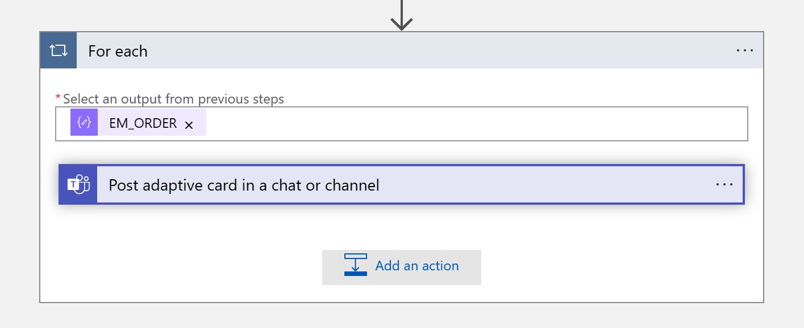
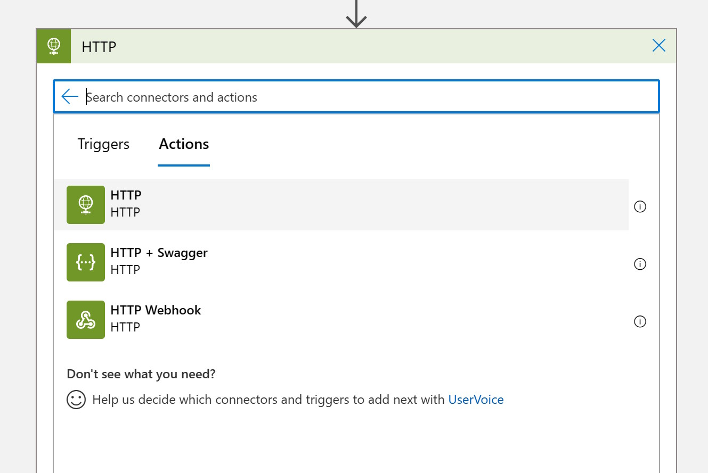
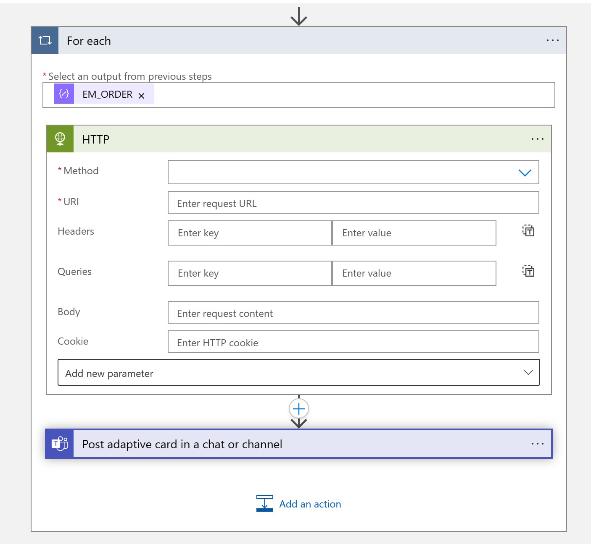
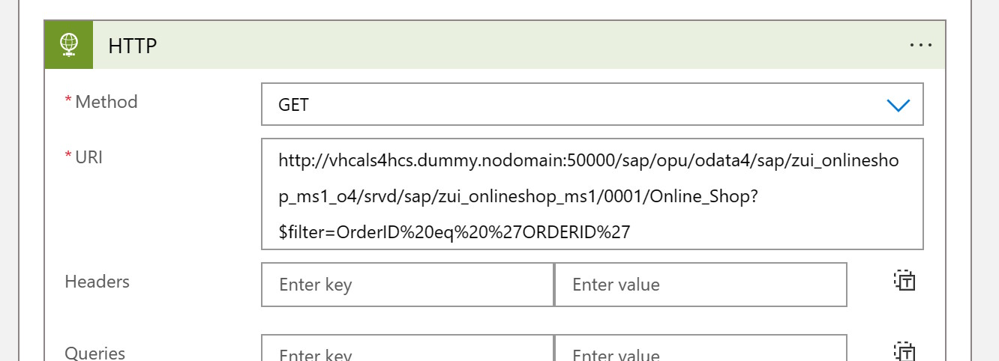
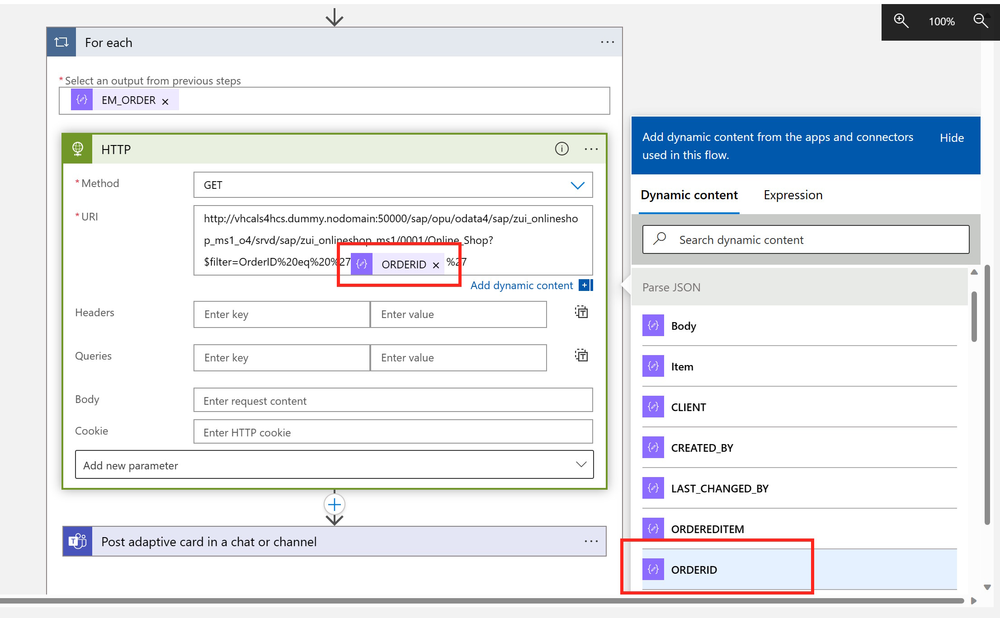
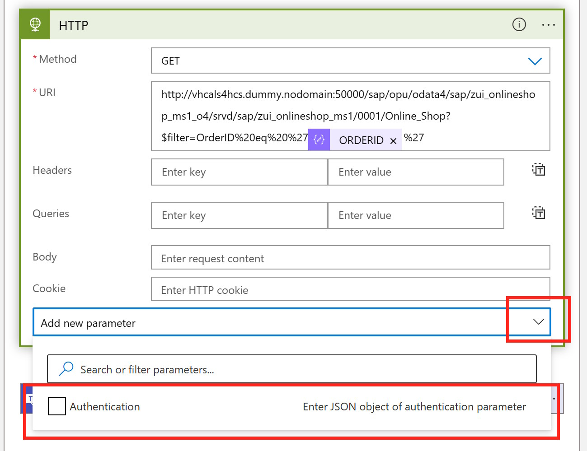
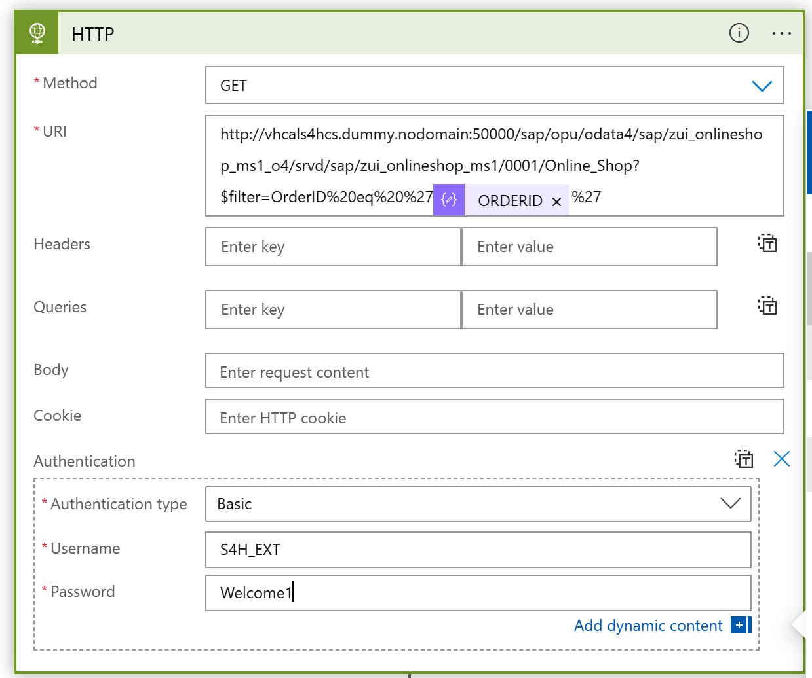
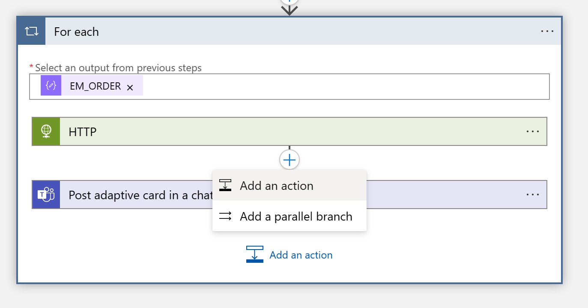
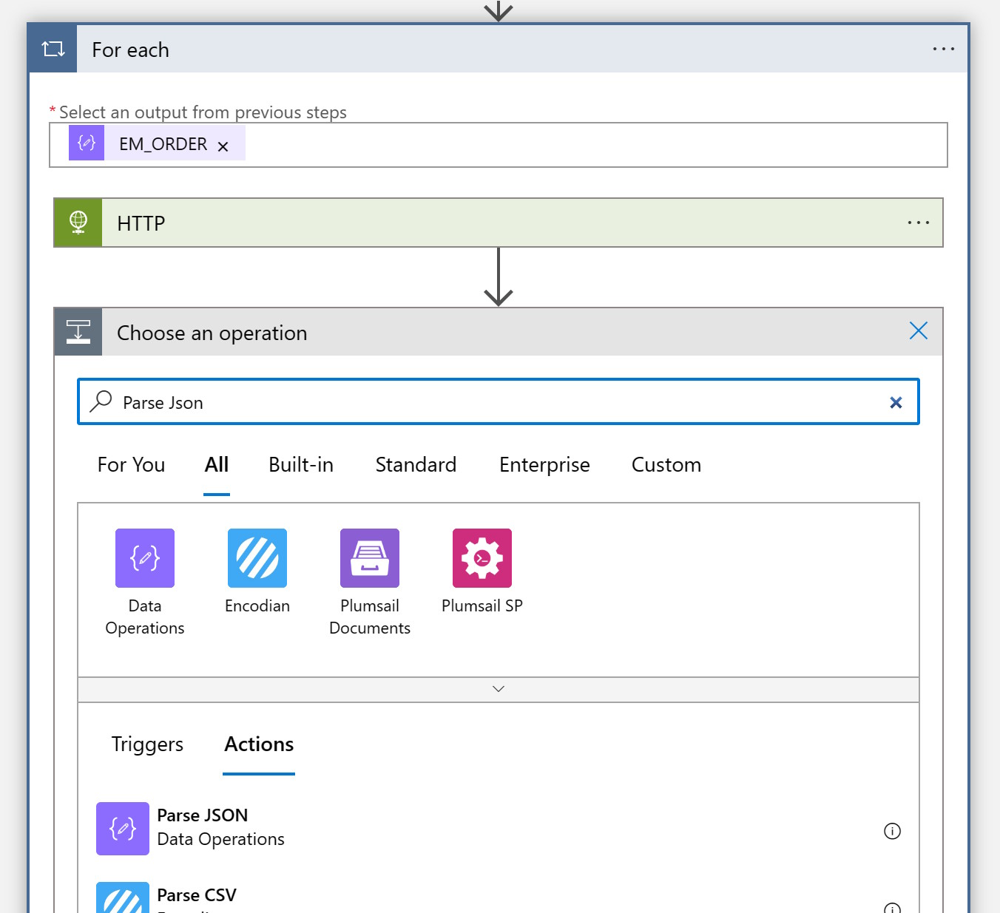
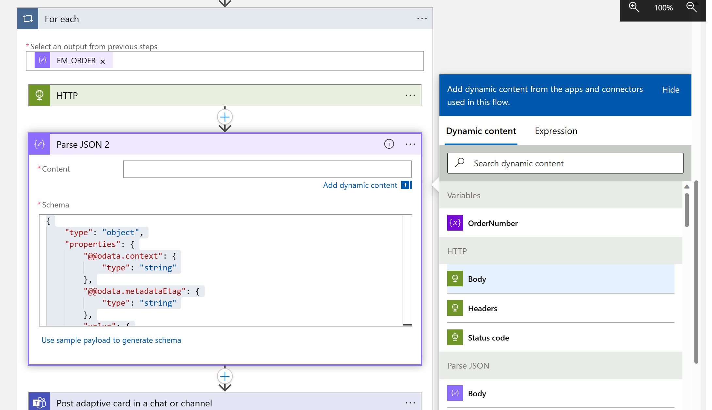

# Quest 3 - Debutant's journey
Whenever an Order is created in the Online Shop the user is now notified in Teams. However, a Purchase Requisition is not yet created. 

In order to simplify this process we want to empower the Teams user to review the created order and then create a Purchase Requistion diretly from Teams. For this we will enhance our Adaptive Card and make it interactive: The user should have the option to create a Purchase Requisition directly from Teams. 

Instead of doing this again via an RFC call, we will now switch to OData. At first we will leverage an OData call to fetch additional information from our Order (since the RFC did not return all the required information like Description). 

Then we will also call the official API (which we can also find in the [SAP API Business Hub](http://api.sap.com)) to create a Purchase Requisition in the SAP System. 

### Enhance the existing Logic App with an additional call to the Odata service
1) In the "For Each" loop that we have to send the Adaptive Card, click on "Add an Action"
  

2) Add HTTP Action


3) Obviously the HTTP action needs to be exectued before the Adaptive Card is sent to Teams. So before providing the required values to the HTTP action, change the position of the "HTTP Action and the Post adaptive card in a chat or channel" action by dragging and dropping the Teams action under the HTTP action. 


4) We are going to execute a call using the GET method (we are only reading information), via the URL !!!IP Adress will change; configure DNS hostname!!!
```
http://
13.81.170.205:50000/sap/opu/odata4/sap/zui_onlineshop_ms1_o4/srvd/sap/zui_onlineshop_ms1/0001/Online_Shop?$filter=OrderID%20eq%20%27ORDERID%27
```
Basically we are colling the OData Service for the Online shop and filtering for the OrderID = our OrderID. 


5) Since we always want to look for the Order ID that was previously fetched from the RFC, replace the OrderID with the variable from the previous RFC call. 


6) Add Authentication


7) Select Authentication Type Basic and enter the username and password for the SAP System, S4H_EXT / Welcome1



6) Similar like with the RFC call we can now prase the JSON response, by adding a new action


7) Using the Parse Json Function 


8) and adding the schema: 
using the Schema
```
{
    "type": "object",
    "properties": {
        "@@odata.context": {
            "type": "string"
        },
        "@@odata.metadataEtag": {
            "type": "string"
        },
        "value": {
            "type": "array",
            "items": {
                "type": "object",
                "properties": {
                    "@@odata.etag": {
                        "type": "string"
                    },
                    "#com.sap.gateway.srvd.zui_onlineshop_ms1.v0001.createPurchaseRequisitionItem": {
                        "type": "object",
                        "properties": {}
                    },
                    "#com.sap.gateway.srvd.zui_onlineshop_ms1.v0001.Edit(PreserveChanges)": {
                        "type": "object",
                        "properties": {}
                    },
                    "OrderUUID": {
                        "type": "string"
                    },
                    "OrderID": {
                        "type": "string"
                    },
                    "Ordereditem": {
                        "type": "string"
                    },
                    "Purchasereqn": {
                        "type": "string"
                    },
                    "Prstatus": {
                        "type": "string"
                    },
                    "DeliveryDate": {},
                    "LocalLastChangedAt": {
                        "type": "string"
                    },
                    "quantity": {
                        "type": "string"
                    },
                    "DescriptionText": {
                        "type": "string"
                    },
                    "URL": {
                        "type": "string"
                    },
                    "CreatedAt": {
                        "type": "string"
                    },
                    "CreatedBy": {
                        "type": "string"
                    },
                    "LastChangedAt": {
                        "type": "string"
                    },
                    "LastChangedBy": {
                        "type": "string"
                    },
                    "HasDraftEntity": {
                        "type": "boolean"
                    },
                    "DraftEntityCreationDateTime": {},
                    "DraftEntityLastChangeDateTime": {},
                    "HasActiveEntity": {
                        "type": "boolean"
                    },
                    "IsActiveEntity": {
                        "type": "boolean"
                    },
                    "__EntityControl": {
                        "type": "object",
                        "properties": {
                            "Deletable": {
                                "type": "boolean"
                            },
                            "Updatable": {
                                "type": "boolean"
                            }
                        }
                    },
                    "__OperationControl": {
                        "type": "object",
                        "properties": {
                            "createPurchaseRequisitionItem": {
                                "type": "boolean"
                            },
                            "Edit": {
                                "type": "boolean"
                            }
                        }
                    },
                    "SAP__Messages": {
                        "type": "array"
                    }
                },
                "required": [
                    "@@odata.etag",
                    "#com.sap.gateway.srvd.zui_onlineshop_ms1.v0001.createPurchaseRequisitionItem",
                    "#com.sap.gateway.srvd.zui_onlineshop_ms1.v0001.Edit(PreserveChanges)",
                    "OrderUUID",
                    "OrderID",
                    "Ordereditem",
                    "Purchasereqn",
                    "Prstatus",
                    "DeliveryDate",
                    "LocalLastChangedAt",
                    "quantity",
                    "DescriptionText",
                    "URL",
                    "CreatedAt",
                    "CreatedBy",
                    "LastChangedAt",
                    "LastChangedBy",
                    "HasDraftEntity",
                    "DraftEntityCreationDateTime",
                    "DraftEntityLastChangeDateTime",
                    "HasActiveEntity",
                    "IsActiveEntity",
                    "__EntityControl",
                    "__OperationControl",
                    "SAP__Messages"
                ]
            }
        }
    }
}
```
8) and selecting the Body form the previous HTTP Call



7) With this information we can make the new information like Description and Quantity also available in the Adaptive Card. 

>> Note: Since the response from the OData call is again an Array, Logic Apps automatically converted the Flow into another For each flow. In our case the results will most likely always be single items, but it is great to see that Logic Apps follows the schema and would be ready for arrays

8) Since the OData services also returned the Order UUID we can now also add a URL to the View Button. 
e3883c89-d853-1edd-a8c6-02cee593a1d7
```
"http://13.81.170.205:50000/sap/bc/adt/businessservices/odatav4/feap?feapParams=C%C2%87u%C2%84C%C2%83%C2%84%C2%89C%C2%83xu%C2%88uHC%C2%87u%C2%84C%C2%8E%C2%89%7Ds%C2%83%C2%82%C2%80%7D%C2%82y%C2%87%7C%C2%83%C2%84s%C2%81%C2%87Es%C2%83HC%C2%87%C2%86%C2%8AxC%C2%87u%C2%84C%C2%8E%C2%89%7Ds%C2%83%C2%82%C2%80%7D%C2%82y%C2%87%7C%C2%83%C2%84s%C2%81%C2%87ECDDDEC77c%C2%82%C2%80%7D%C2%82ysg%7C%C2%83%C2%84777777ni%5Dscb%60%5DbYg%5CcdsagE77DDDE77ni%5Dscb%60%5DbYg%5CcdsagEscH&sap-ui-language=EN&sap-client=100#/Online_Shop(OrderUUID=@{items('For_each_2')?['OrderUUID']},IsActiveEntity=true)
```

8) Now we can test the scenario by creating another Order in our Online Shop

### Add an action to create the Purchase Requisition
In the next step we want to enable the user to create a purchase requisition directly from Teams. We could call the Purchase Requisition API as documented on the 
[SAP API Business Hub](https://api.sap.com/api/OP_PURCHASEREQUISITION_0001/resource), but our Online Shop already provides a proxy that takes care of all the properties. So we can just ask the Online Shop to create a Purchase Requisition for a specific Order Item. 
The creation happens via a POST message. Since POSTing data to an SAP requires a few steps (e.g. you need to fetch a X-CSRF Token and handle etag), we "outsource" the logic into (another Logic Apps)[http://]

1) Lets take a look at the Logic App: 
```
Online_Shop(OrderUUID=<OrderUUID>,IsActiveEntity=true)/com.sap.gateway.srvd.zui_onlineshop_ms1.v0001.createPurchaseRequisitionItem?sap-client=100&$select=SAP__Messages
```

2) With this understanding switch back to the Flow to send the Adaptive Cards to Teams. In the relevant action -- at the very end of the Adaptive Card in the Teams Step -- add another Action (don't forget the first ","):
```json
,
        {
            "type": "Action.OpenUrl",
            "title": "Create Purchase Requisition",
            "url": "URL"
        }
```
and replace the URL placeholder with the URL to our Logic Apps, that creates the Purchase Requisition

```http
https://prod-45.northeurope.logic.azure.com/workflows/a4df8ae7431144149df38445fa318051/triggers/manual/paths/invoke?api-version=2016-10-01&sp=%2Ftriggers%2Fmanual%2Frun&sv=1.0&sig=AsZ40xuXn4ZRYrz2uPHTKxgU_q8Lrn8lHSf8bYOzNF4&InputOrderUUID=@{items('For_each_2')?['OrderUUID']}
```


[< Quest 2](quest2.md) - **[🏠Home](../README.md)** - [ Quest 4 >](quest4.md)
