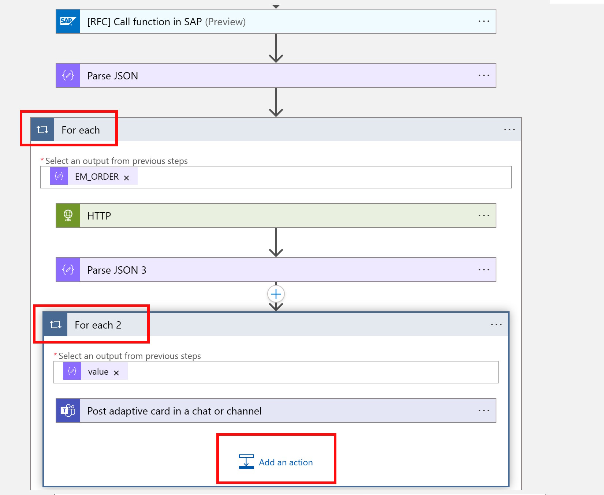
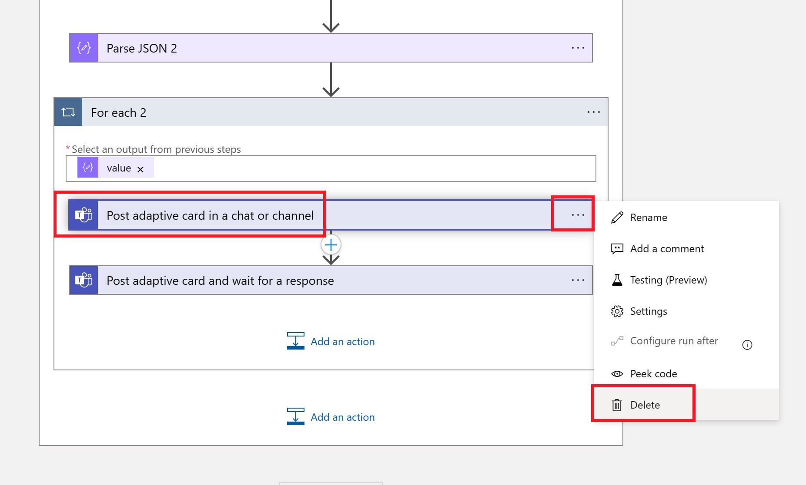

# Quest 3 - Debutant's journey

[< Quest 2](quest2.md) - **[🏠Home](../README.md)** - [ Quest 4 >](quest4.md)

🌟🌟🌟🌟
🕒 1,5 h

Whenever an Order is created in the Online Shop the user is now notified in Teams. However, a Purchase Requisition is not yet created.

In order to simplify this process we want to empower the Teams user to review the created order and then create a Purchase Requisition directly from Teams. For this we will enhance our Adaptive Card and make it interactive: The user should have the option to create a Purchase Requisition directly from Teams.

Instead of doing this again via an RFC call, we will now switch to OData. At first we will leverage an OData call to fetch additional information from our Order (since the RFC did not return all the required information like Description).

Then we will also call the an API from the Online Shop, that creates the actual Purchase Requisition in the SAP System.

## Video guide provided by our Mentors

<p align="center" width="100%">
    <a href="https://youtu.be/zYxu7yR7DAY" target="_blank" rel="noopener noreferrer">
        
    </a>
</p>

The video shall provide hints where lore, poetic code snippets, and narrative cannot.

## Enhance the existing Logic App with an additional call to the OData service

1. If your Logic App is not yet open, go to the [Azure Portal](https://portal.azure.com/) and search for your Logic Apps, e.g. **Developer<XX>-OrderItem** and change to the **Logic app designer** view. In the **For Each** loop at the end of your flow that was created to send the Adaptive Card, click on **Add an Action**

<p align="center" width="100%">

</p>

2. Search for **HTTP** and add the "HTTP" Action

<p align="center" width="100%">

</p>

3. The HTTP action needs to be executed before the Adaptive Card is sent to Teams. So, before providing the required values to the HTTP action, *change the position* of the **HTTP Action and the Post adaptive card in a chat or channel** action by dragging and dropping the Teams action under the HTTP action.

<p align="center" width="100%">

</p>

4. Request an order from the Online Shop via OData filtering by OrderID. Select **GET** for the Method and copy the URL for the Online Shop Item in the URI field.

```http
http://13.81.170.205:50000/sap/opu/odata4/sap/zui_onlineshop_ms1_o4/srvd/sap/zui_onlineshop_ms1/0001/Online_Shop?$filter=OrderID%20eq%20%27ORDERID%27
```

> **Warning** - IP Address will change; configure DNS hostname!

<p align="center" width="100%">

</p>

5. Since we always want to look for the Order ID that was previously fetched from the RFC, replace the placeholder **ORDERID** with the variable from the previous RFC call.

<p align="center" width="100%">

</p>

6. Click on **Add new parameter** and select **Authentication**

<p align="center" width="100%">

</p>

7. Select Authentication Type **Basic** and enter the username and password for the SAP System, **Developer<XX>** / **\<SAP Password>**

<p align="center" width="100%">

</p>

8. Similar like with the RFC call we can now parse the JSON response, by **adding a new action** after the HTTP Call

<p align="center" width="100%">

</p>

9. Using the **Parse Json** Function

<p align="center" width="100%">

</p>

10. Using the schema:

JSON code block

```json
{
    "type": "object",
    "properties": {
        "@@odata.context": {
            "type": "string"
        },
        "@@odata.metadataEtag": {
            "type": "string"
        },
        "value": {
            "type": "array",
            "items": {
                "type": "object",
                "properties": {
                    "@@odata.etag": {
                        "type": "string"
                    },
                    "#com.sap.gateway.srvd.zui_onlineshop_ms1.v0001.createPurchaseRequisitionItem": {
                        "type": "object",
                        "properties": {}
                    },
                    "#com.sap.gateway.srvd.zui_onlineshop_ms1.v0001.Edit(PreserveChanges)": {
                        "type": "object",
                        "properties": {}
                    },
                    "OrderUUID": {
                        "type": "string"
                    },
                    "OrderID": {
                        "type": "string"
                    },
                    "Ordereditem": {
                        "type": "string"
                    },
                    "Purchasereqn": {
                        "type": "string"
                    },
                    "Prstatus": {
                        "type": "string"
                    },
                    "DeliveryDate": {},
                    "LocalLastChangedAt": {
                        "type": "string"
                    },
                    "quantity": {
                        "type": "string"
                    },
                    "DescriptionText": {
                        "type": "string"
                    },
                    "URL": {
                        "type": "string"
                    },
                    "CreatedAt": {
                        "type": "string"
                    },
                    "CreatedBy": {
                        "type": "string"
                    },
                    "LastChangedAt": {
                        "type": "string"
                    },
                    "LastChangedBy": {
                        "type": "string"
                    },
                    "HasDraftEntity": {
                        "type": "boolean"
                    },
                    "DraftEntityCreationDateTime": {},
                    "DraftEntityLastChangeDateTime": {},
                    "HasActiveEntity": {
                        "type": "boolean"
                    },
                    "IsActiveEntity": {
                        "type": "boolean"
                    },
                    "__EntityControl": {
                        "type": "object",
                        "properties": {
                            "Deletable": {
                                "type": "boolean"
                            },
                            "Updatable": {
                                "type": "boolean"
                            }
                        }
                    },
                    "__OperationControl": {
                        "type": "object",
                        "properties": {
                            "createPurchaseRequisitionItem": {
                                "type": "boolean"
                            },
                            "Edit": {
                                "type": "boolean"
                            }
                        }
                    },
                    "SAP__Messages": {
                        "type": "array"
                    }
                },
                "required": [
                    "@@odata.etag",
                    "#com.sap.gateway.srvd.zui_onlineshop_ms1.v0001.createPurchaseRequisitionItem",
                    "#com.sap.gateway.srvd.zui_onlineshop_ms1.v0001.Edit(PreserveChanges)",
                    "OrderUUID",
                    "OrderID",
                    "Ordereditem",
                    "Purchasereqn",
                    "Prstatus",
                    "DeliveryDate",
                    "LocalLastChangedAt",
                    "quantity",
                    "DescriptionText",
                    "URL",
                    "CreatedAt",
                    "CreatedBy",
                    "LastChangedAt",
                    "LastChangedBy",
                    "HasDraftEntity",
                    "DraftEntityCreationDateTime",
                    "DraftEntityLastChangeDateTime",
                    "HasActiveEntity",
                    "IsActiveEntity",
                    "__EntityControl",
                    "__OperationControl",
                    "SAP__Messages"
                ]
            }
        }
    }
}
```


> **Note** - Like in Quest 1, you could have generated this schema by providing a sample HTTP request.

11. and selecting the **Body** form the previous HTTP Call as **Content**

<p align="center" width="100%">

</p>

12. With this information, expand the **Post adaptive card in chat or channel** action and make the new information like Description and Quantity also available in the Adaptive Card.

* Quantity -> **quantity**
* Description Text -> **DescriptionText**

<p align="center" width="100%">

</p>

> **Note** - Since the response from the OData call is an Array, Logic Apps automatically converted the Flow into another **For each** flow. In our case the results will most likely always be single items, but it is great to see that Logic Apps follows the schema and would be ready for arrays. In a productive implementation, you would probably also not do an RFC call first, and then an OData call. This is just to explain the different options how you can connect to your SAP System.

13. The OData services also returned the Order UUID. Make use of that and **add a URL** to the View Button in the Adaptive card. In the **Actions** section at the end of the adaptive card, replace the place holder URL with the link below:

```http
https://vhcals4hcs.dummy.nodomain:44301/sap/bc/adt/businessservices/odatav4/feap?feapParams=C%C2%87u%C2%84C%C2%83%C2%84%C2%89C%C2%83xu%C2%88uHC%C2%87u%C2%84C%C2%8E%C2%89%7Ds%C2%83%C2%82%C2%80%7D%C2%82y%C2%87%7C%C2%83%C2%84s%C2%81%C2%87Es%C2%83HC%C2%87%C2%86%C2%8AxC%C2%87u%C2%84C%C2%8E%C2%89%7Ds%C2%83%C2%82%C2%80%7D%C2%82y%C2%87%7C%C2%83%C2%84s%C2%81%C2%87ECDDDEC77c%C2%82%C2%80%7D%C2%82ysg%7C%C2%83%C2%84777777ni%5Dscb%60%5DbYg%5CcdsagE77DDDE77ni%5Dscb%60%5DbYg%5CcdsagEscH&sap-ui-language=EN&sap-client=100#/Online_Shop(OrderUUID=ORDERUUID-PLACEHOLDER,IsActiveEntity=true)
```

Then also make sure to update the Placeholder in the URL (**ORDERUUID-PLACEHOLDER**) with the dynamic value from the previous HTTP call.

<p align="center" width="100%">

</p>

14. Now we can test the scenario by creating another Order in our Online Shop

As before head over to the [Online Shop](https://vhcals4hcs.dummy.nodomain:44301/sap/bc/adt/businessservices/odatav4/feap?feapParams=C%C2%87u%C2%84C%C2%83%C2%84%C2%89C%C2%83xu%C2%88uHC%C2%87u%C2%84C%C2%8E%C2%89%7Ds%C2%83%C2%82%C2%80%7D%C2%82y%C2%87%7C%C2%83%C2%84s%C2%81%C2%87Es%C2%83HC%C2%87%C2%86%C2%8AxC%C2%87u%C2%84C%C2%8E%C2%89%7Ds%C2%83%C2%82%C2%80%7D%C2%82y%C2%87%7C%C2%83%C2%84s%C2%81%C2%87ECDDDEC77c%C2%82%C2%80%7D%C2%82ysg%7C%C2%83%C2%84777777ni%5Dscb%60%5DbYg%5CcdsagE77DDDE77ni%5Dscb%60%5DbYg%5CcdsagEscH&sap-ui-language=EN&sap-client=100) and create a new Order. 

When you switch back over to Teams, you should see the Adaptive Card, now with additional properties and a working **View** button.

## Add an action to create the Purchase Requisition

In the next step we want to enable the user to create a purchase requisition directly from Teams. We could call the Purchase Requisition API as documented on the
[SAP API Business Hub](https://api.sap.com/api/OP_PURCHASEREQUISITION_0001/resource), but our Online Shop already provides a proxy that takes care of all the properties. So, we can just ask the Online Shop to create a Purchase Requisition for a specific Order Item.

The creation happens via a POST message. POSTing data to SAP requires a few steps (e.g. you need to fetch a X-CSRF Token and handle the ETag).

1. Since we now need to wait for a response, we switch to a different Action. We will first add his new action and then alter delete the existing Teams action. Under the existing Teams action, click on **Add an action**.

<p align="center" width="100%">

</p>

2. Search for **Post adaptive card and wait** and select the new Teams Action

<p align="center" width="100%">

</p>

3. Enter the same values for Team and Channel as before. Keep the "Message" property empty for now

<p align="center" width="100%">

</p>

4. For the message **copy and paste** the message from the previous Teams action and add this section under the View actions section:

```json
{
    "type": "Action.Submit",
    "title": "Create Purchase Requisition",
        "id": "CreatePR"
}
```

<p align="center" width="100%">

</p>

> **Note** - make sure that you start with the first **","** so that the results are as shown in the screenshot.

> **Note** - if you didn't rename anything, this is the correct content

AdaptiveCard code block

```json
{
    "type": "AdaptiveCard",
    "body": [
        {
            "type": "TextBlock",
            "size": "Medium",
            "weight": "Bolder",
            "text": "New Order has been placed in the Online Shop"
        },
        {
            "type": "ColumnSet",
            "columns": [
                {
                    "type": "Column",
                    "items": [
                        {
                            "type": "TextBlock",
                            "weight": "Bolder",
                            "text": "Hi",
                            "wrap": true
                        }
                    ],
                    "width": "stretch"
                }
            ]
        },
        {
            "type": "TextBlock",
            "text": "A new order has been place in the Online Shop URL. Please review the provided information. ",
            "wrap": true
        },
        {
            "type": "FactSet",
            "facts": [
                {
                    "title": "Order ID",
                    "value": "@{items('For_each')?['ORDERID']}"
                },
                {
                    "title": "Status Purchase Requisition",
                    "value": "@{items('For_each')?['PRSTATUS']}"
                },
                {
                    "title": "Ordered Items",
                    "value": "@{items('For_each')?['ORDEREDITEM']}"
                },
                {
                    "title": "Quantity",
                    "value": "@{items('For_each_2')?['quantity']}"
                },
                {
                    "title": "Description Text: ",
                    "value": "@{items('For_each_2')?['DescriptionText']}"
                },
                {
                    "title": "Purchase Requisition: ",
                    "value": "@{items('For_each')?['PURCHASEREQN']}"
                }
            ]
        }
    ],
    "actions": [
        {
            "type": "Action.OpenUrl",
            "title": "View",
            "url": "https://vhcals4hcs.dummy.nodomain:44301/sap/bc/adt/businessservices/odatav4/feap?feapParams=C%C2%87u%C2%84C%C2%83%C2%84%C2%89C%C2%83xu%C2%88uHC%C2%87u%C2%84C%C2%8E%C2%89%7Ds%C2%83%C2%82%C2%80%7D%C2%82y%C2%87%7C%C2%83%C2%84s%C2%81%C2%87Es%C2%83HC%C2%87%C2%86%C2%8AxC%C2%87u%C2%84C%C2%8E%C2%89%7Ds%C2%83%C2%82%C2%80%7D%C2%82y%C2%87%7C%C2%83%C2%84s%C2%81%C2%87ECDDDEC77c%C2%82%C2%80%7D%C2%82ysg%7C%C2%83%C2%84777777ni%5Dscb%60%5DbYg%5CcdsagE77DDDE77ni%5Dscb%60%5DbYg%5CcdsagEscH&sap-ui-language=EN&sap-client=100#/Online_Shop(OrderUUID=@{items('For_each_2')?['OrderUUID']},IsActiveEntity=true)"
        }{
    "type": "Action.Submit",
    "title": "Create Purchase Requisition",
        "id": "CreatePR"
}
    ],
    "$schema": "http://adaptivecards.io/schemas/adaptive-card.json",
    "version": "1.3"
}
```


5. With this we can **delete** the first Action to send an Adaptive Card to Teams.

<p align="center" width="100%">

</p>
  
### Wait for input

1. Now we have to react to the answer from the user. If the User clicked on the **Create Purchase Requisition** button, we need to call the OData Service of the Online Shop to create the Purchase Requisition. 

Under the **Post adaptive card and wait for a response** action, click on **Add an action**. Search for and select **Control** and select the **Condition** action.

If there is an action, we want to check if it was our Create Purchase Requisition Button and only then execute next steps.

<p align="center" width="100%">

</p>

2. For the **Conditions**, enter the value in the **Expression** field (make sure to use the Expression pane on the right)

```json
outputs('Post_adaptive_card_and_wait_for_a_response')['body']['submitActionId']
```

<p align="center" width="100%">

</p>

3. and **CreatePR** for the **Choose a value** 

<p align="center" width="100%">

</p>

> **Note**: In case the Expression Pane hides the **Choose a value**  field, click on **+ Add** without doing anything else there to hide the Pane. As a result you should be able to see the **Choose a value** field.

### Create Purchase Requisition

If the user clicked on the button we can finally create the Purchase Requisition. For this we can use the service.

```http
Online_Shop(OrderUUID=<OrderUUID>,IsActiveEntity=true)/com.sap.gateway.srvd.zui_onlineshop_ms1.v0001.createPurchaseRequisitionItem?sap-client=100&$select=SAP__Messages
```

Since this is a POST call, we also need to provide a valid X-CSRF-Token and do the required e-tag handling. 

1. Let's create another **HTTP** Action in the **True** flow which calls the OData service for a specific OrderUUID and fetches the required X-CSRF token

<p align="center" width="100%">

</p>

2. Select Method **Get**, add the Header: **X-CSRF-Token** = **Fetch** and also provide credentials for the authentication. For the URI use:

```http
http://13.81.170.205:50000/sap/opu/odata4/sap/zui_onlineshop_ms1_o4/srvd/sap/zui_onlineshop_ms1/0001/Online_Shop(OrderUUID=@{items('For_each_2')?['OrderUUID']},IsActiveEntity=true)
```

<p align="center" width="100%">

</p>

3. Next we parse the JSON response to be able to access the X-CSRF-Token. Add another Action as before to **Parse JSON**

<p align="center" width="100%">

</p>

JSON code block

```json
{
    "properties": {
        "#com.sap.gateway.srvd.zui_onlineshop_ms1.v0001.Edit(PreserveChanges)": {
            "properties": {},
            "type": "object"
        },
        "#com.sap.gateway.srvd.zui_onlineshop_ms1.v0001.createPurchaseRequisitionItem": {
            "properties": {},
            "type": "object"
        },
        "@@odata.context": {
            "type": "string"
        },
        "@@odata.etag": {
            "type": "string"
        },
        "@@odata.metadataEtag": {
            "type": "string"
        },
        "CreatedAt": {
            "type": "string"
        },
        "CreatedBy": {
            "type": "string"
        },
        "DeliveryDate": {},
        "DescriptionText": {
            "type": "string"
        },
        "DraftEntityCreationDateTime": {},
        "DraftEntityLastChangeDateTime": {},
        "HasActiveEntity": {
            "type": "boolean"
        },
        "HasDraftEntity": {
            "type": "boolean"
        },
        "IsActiveEntity": {
            "type": "boolean"
        },
        "LastChangedAt": {
            "type": "string"
        },
        "LastChangedBy": {
            "type": "string"
        },
        "LocalLastChangedAt": {
            "type": "string"
        },
        "OrderID": {
            "type": "string"
        },
        "OrderUUID": {
            "type": "string"
        },
        "Ordereditem": {
            "type": "string"
        },
        "Prstatus": {
            "type": "string"
        },
        "Purchasereqn": {
            "type": "string"
        },
        "SAP__Messages": {
            "type": "array"
        },
        "URL": {
            "type": "string"
        },
        "__EntityControl": {
            "properties": {
                "Deletable": {
                    "type": "boolean"
                },
                "Updatable": {
                    "type": "boolean"
                }
            },
            "type": "object"
        },
        "__OperationControl": {
            "properties": {
                "Edit": {
                    "type": "boolean"
                },
                "createPurchaseRequisitionItem": {
                    "type": "boolean"
                }
            },
            "type": "object"
        },
        "quantity": {
            "type": "string"
        }
    },
    "type": "object"
}
```


4. Now we are ready to make the action call to create the Purchase Requisition. Create another **HTTP Action** and use the following values:

<br>
<div style="margin-left: auto; margin-right: auto; width: 50%">

|Property|Value|
|---|---|
|Method|**POST**|
|URI|```http://13.81.170.205:50000/sap/opu/odata4/sap/zui_onlineshop_ms1_o4/srvd/sap/zui_onlineshop_ms1/0001/Online_Shop(OrderUUID=ORDERUUID-PLACEHOLDER,IsActiveEntity=true)/com.sap.gateway.srvd.zui_onlineshop_ms1.v0001.createPurchaseRequisitionItem?sap-client=100&$select=SAP__Messages```|
|If-Match|OData ETag value from Parse Json, e.g. ```body('Parse_JSON_4')?['@odata.etag']```|
|X-CSRF-Token|Dynamic x-csrf-token value from previous HTTP Call, e.g. `outputs('HTTP_2')['headers']?['x-csrf-token']`|
|Cookie|we take the cookie from the previous HTTP call, order not to do another authentication, e.g. `replace(outputs('HTTP_2')['headers']?['Set-Cookie'], ',', ';')`|
</div>

<br>

* **If-Match**

```json
body('Parse_JSON_4')?['@odata.etag']
```

<p align="center" width="100%">

</p>

* **OrderUUID**: Take the value from **Parse JSON 4**

<p align="center" width="100%">

</p>

```http
http://13.81.170.205:50000/sap/opu/odata4/sap/zui_onlineshop_ms1_o4/srvd/sap/zui_onlineshop_ms1/0001/Online_Shop(OrderUUID=@{body('Parse_JSON_4')?['OrderUUID']},IsActiveEntity=true)/com.sap.gateway.srvd.zui_onlineshop_ms1.v0001.createPurchaseRequisitionItem?sap-client=100&$select=SAP__Messages
```

* **X-CSRF-Token**:

```json
outputs('HTTP_2')['headers']?['x-csrf-token']
```

<p align="center" width="100%">

</p>

* **Cookie**:

```json
replace(outputs('HTTP_2')['headers']?['Set-Cookie'], ',', ';')
```

<p align="center" width="100%">

</p>

The result should look like this:

<p align="center" width="100%">

</p>

Make sure to **save** the Logic App!

### Test the new flow

1. Now we can test the flow again. Create a new Order in the [Online Shop](https://vhcals4hcs.dummy.nodomain:44301/sap/bc/adt/businessservices/odatav4/feap?feapParams=C%C2%87u%C2%84C%C2%83%C2%84%C2%89C%C2%83xu%C2%88uHC%C2%87u%C2%84C%C2%8E%C2%89%7Ds%C2%83%C2%82%C2%80%7D%C2%82y%C2%87%7C%C2%83%C2%84s%C2%81%C2%87Es%C2%83HC%C2%87%C2%86%C2%8AxC%C2%87u%C2%84C%C2%8E%C2%89%7Ds%C2%83%C2%82%C2%80%7D%C2%82y%C2%87%7C%C2%83%C2%84s%C2%81%C2%87ECDDDEC77c%C2%82%C2%80%7D%C2%82ysg%7C%C2%83%C2%84777777ni%5Dscb%60%5DbYg%5CcdsagE77DDDE77ni%5Dscb%60%5DbYg%5CcdsagEscH&sap-ui-language=EN&sap-client=100).

<p align="center" width="100%">

</p>

2. While the Logic App flow is still running, you should see the Adaptive Card in Teams, waiting for approval. 

<p align="center" width="100%">

</p>

3. A click on **View** should open up the Order in the Online Store in a separate Window. When you click on **Create Purchase Requisition** the Adaptive Card should change and in the Online Shop you should now see a Purchase Requisition number for your order

<p align="center" width="100%">

</p>

<p align="center" width="100%">

</p>

### Troubleshooting

* Check Logic App Run History

* Switch Condition incorrect

* Adaptive Card not correct

Here is a working flow that you can replace via the **Code view** in the Logic App designer. You will need to connect it to your specific Service Bus Queue and Teams tenant.

<br>
<details><summary><strong>⤵️Logic Apps code block</strong></summary>

```json
{
    "definition": {
        "$schema": "https://schema.management.azure.com/providers/Microsoft.Logic/schemas/2016-06-01/workflowdefinition.json#",
        "actions": {
            "For_each": {
                "actions": {
                    "For_each_2": {
                        "actions": {
                            "Condition": {
                                "actions": {
                                    "HTTP_2": {
                                        "inputs": {
                                            "authentication": {
                                                "password": "Welcome1",
                                                "type": "Basic",
                                                "username": "Developer100"
                                            },
                                            "headers": {
                                                "X-CSRF-Token": "Fetch"
                                            },
                                            "method": "GET",
                                            "uri": "http://13.81.170.205:50000/sap/opu/odata4/sap/zui_onlineshop_ms1_o4/srvd/sap/zui_onlineshop_ms1/0001/Online_Shop(OrderUUID=@{items('For_each_2')?['OrderUUID']},IsActiveEntity=true)"
                                        },
                                        "runAfter": {},
                                        "type": "Http"
                                    },
                                    "HTTP_3": {
                                        "inputs": {
                                            "cookie": "@{replace(outputs('HTTP_2')['headers']?['Set-Cookie'], ',', ';')}",
                                            "headers": {
                                                "If-Match": "@body('Parse_JSON_4')?['@odata.etag']",
                                                "X-CSRF-Token": "@{outputs('HTTP_2')['headers']?['x-csrf-token']}"
                                            },
                                            "method": "POST",
                                            "uri": "http://13.81.170.205:50000/sap/opu/odata4/sap/zui_onlineshop_ms1_o4/srvd/sap/zui_onlineshop_ms1/0001/Online_Shop(OrderUUID=@{body('Parse_JSON_4')?['OrderUUID']},IsActiveEntity=true)/com.sap.gateway.srvd.zui_onlineshop_ms1.v0001.createPurchaseRequisitionItem?sap-client=100&$select=SAP__Messages"
                                        },
                                        "runAfter": {
                                            "Parse_JSON_4": [
                                                "Succeeded"
                                            ]
                                        },
                                        "type": "Http"
                                    },
                                    "Parse_JSON_4": {
                                        "inputs": {
                                            "content": "@body('HTTP_2')",
                                            "schema": {
                                                "properties": {
                                                    "#com.sap.gateway.srvd.zui_onlineshop_ms1.v0001.Edit(PreserveChanges)": {
                                                        "properties": {},
                                                        "type": "object"
                                                    },
                                                    "#com.sap.gateway.srvd.zui_onlineshop_ms1.v0001.createPurchaseRequisitionItem": {
                                                        "properties": {},
                                                        "type": "object"
                                                    },
                                                    "@@odata.context": {
                                                        "type": "string"
                                                    },
                                                    "@@odata.etag": {
                                                        "type": "string"
                                                    },
                                                    "@@odata.metadataEtag": {
                                                        "type": "string"
                                                    },
                                                    "CreatedAt": {
                                                        "type": "string"
                                                    },
                                                    "CreatedBy": {
                                                        "type": "string"
                                                    },
                                                    "DeliveryDate": {},
                                                    "DescriptionText": {
                                                        "type": "string"
                                                    },
                                                    "DraftEntityCreationDateTime": {},
                                                    "DraftEntityLastChangeDateTime": {},
                                                    "HasActiveEntity": {
                                                        "type": "boolean"
                                                    },
                                                    "HasDraftEntity": {
                                                        "type": "boolean"
                                                    },
                                                    "IsActiveEntity": {
                                                        "type": "boolean"
                                                    },
                                                    "LastChangedAt": {
                                                        "type": "string"
                                                    },
                                                    "LastChangedBy": {
                                                        "type": "string"
                                                    },
                                                    "LocalLastChangedAt": {
                                                        "type": "string"
                                                    },
                                                    "OrderID": {
                                                        "type": "string"
                                                    },
                                                    "OrderUUID": {
                                                        "type": "string"
                                                    },
                                                    "Ordereditem": {
                                                        "type": "string"
                                                    },
                                                    "Prstatus": {
                                                        "type": "string"
                                                    },
                                                    "Purchasereqn": {
                                                        "type": "string"
                                                    },
                                                    "SAP__Messages": {
                                                        "type": "array"
                                                    },
                                                    "URL": {
                                                        "type": "string"
                                                    },
                                                    "__EntityControl": {
                                                        "properties": {
                                                            "Deletable": {
                                                                "type": "boolean"
                                                            },
                                                            "Updatable": {
                                                                "type": "boolean"
                                                            }
                                                        },
                                                        "type": "object"
                                                    },
                                                    "__OperationControl": {
                                                        "properties": {
                                                            "Edit": {
                                                                "type": "boolean"
                                                            },
                                                            "createPurchaseRequisitionItem": {
                                                                "type": "boolean"
                                                            }
                                                        },
                                                        "type": "object"
                                                    },
                                                    "quantity": {
                                                        "type": "string"
                                                    }
                                                },
                                                "type": "object"
                                            }
                                        },
                                        "runAfter": {
                                            "HTTP_2": [
                                                "Succeeded"
                                            ]
                                        },
                                        "type": "ParseJson"
                                    }
                                },
                                "expression": {
                                    "and": [
                                        {
                                            "equals": [
                                                "@outputs('Post_adaptive_card_and_wait_for_a_response')['body']['submitActionId']",
                                                "CreatePR"
                                            ]
                                        }
                                    ]
                                },
                                "runAfter": {
                                    "Post_adaptive_card_and_wait_for_a_response": [
                                        "Succeeded"
                                    ]
                                },
                                "type": "If"
                            },
                            "Post_adaptive_card_and_wait_for_a_response": {
                                "inputs": {
                                    "body": {
                                        "body": {
                                            "messageBody": "{\n    \"type\": \"AdaptiveCard\",\n    \"body\": [\n        {\n            \"type\": \"TextBlock\",\n            \"size\": \"Medium\",\n            \"weight\": \"Bolder\",\n            \"text\": \"New Order has been placed in the Online Shop\"\n        },\n        {\n            \"type\": \"ColumnSet\",\n            \"columns\": [\n                {\n                    \"type\": \"Column\",\n                    \"items\": [\n                        {\n                            \"type\": \"TextBlock\",\n                            \"weight\": \"Bolder\",\n                            \"text\": \"Hi,\",\n                            \"wrap\": true\n                        }\n                    ],\n                    \"width\": \"stretch\"\n                }\n            ]\n        },\n        {\n            \"type\": \"TextBlock\",\n            \"text\": \"A new order has been place in the Online Shop URL. Please review the provided information. \",\n            \"wrap\": true\n        },\n        {\n            \"type\": \"FactSet\",\n            \"facts\": [\n                {\n                    \"title\": \"Order ID\",\n                    \"value\": \"@{items('For_each')?['ORDERID']}\"\n                },\n                {\n                    \"title\": \"Status Purchase Requisition\",\n                    \"value\": \"@{items('For_each')?['PRSTATUS']}\"\n                },\n                {\n                    \"title\": \"Ordered Items\",\n                    \"value\": \"@{items('For_each')?['ORDEREDITEM']}\"\n                },\n                {\n                    \"title\": \"Quantity\",\n                    \"value\": \"@{items('For_each_2')?['quantity']}\"\n                },\n                {\n                    \"title\": \"Description Text: \",\n                    \"value\": \"@{items('For_each_2')?['DescriptionText']}\"\n                },\n                {\n                    \"title\": \"Purchase Requisition: \",\n                    \"value\": \"@{items('For_each')?['PURCHASEREQN']}\"\n                }\n            ]\n        }\n    ],\n    \"actions\": [\n        {\n            \"type\": \"Action.OpenUrl\",\n            \"title\": \"View\",\n            \"url\": \"https://vhcals4hcs.dummy.nodomain:44301/sap/bc/adt/businessservices/odatav4/feap?feapParams=C%C2%87u%C2%84C%C2%83%C2%84%C2%89C%C2%83xu%C2%88uHC%C2%87u%C2%84C%C2%8E%C2%89%7Ds%C2%83%C2%82%C2%80%7D%C2%82y%C2%87%7C%C2%83%C2%84s%C2%81%C2%87Es%C2%83HC%C2%87%C2%86%C2%8AxC%C2%87u%C2%84C%C2%8E%C2%89%7Ds%C2%83%C2%82%C2%80%7D%C2%82y%C2%87%7C%C2%83%C2%84s%C2%81%C2%87ECDDDEC77c%C2%82%C2%80%7D%C2%82ysg%7C%C2%83%C2%84777777ni%5Dscb%60%5DbYg%5CcdsagE77DDDE77ni%5Dscb%60%5DbYg%5CcdsagEscH&sap-ui-language=EN&sap-client=100#/Online_Shop(OrderUUID=@{items('For_each_2')?['OrderUUID']},IsActiveEntity=true)\"\n        },\n{\n    \"type\": \"Action.Submit\",\n    \"title\": \"Create Purchase Requisition\",\n        \"id\": \"CreatePR\"\n}\n    ],\n    \"$schema\": \"http://adaptivecards.io/schemas/adaptive-card.json\",\n    \"version\": \"1.3\"\n}",
                                            "recipient": {
                                                "channelId": "19:a38680470d95481685c064f36a146e24@thread.tacv2",
                                                "groupId": "c1eedb2a-3a35-4f0e-98e3-898c2d5e907c"
                                            },
                                            "updateMessage": "Thanks for your response!"
                                        },
                                        "notificationUrl": "@{listCallbackUrl()}"
                                    },
                                    "host": {
                                        "connection": {
                                            "name": "@parameters('$connections')['teams']['connectionId']"
                                        }
                                    },
                                    "path": "/v1.0/teams/conversation/gatherinput/poster/Flow bot/location/@{encodeURIComponent('Channel')}/$subscriptions"
                                },
                                "runAfter": {},
                                "type": "ApiConnectionWebhook"
                            }
                        },
                        "foreach": "@body('Parse_JSON_3')?['value']",
                        "runAfter": {
                            "Parse_JSON_3": [
                                "Succeeded"
                            ]
                        },
                        "type": "Foreach"
                    },
                    "HTTP": {
                        "inputs": {
                            "authentication": {
                                "password": "Welcome1",
                                "type": "Basic",
                                "username": "Developer100"
                            },
                            "method": "GET",
                            "uri": "http://13.81.170.205:50000/sap/opu/odata4/sap/zui_onlineshop_ms1_o4/srvd/sap/zui_onlineshop_ms1/0001/Online_Shop?$filter=OrderID%20eq%20%27@{items('For_each')?['ORDERID']}%27"
                        },
                        "runAfter": {},
                        "type": "Http"
                    },
                    "Parse_JSON_3": {
                        "inputs": {
                            "content": "@body('HTTP')",
                            "schema": {
                                "properties": {
                                    "@@odata.context": {
                                        "type": "string"
                                    },
                                    "@@odata.metadataEtag": {
                                        "type": "string"
                                    },
                                    "value": {
                                        "items": {
                                            "properties": {
                                                "#com.sap.gateway.srvd.zui_onlineshop_ms1.v0001.Edit(PreserveChanges)": {
                                                    "properties": {},
                                                    "type": "object"
                                                },
                                                "#com.sap.gateway.srvd.zui_onlineshop_ms1.v0001.createPurchaseRequisitionItem": {
                                                    "properties": {},
                                                    "type": "object"
                                                },
                                                "@@odata.etag": {
                                                    "type": "string"
                                                },
                                                "CreatedAt": {
                                                    "type": "string"
                                                },
                                                "CreatedBy": {
                                                    "type": "string"
                                                },
                                                "DeliveryDate": {},
                                                "DescriptionText": {
                                                    "type": "string"
                                                },
                                                "DraftEntityCreationDateTime": {},
                                                "DraftEntityLastChangeDateTime": {},
                                                "HasActiveEntity": {
                                                    "type": "boolean"
                                                },
                                                "HasDraftEntity": {
                                                    "type": "boolean"
                                                },
                                                "IsActiveEntity": {
                                                    "type": "boolean"
                                                },
                                                "LastChangedAt": {
                                                    "type": "string"
                                                },
                                                "LastChangedBy": {
                                                    "type": "string"
                                                },
                                                "LocalLastChangedAt": {
                                                    "type": "string"
                                                },
                                                "OrderID": {
                                                    "type": "string"
                                                },
                                                "OrderUUID": {
                                                    "type": "string"
                                                },
                                                "Ordereditem": {
                                                    "type": "string"
                                                },
                                                "Prstatus": {
                                                    "type": "string"
                                                },
                                                "Purchasereqn": {
                                                    "type": "string"
                                                },
                                                "SAP__Messages": {
                                                    "type": "array"
                                                },
                                                "URL": {
                                                    "type": "string"
                                                },
                                                "__EntityControl": {
                                                    "properties": {
                                                        "Deletable": {
                                                            "type": "boolean"
                                                        },
                                                        "Updatable": {
                                                            "type": "boolean"
                                                        }
                                                    },
                                                    "type": "object"
                                                },
                                                "__OperationControl": {
                                                    "properties": {
                                                        "Edit": {
                                                            "type": "boolean"
                                                        },
                                                        "createPurchaseRequisitionItem": {
                                                            "type": "boolean"
                                                        }
                                                    },
                                                    "type": "object"
                                                },
                                                "quantity": {
                                                    "type": "string"
                                                }
                                            },
                                            "required": [
                                                "@@odata.etag",
                                                "#com.sap.gateway.srvd.zui_onlineshop_ms1.v0001.createPurchaseRequisitionItem",
                                                "#com.sap.gateway.srvd.zui_onlineshop_ms1.v0001.Edit(PreserveChanges)",
                                                "OrderUUID",
                                                "OrderID",
                                                "Ordereditem",
                                                "Purchasereqn",
                                                "Prstatus",
                                                "DeliveryDate",
                                                "LocalLastChangedAt",
                                                "quantity",
                                                "DescriptionText",
                                                "URL",
                                                "CreatedAt",
                                                "CreatedBy",
                                                "LastChangedAt",
                                                "LastChangedBy",
                                                "HasDraftEntity",
                                                "DraftEntityCreationDateTime",
                                                "DraftEntityLastChangeDateTime",
                                                "HasActiveEntity",
                                                "IsActiveEntity",
                                                "__EntityControl",
                                                "__OperationControl",
                                                "SAP__Messages"
                                            ],
                                            "type": "object"
                                        },
                                        "type": "array"
                                    }
                                },
                                "type": "object"
                            }
                        },
                        "runAfter": {
                            "HTTP": [
                                "Succeeded"
                            ]
                        },
                        "type": "ParseJson"
                    }
                },
                "foreach": "@body('Parse_JSON')?['EM_ORDER']",
                "runAfter": {
                    "Parse_JSON": [
                        "Succeeded"
                    ]
                },
                "type": "Foreach"
            },
            "Initialize_variable": {
                "inputs": {
                    "variables": [
                        {
                            "name": "Message Content",
                            "type": "string",
                            "value": "@base64ToString(triggerBody()?['ContentData'])"
                        }
                    ]
                },
                "runAfter": {},
                "type": "InitializeVariable"
            },
            "Parse_JSON": {
                "inputs": {
                    "content": "@body('[RFC]_Call_function_in_SAP')?['JsonResponse']",
                    "schema": {
                        "properties": {
                            "EM_ORDER": {
                                "items": {
                                    "properties": {
                                        "CLIENT": {
                                            "type": "string"
                                        },
                                        "CREATED_AT": {
                                            "type": "integer"
                                        },
                                        "CREATED_BY": {
                                            "type": "string"
                                        },
                                        "LAST_CHANGED_AT": {
                                            "type": "integer"
                                        },
                                        "LAST_CHANGED_BY": {
                                            "type": "string"
                                        },
                                        "LOCAL_LAST_CHANGED_AT": {
                                            "type": "integer"
                                        },
                                        "ORDEREDITEM": {
                                            "type": "string"
                                        },
                                        "ORDERID": {
                                            "type": "string"
                                        },
                                        "ORDERUUID": {
                                            "type": "string"
                                        },
                                        "PRSTATUS": {
                                            "type": "string"
                                        },
                                        "PURCHASEREQN": {
                                            "type": "string"
                                        }
                                    },
                                    "required": [
                                        "CLIENT",
                                        "ORDERUUID",
                                        "ORDERID",
                                        "ORDEREDITEM",
                                        "PURCHASEREQN",
                                        "PRSTATUS",
                                        "CREATED_AT",
                                        "CREATED_BY",
                                        "LAST_CHANGED_BY",
                                        "LAST_CHANGED_AT",
                                        "LOCAL_LAST_CHANGED_AT"
                                    ],
                                    "type": "object"
                                },
                                "type": "array"
                            }
                        },
                        "type": "object"
                    }
                },
                "runAfter": {
                    "[RFC]_Call_function_in_SAP": [
                        "Succeeded"
                    ]
                },
                "type": "ParseJson"
            },
            "Parse_JSON_2": {
                "inputs": {
                    "content": "@variables('Message Content')",
                    "schema": {
                        "properties": {
                            "data": {
                                "properties": {
                                    "createdby": {
                                        "type": "string"
                                    },
                                    "date": {
                                        "type": "string"
                                    },
                                    "event": {
                                        "type": "string"
                                    },
                                    "ordernr": {
                                        "type": "string"
                                    },
                                    "time": {
                                        "type": "string"
                                    }
                                },
                                "type": "object"
                            },
                            "dataversion": {
                                "type": "string"
                            },
                            "eventtime": {
                                "type": "string"
                            },
                            "eventtype": {
                                "type": "string"
                            },
                            "id": {
                                "type": "string"
                            },
                            "metadataversion": {
                                "type": "string"
                            },
                            "subject": {
                                "type": "string"
                            },
                            "topic": {
                                "type": "string"
                            }
                        },
                        "type": "object"
                    }
                },
                "runAfter": {
                    "Initialize_variable": [
                        "Succeeded"
                    ]
                },
                "type": "ParseJson"
            },
            "[RFC]_Call_function_in_SAP": {
                "inputs": {
                    "body": "<ZF_RFC_ONLINESHOP_GET_ORDER xmlns=\"http://Microsoft.LobServices.Sap/2007/03/Rfc/\">\n<IM_ORDER>@{body('Parse_JSON_2')?['data']?['ordernr']}</IM_ORDER>\n</ZF_RFC_ONLINESHOP_GET_ORDER>",
                    "host": {
                        "connection": {
                            "name": "@parameters('$connections')['sap']['connectionId']"
                        }
                    },
                    "method": "post",
                    "path": "/CallRfc",
                    "queries": {
                        "autoCommit": false,
                        "rfcGroupFilter": "Z_ONLINESHOP_MSF:msf",
                        "rfcName": "ZF_RFC_ONLINESHOP_GET_ORDER:order:Z_ONLINESHOP_MSF"
                    }
                },
                "runAfter": {
                    "Parse_JSON_2": [
                        "Succeeded"
                    ]
                },
                "type": "ApiConnection"
            }
        },
        "contentVersion": "1.0.0.0",
        "outputs": {},
        "parameters": {
            "$connections": {
                "defaultValue": {},
                "type": "Object"
            }
        },
        "triggers": {
            "When_a_message_is_received_in_a_queue_(auto-complete)": {
                "evaluatedRecurrence": {
                    "frequency": "Minute",
                    "interval": 3
                },
                "inputs": {
                    "host": {
                        "connection": {
                            "name": "@parameters('$connections')['servicebus']['connectionId']"
                        }
                    },
                    "method": "get",
                    "path": "/@{encodeURIComponent(encodeURIComponent('developer100'))}/messages/head",
                    "queries": {
                        "queueType": "Main"
                    }
                },
                "recurrence": {
                    "frequency": "Minute",
                    "interval": 3
                },
                "type": "ApiConnection"
            }
        }
    },
    "parameters": {
        "$connections": {
            "value": {
                "sap": {
                    "connectionId": "/subscriptions/22a9ba10-8328-4f21-baeb-50728288a33c/resourceGroups/Developer100/providers/Microsoft.Web/connections/sap",
                    "connectionName": "sap",
                    "id": "/subscriptions/22a9ba10-8328-4f21-baeb-50728288a33c/providers/Microsoft.Web/locations/northeurope/managedApis/sap"
                },
                "servicebus": {
                    "connectionId": "/subscriptions/22a9ba10-8328-4f21-baeb-50728288a33c/resourceGroups/Developer100/providers/Microsoft.Web/connections/servicebus",
                    "connectionName": "servicebus",
                    "id": "/subscriptions/22a9ba10-8328-4f21-baeb-50728288a33c/providers/Microsoft.Web/locations/northeurope/managedApis/servicebus"
                },
                "teams": {
                    "connectionId": "/subscriptions/22a9ba10-8328-4f21-baeb-50728288a33c/resourceGroups/Developer100/providers/Microsoft.Web/connections/teams",
                    "connectionName": "teams",
                    "id": "/subscriptions/22a9ba10-8328-4f21-baeb-50728288a33c/providers/Microsoft.Web/locations/northeurope/managedApis/teams"
                }
            }
        }
    }
}
```

</details>
<br>

## Where to next?

[< Quest 2](quest2.md) - **[🏠Home](../README.md)** - [ Quest 4 >](quest4.md)

[🔝](#)
