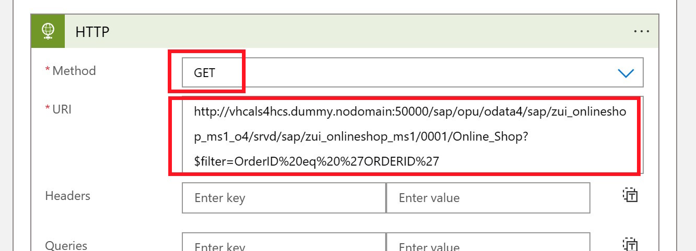
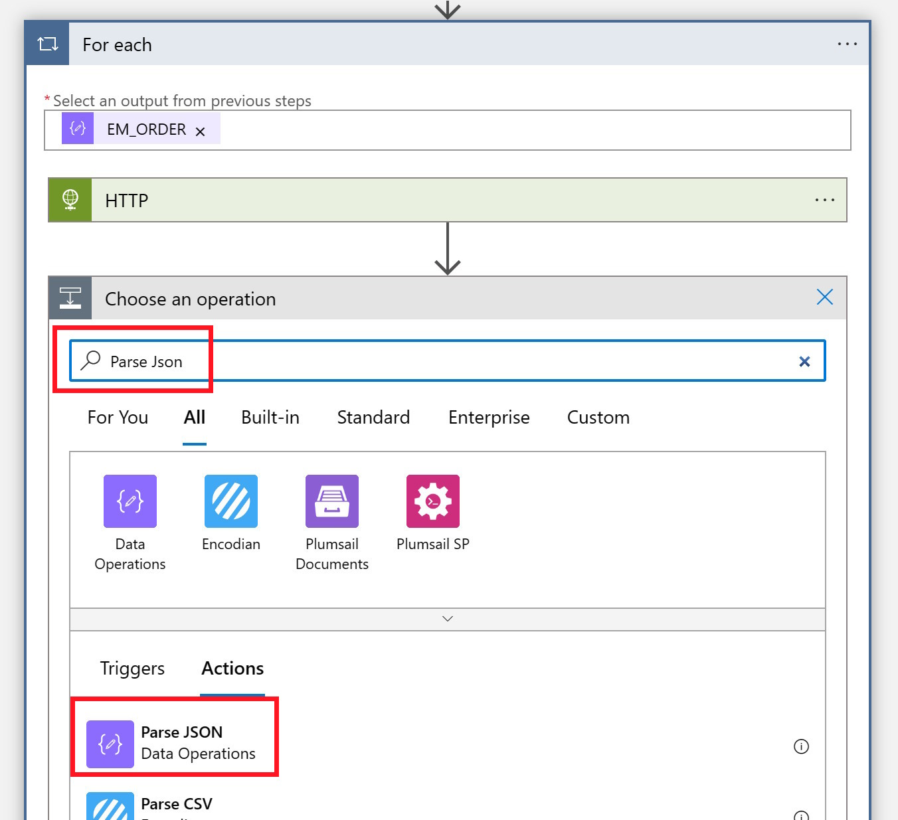
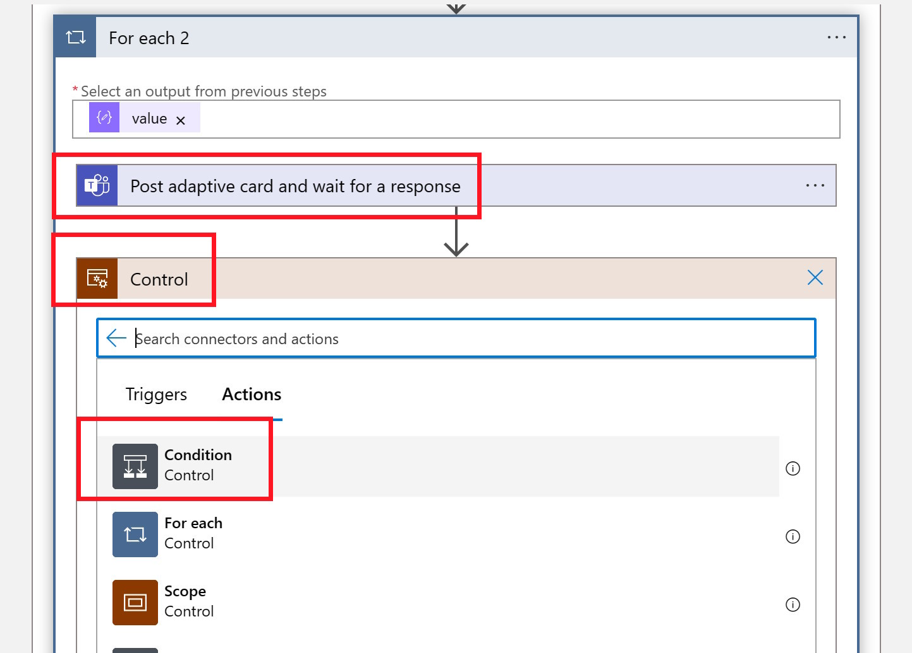

# Quest 3 - Debutant's journey

[< Quest 2](quest2.md) - **[🏠Home](../README.md)** - [ Quest 4 >](quest4.md)

Whenever an Order is created in the Online Shop the user is now notified in Teams. However, a Purchase Requisition is not yet created.

In order to simplify this process we want to empower the Teams user to review the created order and then create a Purchase Requisition directly from Teams. For this we will enhance our Adaptive Card and make it interactive: The user should have the option to create a Purchase Requisition directly from Teams.

Instead of doing this again via an RFC call, we will now switch to OData. At first we will leverage an OData call to fetch additional information from our Order (since the RFC did not return all the required information like Description).

Then we will also call the an API from the Online Shop, that creates the actual Purchase Requisition in the SAP System.

## Enhance the existing Logic App with an additional call to the OData service

1. In the "For Each" loop that was created to send the Adaptive Card, click on "Add an Action"

<p align="center" width="100%">

</p>

2. Search for HTTP and add the "HTTP" Action

<p align="center" width="100%">

</p>

3. The HTTP action needs to be executed before the Adaptive Card is sent to Teams. So, before providing the required values to the HTTP action, change the position of the "HTTP Action and the Post adaptive card in a chat or channel" action by dragging and dropping the Teams action under the HTTP action.

<p align="center" width="100%">

</p>

4. Request an order from the Online Shop via OData filtering by OrderID

```http
http://13.81.170.205:50000/sap/opu/odata4/sap/zui_onlineshop_ms1_o4/srvd/sap/zui_onlineshop_ms1/0001/Online_Shop?$filter=OrderID%20eq%20%27ORDERID%27
```

> **Warning** - IP Address will change; configure DNS hostname!

<p align="center" width="100%">

</p>

5. Since we always want to look for the Order ID that was previously fetched from the RFC, replace the placeholder `ORDERID` with the variable from the previous RFC call.

<p align="center" width="100%">

</p>

6. Click on "Add new parameter" and select "Authentication"

<p align="center" width="100%">

</p>

7. Select Authentication Type Basic and enter the username and password for the SAP System, `S4H_EXT / Welcome1`

<p align="center" width="100%">

</p>

8. Similar like with the RFC call we can now prase the JSON response, by adding a new action

<p align="center" width="100%">

</p>

9. Using the Parse Json Function

<p align="center" width="100%">

</p>

10. Using the schema:

```json
{
    "type": "object",
    "properties": {
        "@@odata.context": {
            "type": "string"
        },
        "@@odata.metadataEtag": {
            "type": "string"
        },
        "value": {
            "type": "array",
            "items": {
                "type": "object",
                "properties": {
                    "@@odata.etag": {
                        "type": "string"
                    },
                    "#com.sap.gateway.srvd.zui_onlineshop_ms1.v0001.createPurchaseRequisitionItem": {
                        "type": "object",
                        "properties": {}
                    },
                    "#com.sap.gateway.srvd.zui_onlineshop_ms1.v0001.Edit(PreserveChanges)": {
                        "type": "object",
                        "properties": {}
                    },
                    "OrderUUID": {
                        "type": "string"
                    },
                    "OrderID": {
                        "type": "string"
                    },
                    "Ordereditem": {
                        "type": "string"
                    },
                    "Purchasereqn": {
                        "type": "string"
                    },
                    "Prstatus": {
                        "type": "string"
                    },
                    "DeliveryDate": {},
                    "LocalLastChangedAt": {
                        "type": "string"
                    },
                    "quantity": {
                        "type": "string"
                    },
                    "DescriptionText": {
                        "type": "string"
                    },
                    "URL": {
                        "type": "string"
                    },
                    "CreatedAt": {
                        "type": "string"
                    },
                    "CreatedBy": {
                        "type": "string"
                    },
                    "LastChangedAt": {
                        "type": "string"
                    },
                    "LastChangedBy": {
                        "type": "string"
                    },
                    "HasDraftEntity": {
                        "type": "boolean"
                    },
                    "DraftEntityCreationDateTime": {},
                    "DraftEntityLastChangeDateTime": {},
                    "HasActiveEntity": {
                        "type": "boolean"
                    },
                    "IsActiveEntity": {
                        "type": "boolean"
                    },
                    "__EntityControl": {
                        "type": "object",
                        "properties": {
                            "Deletable": {
                                "type": "boolean"
                            },
                            "Updatable": {
                                "type": "boolean"
                            }
                        }
                    },
                    "__OperationControl": {
                        "type": "object",
                        "properties": {
                            "createPurchaseRequisitionItem": {
                                "type": "boolean"
                            },
                            "Edit": {
                                "type": "boolean"
                            }
                        }
                    },
                    "SAP__Messages": {
                        "type": "array"
                    }
                },
                "required": [
                    "@@odata.etag",
                    "#com.sap.gateway.srvd.zui_onlineshop_ms1.v0001.createPurchaseRequisitionItem",
                    "#com.sap.gateway.srvd.zui_onlineshop_ms1.v0001.Edit(PreserveChanges)",
                    "OrderUUID",
                    "OrderID",
                    "Ordereditem",
                    "Purchasereqn",
                    "Prstatus",
                    "DeliveryDate",
                    "LocalLastChangedAt",
                    "quantity",
                    "DescriptionText",
                    "URL",
                    "CreatedAt",
                    "CreatedBy",
                    "LastChangedAt",
                    "LastChangedBy",
                    "HasDraftEntity",
                    "DraftEntityCreationDateTime",
                    "DraftEntityLastChangeDateTime",
                    "HasActiveEntity",
                    "IsActiveEntity",
                    "__EntityControl",
                    "__OperationControl",
                    "SAP__Messages"
                ]
            }
        }
    }
}
```

> **Note** - Like in Quest 1, you could have generated this schema by providing a sample HTTP request.

11. and selecting the Body form the previous HTTP Call as Content

<p align="center" width="100%">

</p>

12. With this information we can make the new information like Description and Quantity also available in the Adaptive Card.

<p align="center" width="100%">

</p>

> **Note** - Since the response from the OData call is an Array, Logic Apps automatically converted the Flow into another `For each` flow. In our case the results will most likely always be single items, but it is great to see that Logic Apps follows the schema and would be ready for arrays. In a productive implementation, you would probably also not do an RFC call first, and then an OData call. This is just to explain the different options how you can connect to your SAP System.

13. The OData services also returned the Order UUID. Make use of that and add a URL to the View Button in the Adaptive card. In the "actions" section at the end of the adaptive card, replace the place holder URL with the link below:

```http
https://vhcals4hcs.dummy.nodomain:44301/sap/bc/adt/businessservices/odatav4/feap?feapParams=C%C2%87u%C2%84C%C2%83%C2%84%C2%89C%C2%83xu%C2%88uHC%C2%87u%C2%84C%C2%8E%C2%89%7Ds%C2%83%C2%82%C2%80%7D%C2%82y%C2%87%7C%C2%83%C2%84s%C2%81%C2%87Es%C2%83HC%C2%87%C2%86%C2%8AxC%C2%87u%C2%84C%C2%8E%C2%89%7Ds%C2%83%C2%82%C2%80%7D%C2%82y%C2%87%7C%C2%83%C2%84s%C2%81%C2%87ECDDDEC77c%C2%82%C2%80%7D%C2%82ysg%7C%C2%83%C2%84777777ni%5Dscb%60%5DbYg%5CcdsagE77DDDE77ni%5Dscb%60%5DbYg%5CcdsagEscH&sap-ui-language=EN&sap-client=100#/Online_Shop(OrderUUID=ORDERUUID-PLACEHOLDER,IsActiveEntity=true)
```

Then also make sure to update the Placeholder in the URL (ORDERUUID-PLACEHOLDER) with the dynamic value from the previous HTTP call.

<p align="center" width="100%">

</p>

14. Now we can test the scenario by creating another Order in our Online Shop

TODO--TODO--TODO--TODO--TODO--TODO--TODO--TODO--
Screenshot from Online Shop

## Add an action to create the Purchase Requisition

In the next step we want to enable the user to create a purchase requisition directly from Teams. We could call the Purchase Requisition API as documented on the
[SAP API Business Hub](https://api.sap.com/api/OP_PURCHASEREQUISITION_0001/resource), but our Online Shop already provides a proxy that takes care of all the properties. So, we can just ask the Online Shop to create a Purchase Requisition for a specific Order Item.

The creation happens via a POST message. POSTing data to SAP requires a few steps (e.g. you need to fetch a X-CSRF Token and handle the ETag).

1. Use another action for publishing the adaptive card to Teams, which also waits for the response of the user. Under the existing Teams action, click on "Add an action".

<p align="center" width="100%">

</p>

2. Search for "Post adaptive card and wait" and select the new Teams Action

<p align="center" width="100%">

</p>

3. Enter the same values for Team and Channel as before. Keep the "Message" property empty for now

<p align="center" width="100%">

</p>

4. For the message copy and paste the message from the previous Teams action and add this section under the View actions section:

```json
{
    "type": "Action.Submit",
    "title": "Create Purchase Requisition",
        "id": "CreatePR"
}
```

<p align="center" width="100%">

</p>

> **Note** - make sure that you start with the first "," so that the results are as shown in the screenshot.

5. With this we can delete the first Action to send an Adaptive Card to Teams.

<p align="center" width="100%">

</p>
  
### Wait for input

1. Now we have to react to the answer from the user. If the User clicked on the "Create Purchase Requisition" button, we need to call the OData Service of the Online Shop to create the Purchase Requisition.

Add a new Action by searching for and selecting "Control" and selecting the "Condition" action.

If there is an action, we want to Check if it was our Create Purchase Requisition Button and only then execute next steps.

<p align="center" width="100%">

</p>

2. For the conditions enter, the value in the Expression field (make sure to use the Expression pane on the right)

```json
outputs('Post_adaptive_card_and_wait_for_a_response')['body']['submitActionId']
```

<p align="center" width="100%">

</p>

3. and CreatePR for the value

<p align="center" width="100%">

</p>

### Create Purchase Requisition

If the user clicked on the button we can finally create the Purchase Requisition. For this we can use the service.

```http
Online_Shop(OrderUUID=<OrderUUID>,IsActiveEntity=true)/com.sap.gateway.srvd.zui_onlineshop_ms1.v0001.createPurchaseRequisitionItem?sap-client=100&$select=SAP__Messages
```

Since this is a POST call, we also need to provide a valid X-CSRF-Token and do the required e-tag handling. 

1. Let's create another "HTTP" Action in the "True" flow which calls the OData service for a specific OrderUUID and fetches the required X-CSRF token

<p align="center" width="100%">

</p>

2. Select Method Get, add the Header: X-CSRF-Token = Fetch and also provide credentials for the authentication. For the URI use:

```http
http://13.81.170.205:50000/sap/opu/odata4/sap/zui_onlineshop_ms1_o4/srvd/sap/zui_onlineshop_ms1/0001/Online_Shop(OrderUUID=@{variables('OrderUUID')},IsActiveEntity=true)
```

<p align="center" width="100%">

</p>

3. Next we parse the JSON response to be able to access the X-CSRF-Token

<p align="center" width="100%">

</p>

```json
{
    "properties": {
        "#com.sap.gateway.srvd.zui_onlineshop_ms1.v0001.Edit(PreserveChanges)": {
            "properties": {},
            "type": "object"
        },
        "#com.sap.gateway.srvd.zui_onlineshop_ms1.v0001.createPurchaseRequisitionItem": {
            "properties": {},
            "type": "object"
        },
        "@@odata.context": {
            "type": "string"
        },
        "@@odata.etag": {
            "type": "string"
        },
        "@@odata.metadataEtag": {
            "type": "string"
        },
        "CreatedAt": {
            "type": "string"
        },
        "CreatedBy": {
            "type": "string"
        },
        "DeliveryDate": {},
        "DescriptionText": {
            "type": "string"
        },
        "DraftEntityCreationDateTime": {},
        "DraftEntityLastChangeDateTime": {},
        "HasActiveEntity": {
            "type": "boolean"
        },
        "HasDraftEntity": {
            "type": "boolean"
        },
        "IsActiveEntity": {
            "type": "boolean"
        },
        "LastChangedAt": {
            "type": "string"
        },
        "LastChangedBy": {
            "type": "string"
        },
        "LocalLastChangedAt": {
            "type": "string"
        },
        "OrderID": {
            "type": "string"
        },
        "OrderUUID": {
            "type": "string"
        },
        "Ordereditem": {
            "type": "string"
        },
        "Prstatus": {
            "type": "string"
        },
        "Purchasereqn": {
            "type": "string"
        },
        "SAP__Messages": {
            "type": "array"
        },
        "URL": {
            "type": "string"
        },
        "__EntityControl": {
            "properties": {
                "Deletable": {
                    "type": "boolean"
                },
                "Updatable": {
                    "type": "boolean"
                }
            },
            "type": "object"
        },
        "__OperationControl": {
            "properties": {
                "Edit": {
                    "type": "boolean"
                },
                "createPurchaseRequisitionItem": {
                    "type": "boolean"
                }
            },
            "type": "object"
        },
        "quantity": {
            "type": "string"
        }
    },
    "type": "object"
}
```

4. Now we are ready to make the action call to create the Purchase Requisition. Create another HTTP Action and use the following values:

<br>
<div style="margin-left: auto; margin-right: auto; width: 50%">

|Property|Value|
|---|---|
|Method|POST|
|URI|http://13.81.170.205:50000/sap/opu/odata4/sap/zui_onlineshop_ms1_o4/srvd/sap/zui_onlineshop_ms1/0001/Online_Shop\(OrderUUID=ORDERUUID-PLACEHOLDER,IsActiveEntity=true)/com.sap.gateway.srvd.zui_onlineshop_ms1.v0001.createPurchaseRequisitionItem?sap-client=100&$select=SAP__Messages|
|If-Match|OData Etag value from Parse Json, e.g. body('Parse_JSON_3')?['@odata.etag']|
|X-CSRF-Token|Dynamic x-csrf-token value from previous HTTP Call, e.g. outputs('HTTP_2')['headers']?['x-csrf-token']|
|Cookie|we take the cookie from the previous HTTP call, order not to do another authentication, e.g. replace(outputs('HTTP_2')['headers']?['Set-Cookie'], ',', ';')|
</div>

* If- Match

```json
body('Parse_JSON_3')?['@odata.etag']
```

<p align="center" width="100%">

</p>

* OrderUUID:

<p align="center" width="100%">

</p>

* X-CSRF-Token:

```json
outputs('HTTP_2')['headers']?['x-csrf-token']
```

<p align="center" width="100%">

</p>

* Cookie:

```json
replace(outputs('HTTP_2')['headers']?['Set-Cookie'], ',', ';')
```

<p align="center" width="100%">

</p>

The result should look like this:

<p align="center" width="100%">

</p>

### Test the new flow

1. Now we can test the flow again. Create a new Order in the [Online Shop](https://vhcals4hcs.dummy.nodomain:44301/sap/bc/adt/businessservices/odatav4/feap?feapParams=C%C2%87u%C2%84C%C2%83%C2%84%C2%89C%C2%83xu%C2%88uHC%C2%87u%C2%84C%C2%8E%C2%89%7Ds%C2%83%C2%82%C2%80%7D%C2%82y%C2%87%7C%C2%83%C2%84s%C2%81%C2%87Es%C2%83HC%C2%87%C2%86%C2%8AxC%C2%87u%C2%84C%C2%8E%C2%89%7Ds%C2%83%C2%82%C2%80%7D%C2%82y%C2%87%7C%C2%83%C2%84s%C2%81%C2%87ECDDDEC77c%C2%82%C2%80%7D%C2%82ysg%7C%C2%83%C2%84777777ni%5Dscb%60%5DbYg%5CcdsagE77DDDE77ni%5Dscb%60%5DbYg%5CcdsagEscH&sap-ui-language=EN&sap-client=100).

<p align="center" width="100%">

</p>

2. While the Logic App flow is still running, you should see the Adaptive Card in Teams, waiting for approval. 

<p align="center" width="100%">

</p>

3. A click on View should open up the Order in the Online Store in a separate Window. When you click on "Create Purchase Requisition" the Adaptive Card should change and in the Online Shop you should now see a Purchase Requisition number for your order

<p align="center" width="100%">

</p>

<p align="center" width="100%">

</p>

[< Quest 2](quest2.md) - **[🏠Home](../README.md)** - [ Quest 4 >](quest4.md)
