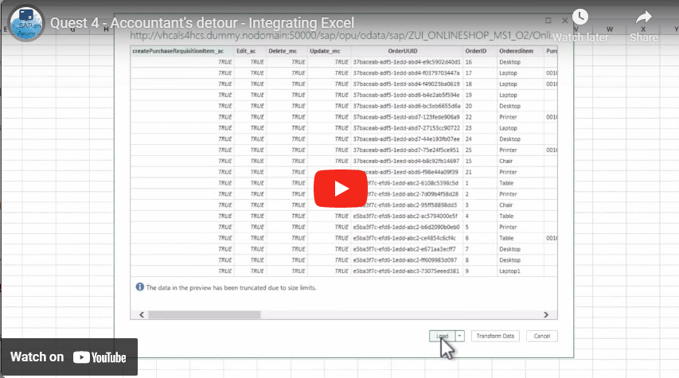
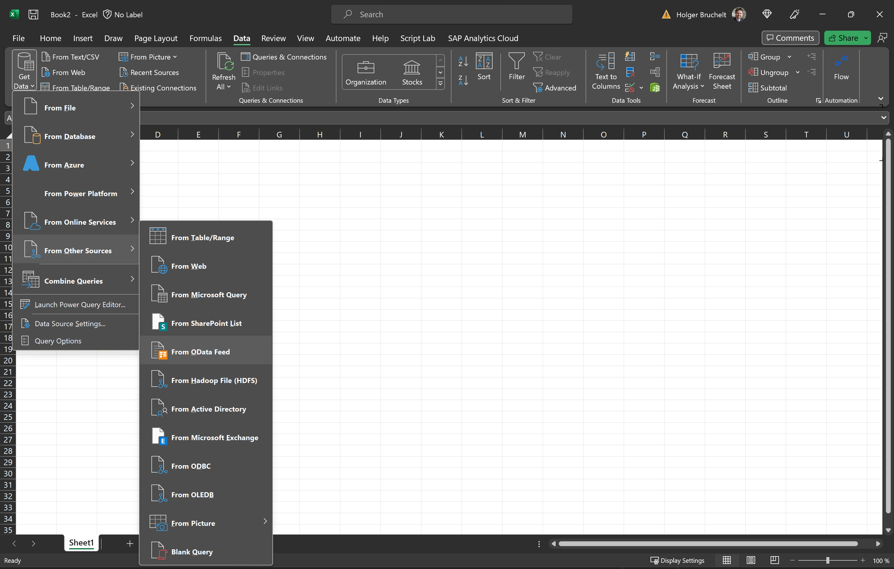
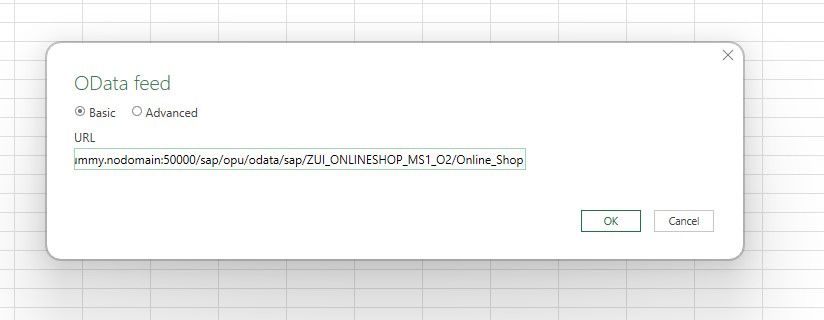
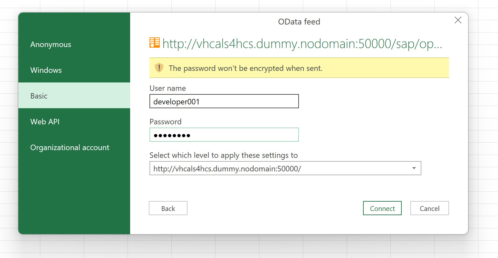
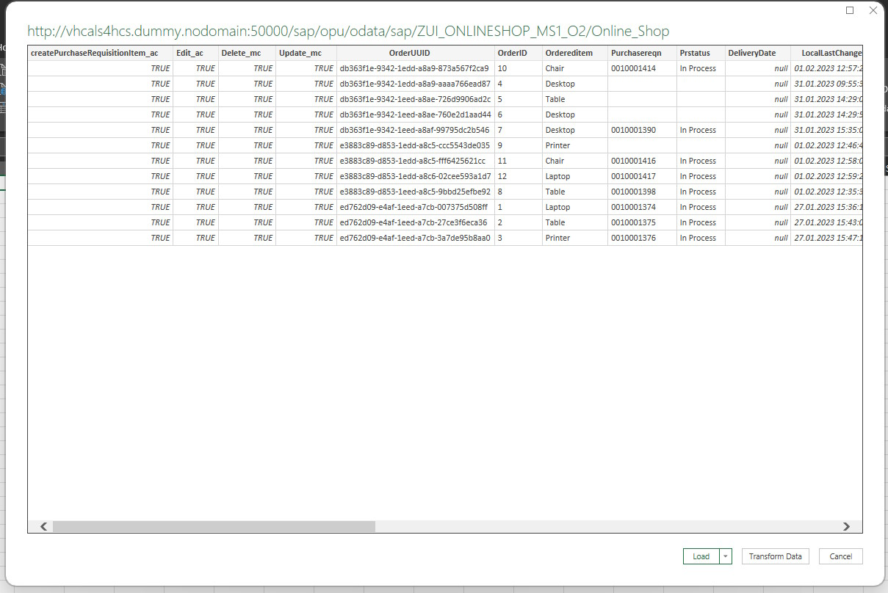
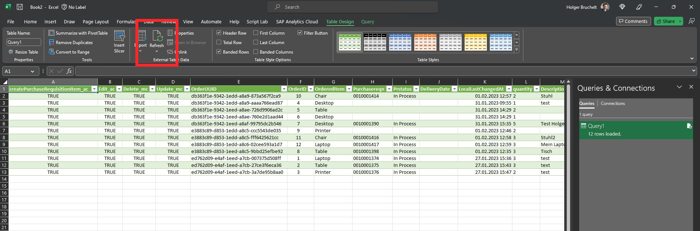

# Quest 4 - Accountant's detour

[< Quest 3](quest3.md) - **[🏠Home](../README.md)** - [ Quest 5 >](quest5.md)

🌟
🕒 30 mins

In the next step we want to integrate the Ordered Items in Excel. Use OData v2 instead of OData v4 to verify legacy support. Luckily creating an OData v2 services from default v4 is just a click away with RAP.

```http
http://13.81.170.205:50000/sap/opu/odata/sap/ZUI_ONLINESHOP_MS1_O2/Online_Shop 
```

> **Note** - As before we are using here HTTP and Port 50000 (not HTTPS), because we have not configured any certificates.

## Video guide provided by our Mentors

<p align="center" width="100%">
    <a href="https://youtu.be/IsJS36Ll5uU" target="_blank" rel="noopener noreferrer">
        
    </a>
</p>

The video shall provide hints where lore, poetic code snippets, and narrative cannot.

## The path

1. Open **Microsoft Excel** (You can either install Office on the VM as mentioned before, or for this Quest you can also easily use Excel installed on your PC)

> **Note** - If you use your Excel installed on your local computer, please use this URL instead (the 13.81.170.205 requires you to have an entry in our etc/hosts file)
```http
http://13.81.170.205:50000/sap/opu/odata/sap/ZUI_ONLINESHOP_MS1_O2/Online_Shop 
```


2. From a clean Excel Worksheet, navigate to Data and select **Get Data** -> **Open From Other Sources** -> **From OData Feed**

<p align="center" width="100%">

</p>

3. When prompted **enter the URL**

```http
http://13.81.170.205:50000/sap/opu/odata/sap/ZUI_ONLINESHOP_MS1_O2/Online_Shop
```

<p align="center" width="100%">

</p>

> **Note** - you can also open this URL in a browser first to validate that you get the Ordered Items in JSON

4. In order to authenticate with the SAP System, select **Basic** and enter your SAP **Username** and **Password**

<p align="center" width="100%">

</p>

5. In the preview screen you could now filter and transform the data. We will leave it as is, and just click on **Load**

<p align="center" width="100%">

</p>

6. As a results we have the live data from the SAP system in Excel. If you go back and create another order item in the [Online Shop](https://13.81.170.205:44301/sap/bc/adt/businessservices/odatav4/feap?feapParams=C%C2%87u%C2%84C%C2%83%C2%84%C2%89C%C2%83xu%C2%88uHC%C2%87u%C2%84C%C2%8E%C2%89%7Ds%C2%83%C2%82%C2%80%7D%C2%82y%C2%87%7C%C2%83%C2%84s%C2%81%C2%87Es%C2%83HC%C2%87%C2%86%C2%8AxC%C2%87u%C2%84C%C2%8E%C2%89%7Ds%C2%83%C2%82%C2%80%7D%C2%82y%C2%87%7C%C2%83%C2%84s%C2%81%C2%87ECDDDEC77c%C2%82%C2%80%7D%C2%82ysg%7C%C2%83%C2%84777777ni%5Dscb%60%5DbYg%5CcdsagE77DDDE77ni%5Dscb%60%5DbYg%5CcdsagEscH&sap-ui-language=EN&sap-client=100) , you can just click on Refresh and get the latest data from SAP.

<p align="center" width="100%">

</p>

## Where to next?

[< Quest 3](quest3.md) - **[🏠Home](../README.md)** - [ Quest 5 >](quest5.md)

[🔝](#)
