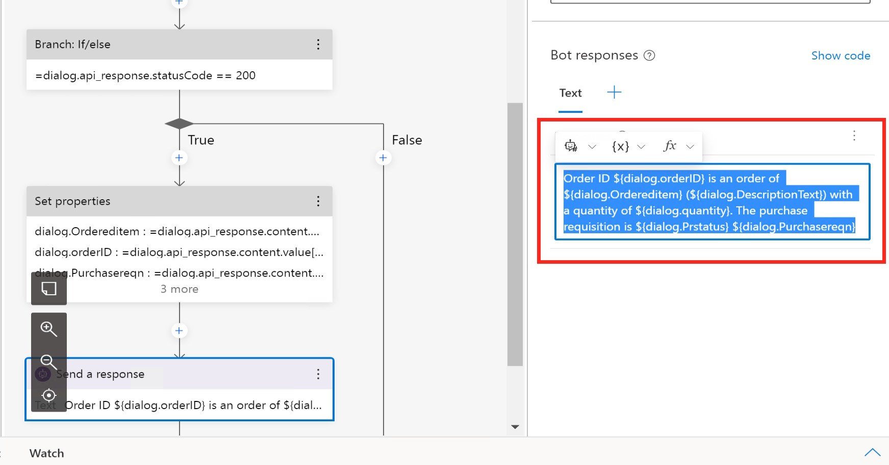

# Quest 5 - Master's trail
We are following the official [Tutorial: Create a weather bot with Composer](https://learn.microsoft.com/en-us/composer/tutorial-create-weather-bot) -- however: instead of connecting to a Weather API, we are going to connect to our Online Store Service and retrieve additional information of a specific order. 

### Create an Empty Bot in Composer
1) Start the Bot Framework Composer and click on "+ Create new" 


2) Enter a name for the bot, e.g. "fetch_order_infos"


### Modify the Greeting
1) Select the Greeting trigger in the bot explorer and select the "Send a response" action
2) Select "Send a response"


2) Click on the existing text and replace it with something like "Welcome to the SAP Online Shop Bot. Type "orders" to get started." 


3) After that you can test the bot by clicking on "Start Bot" at the top of the window. When the Bot is running you can click on "Open Web Chat" to see the Greeting in a new window. 

 


4) Close the Bot Framework Windows (not the Composer) by clicking on the "X"


### Create a new dialog
1) Select the "..." next to the fetch_order_infos bot in the Bot explorer and click on "+ Add a dialog"


2) Enter Name "get_order" and description "Get the details of a specific order" in the Create a dialog window and click on "OK"


3) In the Bot explorer you can now see the new dialog "get_order" with a trigger "BeginDialog". Select this trigger, click on the "+" and select "Send a response"


4) While the "Send a response" dialog is selected, click on "Add alternative" to enter your initial response for the step "get_order", e.g. "Let's lookup some order information"
>> Note: If you cannot see the properties pane for the "Send a response", the Bot framwork migth still be running. In this case, close the windows of the running bot. 


### Start a dialog from a trigger
1) Select the fetch_order_infos dialog in the bot explorer and click on Change in the properties for "Recognizer Type/Dispatch type". Then select the "Regular expressioN" type and click on Done


2) Now with the trigger changed to Regular expression, click on the "..." next to the fetch_order_infos and select "+ Add new trigger"


3) In the new windows select "Intent recognized" under trigger type and user order for the name and input of the regular expression


4) Next we need to link this new "order" trigger to our Dialog. Start by selecting the order trigger in the box explorer, click on the "+" and select "Dialog management" -> "Begin a new dialog"


5) Having the "Begin a new dialog" step still selected, select "get_order" from the Dialog name dropdown. 


6) With this we can again test the flow. Click on start bot / restart bot and open the Web Chat:


7) If you now trigger our flow (e.g. using something with order), you will get the response from our get_order dialog. 


### Prompt a user for input
1) In the next step we need to ask the user for an order number. For this select the BeginDialog step under "get_order" and click on the "+" sign after the "Send a response" step. From there Click on "Ask a question" and "Number". 


2) Select the "Prompt for a number" step and click on "Add alternative" to add a question, e.g. "What order ID are you looking for?"
>> Note: You might  need to Close the Chat window again. 


3) Next click on "User Input" and in the property field enter, user.orderID


### Call the Online Shop OData service
1) Now that we have all the information it is time to call the OData service. Under the User input dialog, click on the "+" and select "Access external resource" -> "Send an HTTP request"


2) For the HTTP method, select "GET" and for the URL enter 
```http
http://13.81.170.205:50000/sap/opu/odata4/sap/zui_onlineshop_ms1_o4/srvd/sap/zui_onlineshop_ms1/0001/Online_Shop?$filter=OrderID%20eq%20%27${user.orderID}%27
```

>> Note: For the order ID we user the property stored in the answer from the user stored in {user.orderID}

3) To authenticate with our S4H_EXT user, click on "Add new" in the Headers section and enter "Authorization" as the key and "Basic czRoX2V4dDpXZWxjb21lMQ==" as the value. 

>>Note: Sometimes these properties are not stored. Before continuing with the next step, click on somewhere else to leave the focus of the Value input field.


4) Since we expect a response in json and we want to store the results in a variable, enter "dialog.api_response" for the Result property and "json" for the Response type. 


5) With the response from the Online Shop we can now check if everything was OK. For that we create a if/else branch by clicking on the "+", selecting "Create a condition" and using the "Branch: If/else" action


6) In the Branch: If/else dialog select "Write an expression" from the Condition drop down. 


7) enter the expression, 
```
=dialog.api_response.statusCode == 200
```


8) in the True branch, click on the "+" and select "Manage Properties" -> "Set properties" 


9) For each of the following properties, click on "Add new" under Assignment. 


|Property|Value|
|---|---|
|dialog.orderID|=dialog.api_response.content.value[0].OrderID|
|dialog.Ordereditem|=dialog.api_response.content.value[0].Ordereditem|
|dialog.Purchasereqn|=dialog.api_response.content.value[0].Purchasereqn|
|dialog.Prstatus|=dialog.api_response.content.value[0].Prstatus|
|dialog.quantity|=dialog.api_response.content.value[0].quantity|
|dialog.DescriptionText|=dialog.api_response.content.value[0].DescriptionText|


10) We should have all the information now so we can write a response to the user. Click on "+" in the True branch and click on "Send a resposne" 


11) As before add a text for the response:
```
Order ID ${dialog.orderID} is an order of ${dialog.Ordereditem} (${dialog.DescriptionText}) with a quantity of ${dialog.quantity}. The purchase requisition is ${dialog.Prstatus} ${dialog.Purchasereqn}
```

>> Note: We can also create a more beautiful adaptive card here like the one we sent to Teams from Logic Apps before. 

12) Also add a response for the False branch using:
```
Something went wrong: ${dialog.api_response.content.message}.
``` 


13) In case of an error we will also clean-up the property to enable the user to enter another Order ID. In the Fail branch, under the Send a response, click on the "+", select "Manage properties" and click on "Delete a property"


14) Enter "user.orderID" in the Properties of the Delete a property field. 


### Run the bot
1) Click again on "Restart bot" -> "Open Web Chat" to test the integration. 


### Publish the bot to Teams
ToDo--ToDo--ToDo--ToDo--ToDo--
As a next step you could publish the bot to Azure Bot Framework and from there make it also available in Teams. 

[< Quest 4](quest4.md) - **[🏠Home](../README.md)** - [ Quest 6 >](quest6.md)


