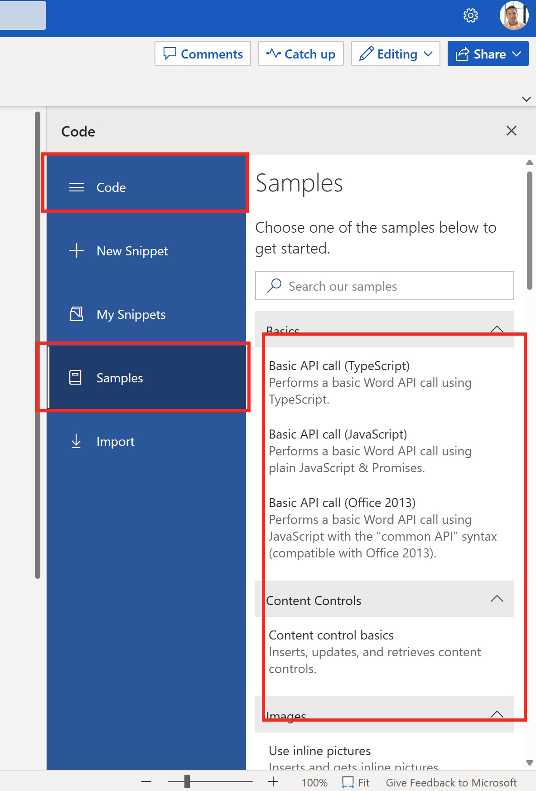
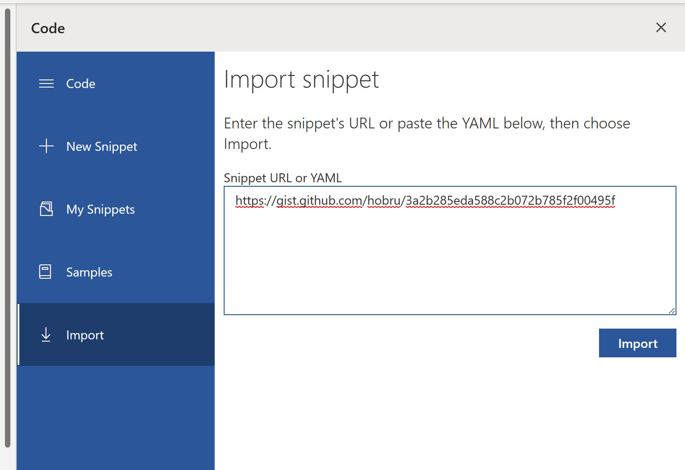
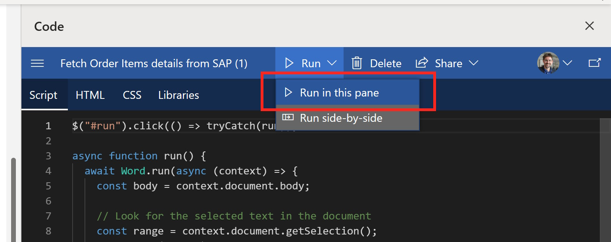
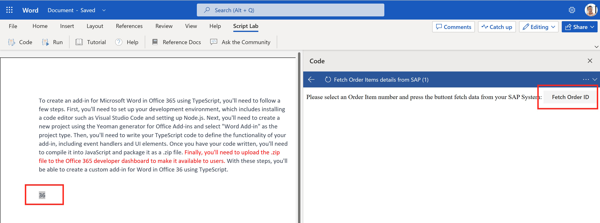
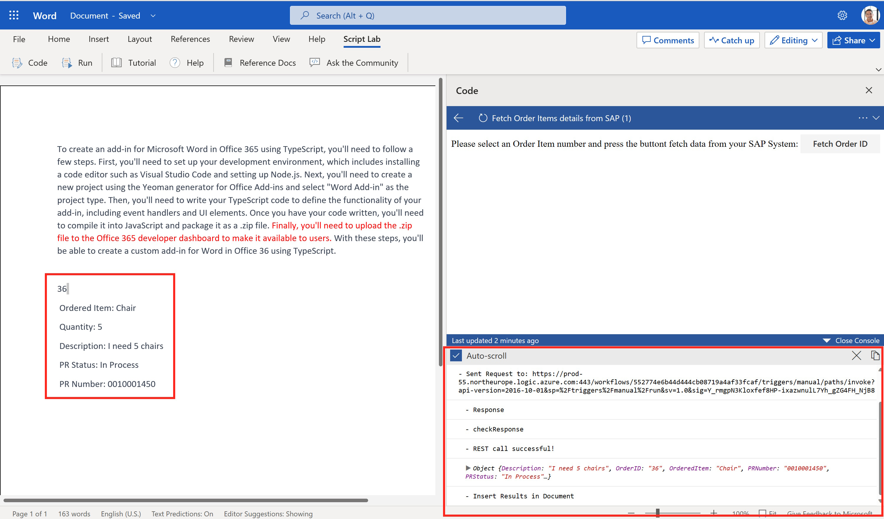

# Quest 6 - Wizard's route
Now we want to leverage the same OData service to build an App in the Office suite of Microsoft 365. Instead of using Visual Studio Code or Visual Studio to build a "full" app, we are going to leverage the Script-Lab add-in which enables you to create an app directly from within the Office app. The concept is the same for Excel, Outlook or Power Point, so we are going to do this in Microsoft Word. 

Once the app is build, you can easily create a stand-alone app and continue the app development following the process outlined [here](https://learn.microsoft.com/en-us/office/dev/add-ins/overview/create-an-office-add-in-from-script-lab). 


## Install Script-Lab add-in into Word
1) Click on Insert -> "..." and Select Add-ins


2) Search for Script and click on "Add" to add the Script-Lab add-in to Word


3) When prompted click on "Continue"


4) As a result you can now see the Script Lab add-in in the menu and task pane on the right. 


## Run a first test
To get familiar with the concepts of the Office JavaScript libraries, let's start with a few simple examples. 

1) In the Script Lab task pane on the right click on "Basic API call (Typscrip)"

2) Write some text, select a section and click on Run


3) The TypScript call is executed within Word and a Button is Displayed. Click on the "Print Selection" button which will convert the marked text to Red. 


3) Continue to explore additional Samples by going back. 



## Fetch data from the Online Store
Now lets go back and create a new app that will connect to the Online Store OData service and fetch details to a specific order. 

1) To speed up the process, lets click on Import and use the URL, 
```html
https://gist.github.com/hobru/3a2b285eda588c2b072b785f2f00495f
``` 
to import a sample from Git



2) Take a look and explore the important content. The code basically looks at a marked text in your word document (e.g. an Order ID number) and calls a Logic Apps which then call the OData Service to filter and fetch a specific Order ID. 
Then the results are pasted in the Word document. 

Click on Run 


3) Now write a number in your Document for an Order ID that you have previously created. Select this text and click on "Run"

 
4) In the console Log you can see the different steps being executed and also the JSON response. The results are then pasted in the Word document



[< Quest 1](quest5.md) - **[🏠Home](../README.md)**
