# Quest 6 - Wizard's route

[< Quest 5](quest5.md) - **[🏠Home](../README.md)**

🌟
🕒 30 mins

Now we want to leverage the same OData service to build an App in the Office suite of Microsoft 365. Instead of using Visual Studio Code or Visual Studio to build a "full" app, we are going to leverage the Script-Lab add-in which enables you to create an app directly from within the Office app. The concept is the same for Excel, Outlook or Power Point, so we are going to do this in Microsoft Word.

Once the app is build, you can easily create a stand-alone app and continue the app development in VS Code following the process outlined [here](https://learn.microsoft.com/office/dev/add-ins/overview/create-an-office-add-in-from-script-lab).

## Install Script-Lab add-in into Word

1. [Open Word](https://www.office.com/launch/word?auth=2) with a Blank document, click on **Insert** -> **...** and select **Add-ins**

<p align="center" width="100%">
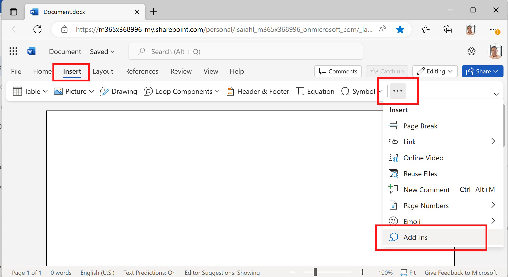
</p>

2. In the top row select **Store** and search for **Script** and click on **Add** to add the Script-Lab add-in to Word

<p align="center" width="100%">
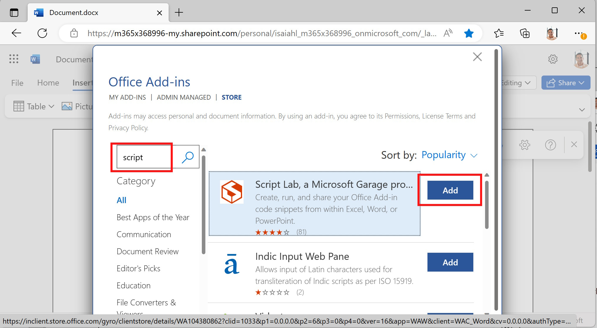
</p>

3. When prompted click on **Continue**

<p align="center" width="100%">
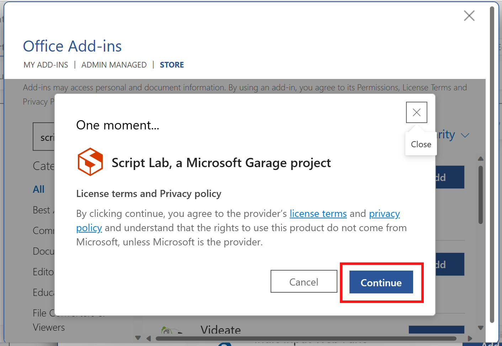
</p>

4. As a result you can now see the Script Lab add-in in the menu and task pane on the right.

<p align="center" width="100%">
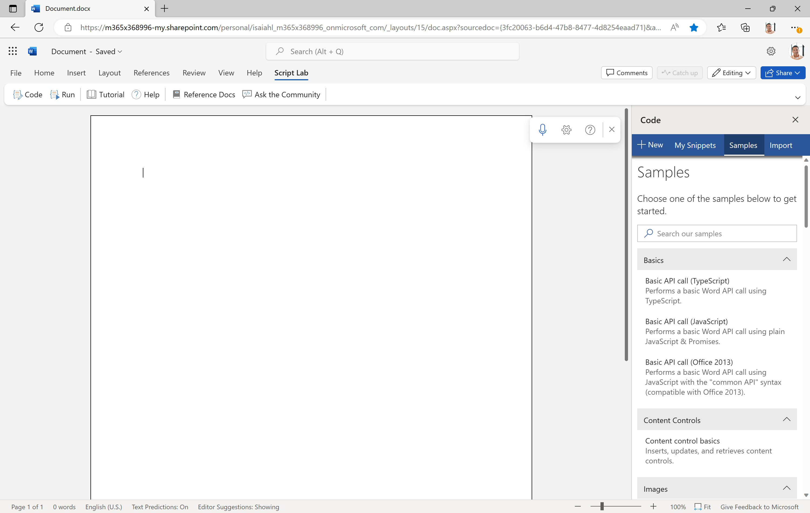
</p>

## Run a first test

To get familiar with the concepts of the Office JavaScript libraries, let's start with a few simple examples.

1. In the Script Lab task pane on the right click on **Basic API call (Typescript)**

2. Write some text in the main document, select a section and click on **Run** in the Script Lab task pane.

<p align="center" width="100%">
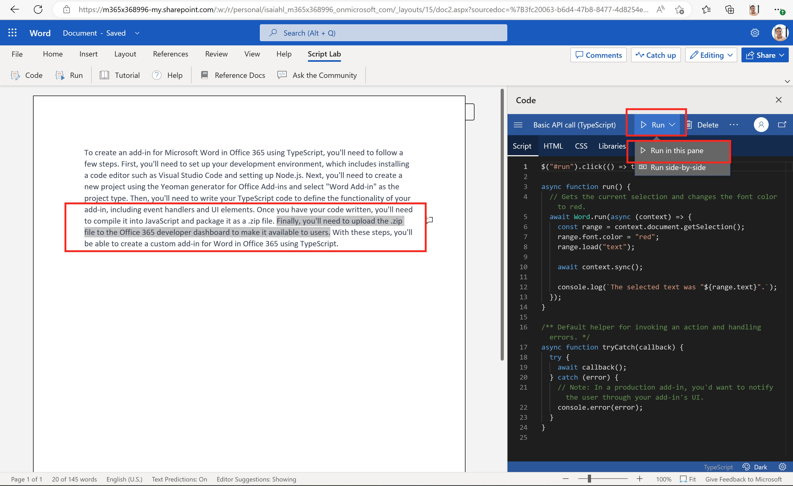
</p>

3. The TypScript call is executed within Word and a button is displayed. Click on the **Print Selection** button which will convert the marked text to Red.

<p align="center" width="100%">
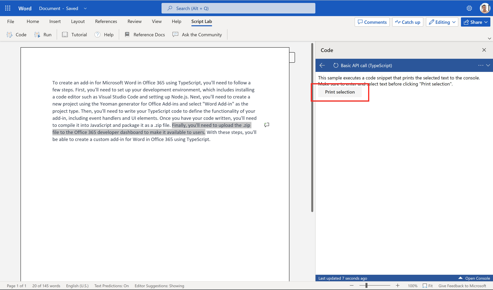
</p>

4. Continue to explore additional Samples by going back (you might need to expand the Code task pane to see the different entries in the Menu)

<p align="center" width="100%">
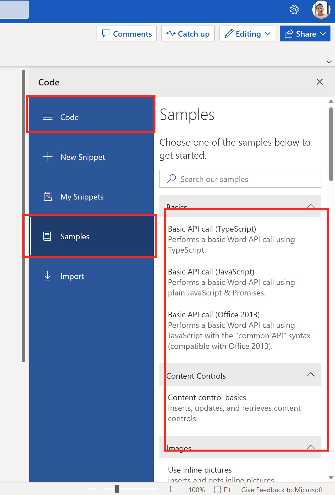
</p>

> **Note**: You can make the **Script lab** pane larger so that you can see the full content of the Code Menu.

## Fetch data from the Online Store

Now lets go back and create a new app that will connect to the Online Store OData service and fetch details to a specific order.

1. To speed up the process, lets click on **Import** and use the **URL**,

```http
https://gist.github.com/hobru/3a2b285eda588c2b072b785f2f00495f
```

to import a sample from Git

<p align="center" width="100%">
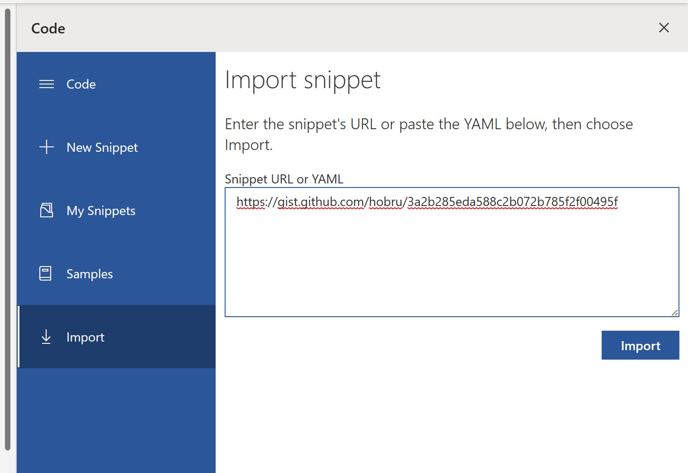
</p>

> **Note** - If the URL does not work, open the URL from above in a new tab and copy and paste the full YAML in the Snippet box

When the import is done, click on **Trust** to trust the snippet.

2. Take a look and explore the imported content. The code basically looks at a marked text in your Word document (e.g. an Order ID number) and calls a Logic Apps which then calls the OData Service to filter and fetch a specific Order ID. Then the results are pasted in the Word document.

Click on **Run**

<p align="center" width="100%">
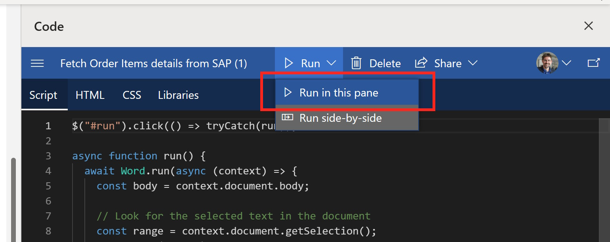
</p>

3. Now write a number in your Document for an Order ID that you have previously created. Select this text and click on **Run**

<p align="center" width="100%">
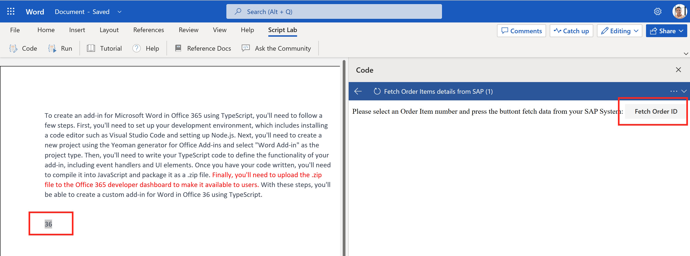
</p>
 
4. In the console Log you can see the different steps being executed and also the JSON response. The results are then pasted in the Word document

<p align="center" width="100%">
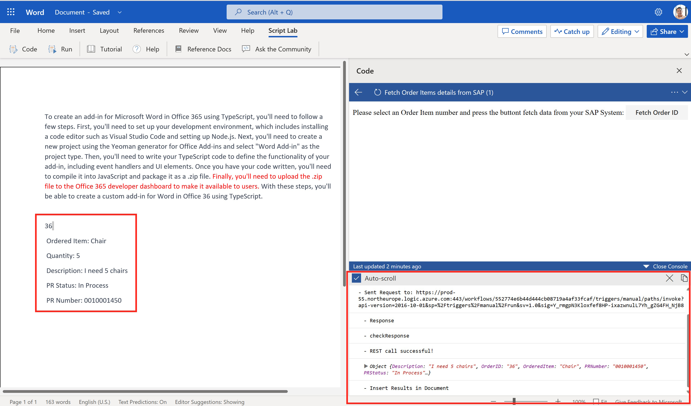
</p>

## Cleaning up

Feel free to reminiscent about your journey while covering your tracks in the cloud.

- [Delete resources](https://learn.microsoft.com/azure/azure-resource-manager/management/delete-resource-group?tabs=azure-powershell) in Azure if no longer needed
- Decommission the M365 dev tenant if no longer needed
- Devour left overs from lunch box

## Where to next?

[< Quest 5](quest5.md) - **[🏠Home](../README.md)**

[🔝](#)
